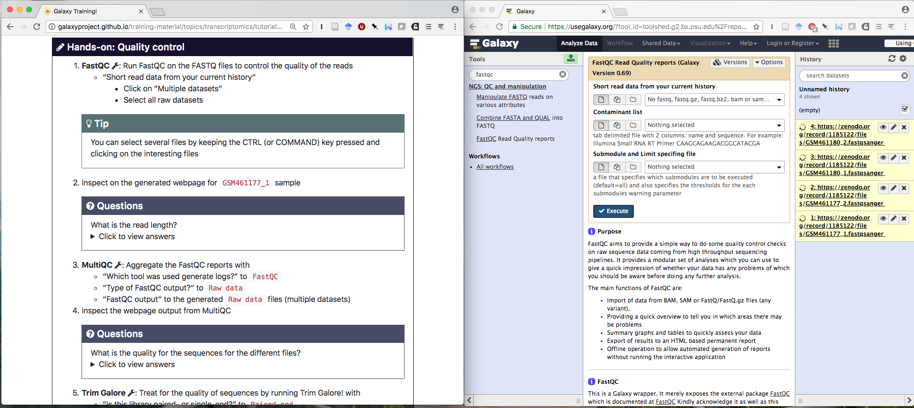
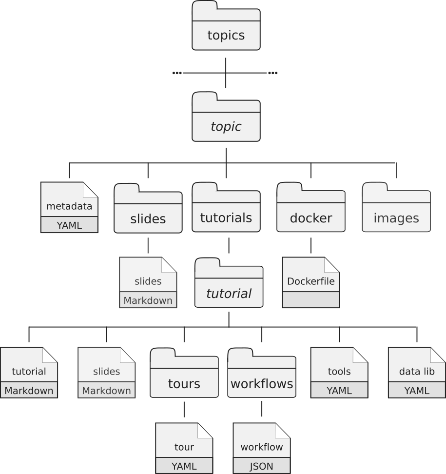
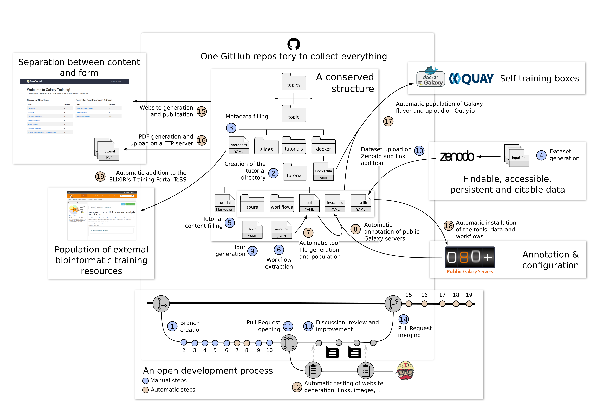

1. TOC
{:toc}

# Overview Questions

## What is this website?

This website is a collection of hands-on tutorials that are designed to be interactive and are built around Galaxy:

This material is developed and maintained by the [worldwide Galaxy community](https://galaxyproject.org/). You can learn more about this effort by reading our [article](https://www.biorxiv.org/content/early/2018/04/05/225680).

## What is Galaxy?

[Galaxy](https://galaxyproject.org/) is an open data integration and analysis platform for the life sciences, and it is particularly well-suited for data analysis training in life science research.

## What are the tutorials for?

These tutorials can be used for learning and teaching how to use Galaxy for general data analysis, and for learning/teaching specific domains such as assembly and differential gene expression analysis with RNA-Seq data.

## What audiences are the tutorials for?

There are two distinct audiences for these materials.

1. **Self-paced individual learners.** These tutorials provide everything you need to learn a topic, from explanations of concepts to detailed hands-on exercises.
2. **Instructors.** They are also designed to be used by instructors in teaching/training settings.  Slides, and detailed tutorials are provided. Most tutorials also include computational support with the needed tools, data as well as Docker images that can be used to scale the lessons up to many participants.

## How is the content licensed?

The content of this website is Creative Commons Attribution 4.0 ([License]({{ site.github_repository }}/LICENSE.md)).

## How can I cite this effort?

We wrote an [article](https://www.biorxiv.org/content/early/2018/04/05/225680) about our efforts.

# For Individual Learners

Learning Galaxy and data analysis on your own and at your own pace?  This material is for you.

## Where do I start?

If you are new to Galaxy then start with one of the introductory topics.  These introduce you to concepts that are useful in Galaxy, no matter what domain you are doing analysis in.

If you are already familiar with Galaxy basics and want to learn how to use it in a particular domain (for example, ChIP-Seq), then start with one of those topics.

If you are already well informed about bioinformatics data analysis and you just want to get a feel for how it works in Galaxy than many tutorials include *Instructions for the impatient* sections.

## How do I use this material?

Many topics include slide decks and if the topic you are interested in has slides then start there.  These will introduce the topic and important concepts.

Most of your learning will happen in the next step - the hands-on tutorials.  This is where you'll become familiar with using the Galaxy interface and experiment with different ways to use Galaxy and the tools in Galaxy.

## Where can I run the hands-on tutorials?

To run the hands-on tutorials you need a Galaxy server to run them on.

Each tutorial is annotated with the information on which [public Galaxy servers](https://galaxyproject.org/public-galaxy-servers/) it can be run. These servers are available to anyone on the world wide web and some may have all the tools that are needed by a specific tutorial.

If your organization/consortia/community has its own Galaxy server, then you may  want to run tutorials on that. You will need to confirm that all needed tools and reference genomes are available on your server and maybe install missing tools and data. To learn how to do that, you can follow our [dedicated tutorial]({{ site.baseurl }}/topics/contributing/tutorials/setup-galaxy-for-training/tutorial.html).

Some topics have a [Docker](https://www.docker.com/) image that can be installed and run on participants' laptops.  These images contain Galaxy instances that include all tools and datasets used in a tutorial, as well as saved analyses and repeatable workflows that are relevant. You will need to [install Docker](https://docs.docker.com/install/).

Finally, you can also run your tutorials on cloud-based infrastructures.  Galaxy is [available on many national research infrastructures](https://galaxyproject.org/galaxy-services/) such as [Jetstream](https://galaxyproject.org/cloud/jetstream/) (United States), [GenAP](https://www.genap.ca/) (Canada), [GVL](https://launch.genome.edu.au/launch) (Australia), [CLIMB](http://www.climb.ac.uk/) (United Kingdom), and more.  These instances are typically easy to launch, and easy to shut down when you are done. 

If you are already familiar with, and have an account on [Amazon Web Services](https://aws.amazon.com/) then you can also launch a Galaxy server there using [CloudLaunch](https://launch.usegalaxy.org/).

## How can I get help?

If you have questions about this training material, you can reach us using the [Gitter chat]({{ site.gitter_url }}).  You'll need a [GitHub](https://github.com/) or [Twitter](https://twitter.com/) account to post questions.  If you have questions about Galaxy outside the context of training, see the [Galaxy Support page](https://galaxyproject.org/support/).

# For Instructors

This material can also be used to teach Galaxy and data analysis in a group setting to students and researchers.

## Where do I start?

Spend some time exploring the different tutorials and the different resources that are available. Become familiar with the structure of the tutorials and think about how you might use them in your teaching.

## What Galaxy instance should I use for my training?

To teach the hands-on tutorials you need a Galaxy server to run the examples on.

Each tutorial is annotated with the information on which [public Galaxy servers](https://galaxyproject.org/public-galaxy-servers/) it can be run. These servers are available to anyone on the world wide web and some may have all the tools that are needed by a specific tutorial. If you choose this option then you should work with that server's admins to confirm that think the server can handle the workload for a workshop. For example, the [usegalaxy.eu](https://usegalaxy.eu/)

If your organization/consortia/community has its own Galaxy server, then you may  want to run tutorials on that. This can be ideal because then the instance you are teaching on is the same you your participants will be using after the training. They'll also be able to revisit any analysis they did during the training. If you pursue this option you'll need to work with your organization's Galaxy Admins to confirm that 

- the server can support a room full of people all doing the same analysis at the same time.
- all tools and reference datasets needed in the tutorial are locally installed.  To learn how to setup a Galaxy instance for a tutorial, you can follow our [dedicated tutorial]({{ site.baseurl }}/topics/contributing/tutorials/setup-galaxy-for-training/tutorial.html).
- all participants will be able to create/use accounts on the system.

Some training topics have a Docker image that can be installed and run on all participants' laptops.  These images contain Galaxy instances that include all tools and datasets used in a tutorial, as well as saved analyses and repeatable workflows that are relevant.

Finally, you can also run your tutorials on cloud-based infrastructures.  Galaxy is [available on many national research infrastructures](https://galaxyproject.org/galaxy-services/) such as [Jetstream](https://galaxyproject.org/cloud/jetstream/) (United States), [GenAP](https://www.genap.ca/) (Canada), [GVL](https://launch.genome.edu.au/launch) (Australia), [CLIMB](http://www.climb.ac.uk/) (United Kingdom), and more.

## What are the best practices for teaching with Galaxy?

We started to collect some best practices for instructors inside our [Good practices slides]({{ site.baseurl }}/topics/contributing/tutorials/good-practices/slides.html#1)

## How do I get help?

The support channel for instructors is the same as for individual learners.  We suggest you start by posting a question to the Galaxy Training Network [Gitter chat]({{ site.gitter_url }}). Anyone can view the discussion, but you'll need to login (using your GitHub or Twitter account) to add to the discussion.

If you have questions about Galaxy in general (that are not training-centric) then there are [several support options](https://galaxyproject.org/support/).

# Contributing

First off, thanks for your interest in contributing to the Galaxy training materials!

Individual learners and instructors can make these training more effective by contributing back to them. You can report mistakes and errors, create more content, etc. Whatever is your background, there is a way to contribute: via the GitHub website, via command-line or even without dealing with GitHub.

We will address your issues and/or assess your change proposal as promptly as we can, and help you become a member of our community. You can also check our [tutorials]({{ site.github_repository }}/topics/contributing) for more details.

## How can I give feedback?

At the end of each tutorial, there is a link to [a feedback form](https://docs.google.com/forms/d/1BILuBp8bPv42odpZ55Kcf2rqzR-k0Czx46agVVSRgm4/edit). We use this information to improve our tutorials.

For global feedbacks, you can open an [issue on GitHub]({{ site.github_repository }}/issues/new), write us on [Gitter]({{ site.gitter_url }}) or send us an [email](mailto:{{ site.email }}).

## How can I report mistakes or errors?

The easiest way to start contributing is to [file an issue]({{ site.github_repository }}/issues/new) to tell us about a problem such as a typo, spelling mistake, or a factual error. You can then introduce yourself and meet some of our community members.

## How can I fix mistakes or expand an existing tutorial using the GitHub interface?

Check our tutorial to learn how to use the GitHub interface (soon...)

## How can I create new content without dealing with git?

If you feel uncomfortable with using the git and the [GitHub flow](https://guides.github.com/introduction/flow/), you can write a new tutorial with any text editor and then contact us (via [Gitter]({{ site.gitter_url }}) or [email](mailto:{{ site.email }})). We will work together to integrate the new content.

## How can I contribute in "advanced" mode?

Most of the content is written in [GitHub Flavored Markdown](https://guides.github.com/features/mastering-markdown/) with some metadata (or variables) found in [YAML](http://yaml.org/) files. Everything is stored on our [GitHub repository]({{ site.github_repository }}). Each training material is related to a topic. All training materials (slides, tutorials, etc) related to a topic are found in a dedicated directory (*e.g.* `transcriptomics` directory contains the material related to transcriptomis analysis). Each topic have the following structure:

{: width="400px"}

- a metadata file in YAML format
- a directory with the topic introduction slide deck in Markdown with introductions to the topic
- a directory with the tutorials:

    Inside the tutorials directory, each tutorial related to the topic has its own subdirectory with several files:
    - a tutorial file written in Markdown with hands-on
    - an optional slides file in Markdown with slides to support the tutorial
    - a directory with Galaxy Interactive Tours to reproduce the tutorial
    - a directory with workflows extracted from the tutoria
    - a YAML file with the links to the input data needed for the tutorial 
    - a YAML file with the description of needed tools to run the tutorial

- a directory with the Dockerfile describing the details to build a container for the topic (self-study environments). 

To manage changes, we use [GitHub flow](https://guides.github.com/introduction/flow/) based on Pull Requests (check our [tutorial]({{ site.baseurl }}/topics/contributing/tutorials/create-new-tutorial-content/tutorial.html)):

1. [Create a fork](https://help.github.com/articles/fork-a-repo/) of this repository on GitHub
2. Clone your fork of this repository to create a local copy on your computer and init needed submodules (`git submodule init` and `git submodule update`)
3. Create a new branch in your local copy for each significant change
4. Commit the changes in that branch
5. Push that branch to your fork on GitHub
6. Submit a pull request from that branch to the [master repository]({{ site.github_repository }})
7. If you receive feedback, make changes in your local clone and push them to your branch on GitHub: the pull request will update automatically
8. Pull requests will be merged by the training team members after at least one other person has reviewed the Pull request and approved it.

Globally, the process of development of new content is open and transparent:

1. Creation of a branch derived from the master branch of the GitHub repository
2. Initialization of a new directory for the tutorial
3. Filling of the metadata with title, questions, learning objectives, etc
4. Generation of the input dataset for the tutorial
5. Filling of the tutorial content
6. Extraction of the workflows of the tutorial
7. Automatic extraction of the required tools to populate the tool file
8. Automatic annotation of the public Galaxy servers
9. Generation of an interactive tour for the tutorial with the Tourbuilder web-browser extension
10. Upload of the datasets to Zenodo and addition of the links in the data library file.
11. Once ready, opening a Pull Request 
12. Automatic checks of the changes are automatically checked for the right format and working links using continuous integration testing on Travis CI
13. Review of the content by several other instructors via discussions
14. After the review process, merge of the content into the main branch, starting a series of automatic steps triggered by Travis CI
15. Regeneration of the website and publication on [{{site.url}}/{{site.baseurl}}]({{site.url}}/{{site.baseurl}})
16. Generation of PDF artifacts of the tutorials and slides and upload on the FTP server
18. Population of [TeSS](https://tess.elixir-europe.org/), the ELIXIR’s Training Portal, via the metadata

To learn how to add new content, check out our [series of tutorials on creating new content]({{ site.baseurl }}/topics/contributing/):


<ol>

 
  
<li><a href="{{ site.baseurl }}/topics/{{ topic.name }}/slides/{{ material.name }}.html">{{ material.title }}</a></li>
 
  
<li><a href="{{ site.baseurl }}/topics/{{ topic.name  }}/tutorials/{{ material.name }}/tutorial.html">{{ material.title }}</a></li>
  
<li><a href="{{ site.baseurl }}/topics/{{ topic.name }}/tutorials/{{ material.name }}/slides.html">{{ material.title }}</a></li>
   
  
 

 </ol>

We also strongly recommend you read and follow [Software Carpentry's](https://software-carpentry.org/) recommendations on [lesson design](https://swcarpentry.github.io/lesson-example/01-design/) and [lesson writing](https://swcarpentry.github.io/instructor-training/19-lessons/) if you plan to add or change some training materials, and also to check the [structure of the training material](#how-the-training-material-is-structured).

## What can I do to help the project?

In [issues](https://github.com/galaxyproject/training-material/issues), you will find lists of issues to fix and features to implement (with the ["newcomer-friendly"]({{ site.github_repository }}/issues?q=is%3Aissue+is%3Aopen+sort%3Aupdated-desc+label%3Anewcomer-friendly) label for example). Feel free to solve them.

# Other Questions

## Are there any upcoming events focused on Galaxy Training?

Yes. As of May 2018, these events are on the horizon:

* [CarpentryCon 2018](http://www.carpentrycon.org/), 30 May - 1 June, Dublin, Ireland
  * Not specifically about Galaxy Training, but an excellent opportunity to gather with other computational science educators. [Bérénice Batut](@bebatut) will present a poster and lightning talk on [Community-Driven Training for Biological Data Analysis with the Galaxy Training Network](https://github.com/carpentries/carpentrycon/blob/master/Sessions/2018-05-30/13-Poster-Session/abstract-berenice-batut.md)
* [GCCBOSC 2018](https://gccbosc2018.sched.com/), June 25-30, Portland, Oregon, United States
  * The annual gathering of the Galaxy Community is an opportunity to learn from experienced Galaxy trainers and to contribute to these efforts:
    * [Bioinformatics Training and Education with the Galaxy Training Network](http://sched.co/Drp9), training session on how to use and contribute to these materials, presented by [Bérénice Batut](@bebatut)
    * [A fruitful year for the Galaxy Training materials]()http://sched.co/EYF1, conference talk by [Bérénice Batut](@bebatut)
    * [Panel: Training and Documentation in Bioinformatics](http://sched.co/Dup7)
    * The *Galaxy documentation, analysis, and training (Galaxy DAT)* track of [CollaborationFest](https://galaxyproject.org/events/gccbosc2018/collaboration/), June 29 - July 2. Focus on expanding Galaxy community resources like training materials and documentation.
* Quarterly online training material Contribution Fests: The training community will meet online on the 3rd Friday of every 3rd month to focus on enhancing particular areas of the training material.

Is the above list now out of data (it happens).  See the [Galaxy Community Events Calendar](https://galaxyproject.org/events/) for what coming up right now.

