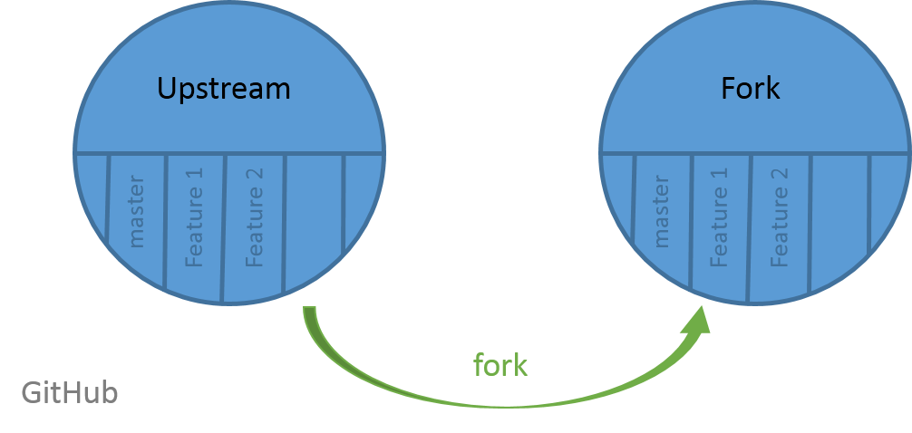
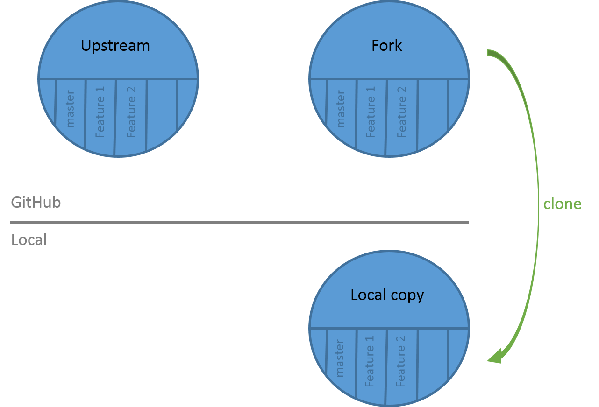
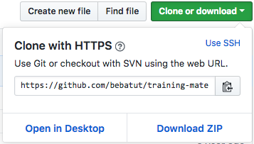
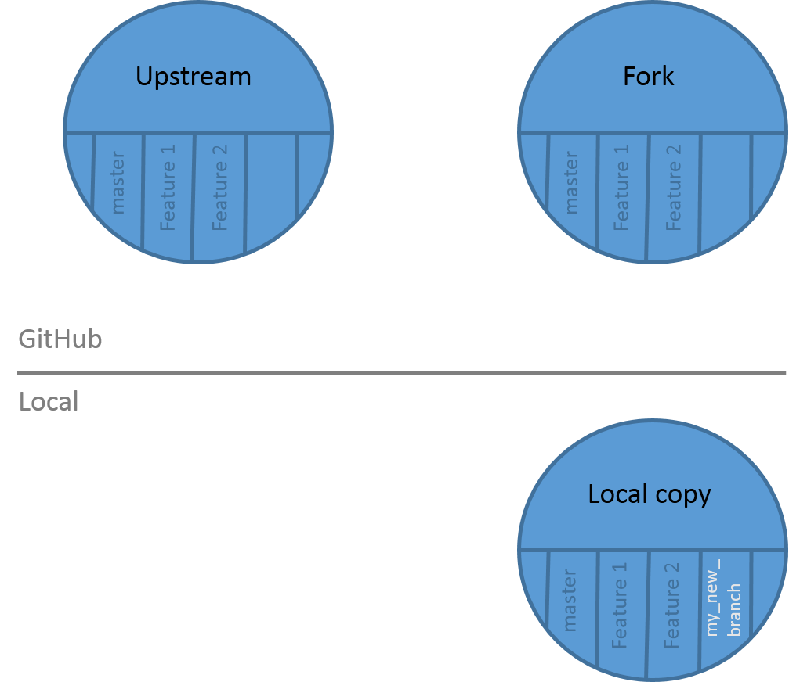
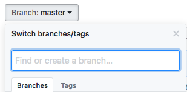
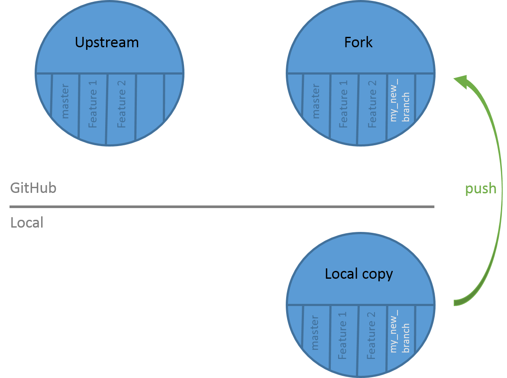
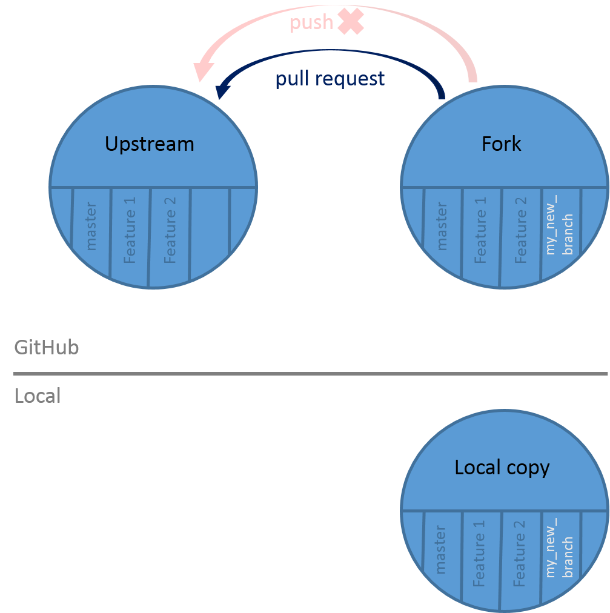
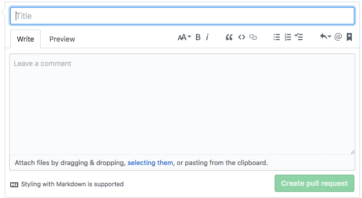
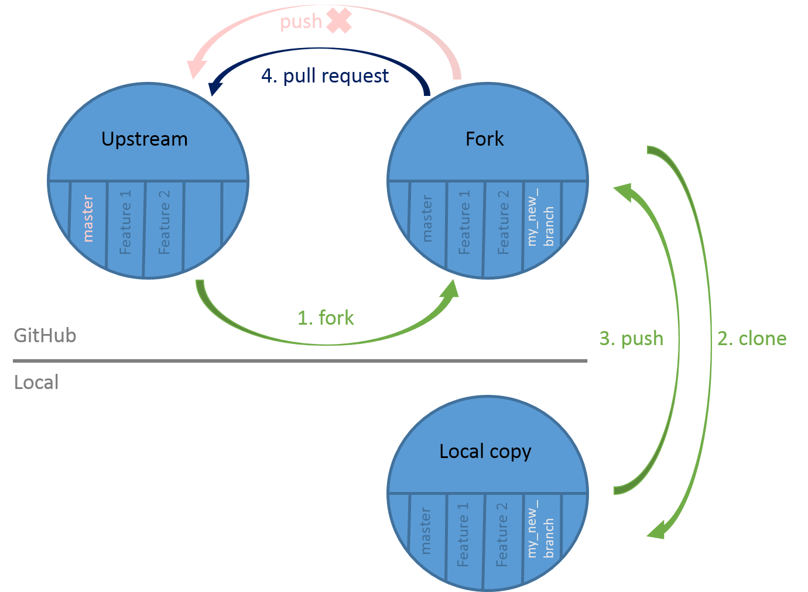

# Introduction
{:.no_toc}

Most of the content is written in [GitHub Flavored Markdown](https://guides.github.com/features/mastering-markdown/) with some metadata (or variables) found in [YAML](http://yaml.org/) files. Everything is stored on a [GitHub](https://github.com) repository: [{{ site.github_repository }}]({{ site.github_repository }}).

The process of development of new content is open and transparent, using git and following the [GitHub flow](https://guides.github.com/introduction/flow/):


1. Create a fork
1. Clone your fork of this repository to create a local copy on your computer 
1. Create a new branch in your local copy for each significant change
2. Commit the changes in that branch
1. Push that branch to your fork on GitHub
1. Submit a pull request from that branch to the [master repository]({{ site.github_repository }})
1. If you receive feedback, make changes in your local clone and push them to your branch on GitHub: the pull request will update automatically
1. Pull requests will be merged by the training team members after at least one other person has reviewed the Pull request and approved it.

> ### Agenda
>
> In this tutorial, you will learn how to contribute to the GitHub repository:
>
> 1. TOC
> {:toc}
>
{: .agenda}

# Create a fork of this repository on GitHub

A fork is a copy of a repository. [Forking](https://help.github.com/articles/fork-a-repo/) a repository allows you to freely experiment with changes without affecting the original project:

{: width="900px"}

Forking a repository is a simple two-step process:

> ###  Hands-on: Fork the repository
>
> 1. Go on the GitHub repository: [{{ site.github_url }}]({{ site.github_url }})
> 2. Click on **Fork** (top-right corner of the page)
>   
>    
>
> > ###  Comment
> > When you click the **Fork** button GitHub will show you a list with your user and any groups where you can create a fork of this repository. If you do not see yourself, it means you already have a fork.
> {: .comment}
> 
{: .hands_on}

# Clone the GitHub repository on your computer

To modify the content of the repository, you need a copy of it on your computer. This step of importing a git repository is called "cloning":

{: width="900px"}

> ###  Hands-on: Clone the GitHub repository
>
> 1. Get the URL of your fork. You can find this on the main page of your fork under the green button:
>    1. Click on **Clone or download** (right)
>
>       
>
>    2. Copy the URL
>
>       It should be something like `https://github.com/< Your GitHub Username >/training-material.git`
>
> 1. Open a terminal
> 2. Navigate with `cd` to the folder in which you will clone the repository
> 3. Clone the repository with the command:
>
>    ```
>    $ git clone https://github.com/< Your GitHub Username >/training-material.git
>    ```
>
> 4. Navigate to the repository
>
>    ```
>    $ cd training-material
>    ```
{: .hands_on}

# Create a new branch

You have now your repository locally and you want to modify it. For this example tutorial, you will add yourself as contributor of the project to appear on the [Hall of Fame]({{ site.baseurl }}/hall-of-fame).

In GitHub flow, there is a concept: one new feature or change = one branch.

When you're working on a project, you're going to have a bunch of different features or ideas in progress at any given time – some of which are ready to go, and others which are not. Branching exists to help you manage this workflow. You should develop different features on different branches to help keep the changes you make simple and easy to review.


Here for this tutorial, you will create a branch called "my_new_branch" in which you will modify the `CONTRIBUTORS.yaml` file, the file used to generate the [Hall of Fame]({{ site.baseurl }}/hall-of-fame).

> ###  Hands-on: Create a branch
>
> 1. See which branch you are currently on
>
>    ```
>    $ git branch 
>      * master
>    ```
>
> 2. Create a new branch
>
>    ```
>    $ git checkout -b my_new_branch
>    Switched to a new branch 'my_new_branch'
>    ```
{: .hands_on}

This branch is added to your local copy:



# Make your changes on this branch

You have created your first branch! Now you want to make the change in the `CONTRIBUTING.yaml` file. By changing a file in this branch, it will diverge from the `master` branch. It will contain data that is only on this new branch:


> ###  Hands-on: Make changes in a branch
>
> 1. Modify the `CONTRIBUTORS.yaml` to add yourself
>
>    You should use your GitHub username and add it followed by `:` at the correct position given the alphabetical order
>
> 2. Save the file
> 3. Check the changes you made
>
>    ```
>    $ git status
>    On branch my_new_branch
>    Changes not staged for commit:
>      (use "git add/rm <file>..." to update what will be committed)
>      (use "git checkout -- <file>..." to discard changes in working directory)
>    
>        modified:   CONTRIBUTORS.yaml
>    
>    no changes added to commit (use "git add" and/or "git commit -a")
>    ```
>
> 4. Add the file and commit the changes
>
>    ```
>    $ git add CONTRIBUTORS.yaml
>    $ git commit -m "Add ..."
>    ```
>
> 5. Check that there are no more changes to commit with `git status`
>
{: .hands_on}

# Push your branch on your GitHub repository

The changes you made on your branch are only on the local copy of the repository. To propagate them online, you need to push them on your fork on GitHub:

> ###  Hands-on: Push the changes
>
> 1. Push the changes to the GitHub repository
>
>    ```
>    $ git push origin my_new_branch
>    ```
>
>    > ###  "push origin"
>    > When you `git push`ed, you specified `origin`. Git repositories can know that forks exist in multiple places. When you clone one, it creates a "remote" (a remote repository) which it names `origin`, set to the URL that you used when you cloned. By having multiple remotes, you can manage more complex workflows.
>    {: .details}
>
> 2. Go to your GitHub repository
> 3. Change to the "my_new_branch" branch:
>    1. Click on **Branch: master** (left)
>
>       
>
>    2. Select the branch "my_new_branch"
>
> 4. Check that your name is in the `CONTRIBUTORS.yaml` file
>
{: .hands_on}



# Open a pull request

You pushed your changes to GitHub, but currently they are only on your fork. You want to have these changes in the main GitHub repository in order to appear on our [Hall of Fame]({{ site.baseurl }}/hall-of-fame) online. You can't add or push directly the main GitHub repository, so you need to create what we call a pull request:



> ###  Hands-on: Create a pull request
>
> 2. Go to your GitHub repository
> 1. Click on **Compare & pull request**
>
>    
>
> 3. Check that the selected branch are correct: **master** on the left and your branch name on the right
>
>    
> 
> 2. Fill in the pull request description
>    
>    
>
>    1. Add a title for the Pull Request
>    2. Add a message explaining the changes you made (Be kind <i class="fa fa-smile-o" aria-hidden="true"></i>)
>    3. Click on **Create pull request**
> 3. Go to **Pull requests** to check if it is there
{: .hands_on}

Once the pull is open, it will be reviewed. There are two possible outcomes:

1. Your pull request is accepted. Congratulations! Your changes will be merged into the master branch of the original repository. The website will be re-built and you will be in the [Hall of Fame]({{ site.baseurl }}/hall-of-fame)
2. Your pull request needs modifications: the reviewers will ask for some changes, possibly because the automatic tests are failing.

# Make the requested changes

One of the reviewers of your pull request asked you to add your name after your GitHub username in the `CONTRIBUTORS.yaml` file

> ###  Hands-on: Make further changes
>
> 1. Make the requested changes in the `CONTRIBUTORS.yaml` file 
>
>    It should look like
>    
>    ```
>    bebatut:
>         name: Bérénice Batut
>    ```
>
> 2. Check the changes that you made
>
>    ```
>    $ git status
>    On branch my_new_branch
>    Changes not staged for commit:
>      (use "git add/rm <file>..." to update what will be committed)
>      (use "git checkout -- <file>..." to discard changes in working directory)
>    
>        modified:   CONTRIBUTORS.yaml
>    
>    no changes added to commit (use "git add" and/or "git commit -a")
>    ```
>
> 3. Add the file and commit the changes
>
>    ```
>    $ git add CONTRIBUTORS.yaml
>    $ git commit -m "Add ..."
>    ```
>
> 4. Check that there are no more changes to commit with `git status`
> 5. Push the new changes to GitHub
>
>    ```
>    $ git push origin my_new_branch
>    ```
>
>    The pull request should be automatically updated
>
> 6. Check that the new changes are added to the pull request on GitHub
>
{: .hands_on}

# Check the automatic tests

When a pull request is opened, some automated tests are automatically launched on [Travis](http://travis-ci.org/) to be sure that the changes do not break the website, the URL are valid, etc.

On the bottom of your pull request, you can see the status of the tests:

- Yellow (with circle)

    

    The tests are still running

- Red (with cross)
    
    

    When it is red, you can investigate why by clicking on **Details**. You will be redirected on [Travis](http://travis-ci.org/) where you can see the logs of the tests. Get in touch with us on [Gitter]({{ site.gitter_url }}) if you need help to understand the issue.

- Green (with tick)

    

    The tests passed. Good job!

    Even it is green, we recommend to check the result of the tests, as some of tests are allowed to fail (to avoid too much noise).

# Conclusion
{:.no_toc}

With this tutorial, you have learned the basics of contributing using GitHub:



You can now contribute and help us to improve our tutorials.

> ###  Git in Depth
> This tutorial was a quick introduction to explain the basics of contributing to the training material. We recommend that everyone follow a more detailed git tutorial, e.g. the one of [Software Carpentry](), and test yourself using the [GitHub test]().
{: .tip}
