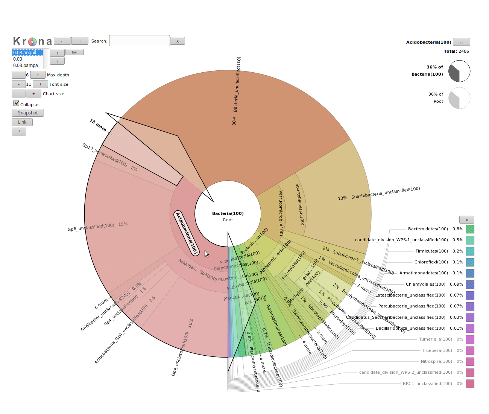

# イントロダクション
{:.no_toc}

メタゲノミクスでは、環境内の微生物に関する情報を主に2つの技術で抽出することができます:

- アンプリコンシーケンス（または 16S rRNA/rDNA ）では、生物の rRNA/rDNA のみでシーケンスします
- ショットガンシーケンスでは、環境中の微生物の全ゲノムをシーケンスします

このチュートリアルでは、2種類の解析の一般的な原理とそれぞれの手法の違いを説明します。このような解析をさらに深く知りたい場合は、それぞれの解析の詳細なチュートリアルを確認することをお勧めします。

そのため、私たちは同じ環境から得た2つのデータセットを使用します（1つはアンプリコン用でもう1つはショットガン用）: アルゼンチン Anguil のバルクの土壌で、[project on the Argentinean agricultural pampean soils](https://www.ebi.ac.uk/metagenomics/projects/SRP016633) の研究によって得たもの。このプロジェクトでは、3種類の土地を利用しショットガンとアンプリコンシーケンスを使用して2種類の土壌（バルクと根圏）を解析しました。私たちはアルゼンチン Anguil のバルクの土壌に焦点を当てていきます。

> ### アジェンダ
>
> このチュートリアルでは、以下のことを扱います:
>
> 1. TOC
> {:toc}
>
{: .agenda}

# アンプリコンデータ

アンプリコンシーケンスは特定のゲノム領域の遺伝的な変異を解析する高度に標的化されたアプローチです。
メタゲノミクスの分野において、アンプリコンシーケンスはサンプル中の rRNA データを補足して配列決定することを指しています。
それは細菌や古細菌では 16S で真核生物の場合は 18S です。

> ###  背景: 16S リボソーム RNA 遺伝子
>  <br><br>
>
> 16S rRNA 遺伝子は私たちの目的に非常に適したいくつかの特性を持っています
>
> 1. すべての生物に存在する
> 2. 高度に保存されている領域と高度に可変な領域
> 3. 巨大なリファレンスのデータベース
>
> 
>
> 高度に保存された領域を用いて異なった種で標的とする(同じ)遺伝子を特定でき、高度に可変な領域を用いて異なる種が区別できます。
>
{: .tip}

アンプリコンデータでは、サンプル中の配列がどの微生物に由来しているのかを抽出することができます。これは、taxonomic assignation と呼ばれています。
私たちは taxons に配列を割り当ててそれからサンプルでタキソノミーを分類または抽出してみます。

この解析では、[mothur tool suite](https://mothur.org) を使用しますが、使うのはこのツールができることのほんの一部だけです。
より詳しく使用方法を学びたい場合は、[mothur tutorial](../mothur-miseq-sop/tutorial.html) を参照してください。

## データをインポートする

私たちのデータセットはアルゼンチンの2か所の土地から採取した土壌サンプルに由来していて、454 GS FLX Titanium を用いて 16S rDNA V4領域をシーケンスしたものです。このチュートリアルでは、オリジナルの fastq データをダウンサンプリングして fasta に変換されたものを使用しています。オリジナルのデータは EBI Metagenomics で下記の実行番号で取得することができます:

- Pampa の土壌: [SRR531818](https://www.ebi.ac.uk/metagenomics/projects/SRP016633/samples/SRS353016/runs/SRR531818/results/versions/2.0)
- Anguil の土壌: [SRR651839](https://www.ebi.ac.uk/metagenomics/projects/SRP016633/samples/SRS386929/runs/SRR651839/results/versions/2.0)


> ###  ハンズオン: データをアップロードする
>
> 1. [Zenodo](https://zenodo.org/record/815875) または（"Analyses of metagenomics data" 内の）データライブラリからファイルをインポートする
>    - `SRR531818_pampa.fasta`
>    - `SRR651839_anguil.fasta`
>
>    ```
>    https://zenodo.org/record/815875/files/SRR531818_pampa.fasta
>    https://zenodo.org/record/815875/files/SRR651839_anguil.fasta
>    ```
>
>    > ###  Tip: リンクからデータをインポートする
>    >
>    > * リンクをコピーする
>    > * Galaxy Upload Manager を開く
>    > * **Paste/Fetch Data** を選択する
>    > * テキスト画面にリンクをペーストする
>    > * **Start** を押す
>    {: .tip}
>
>    > ###  Tip: データライブラリからデータをインポートする
>    >
>    > * 「共有データ」（トップパネル）を選び、それから "Data libraries" を選択する
>    > * Click on "Training data" and then "Analyses of metagenomics data"
>    > * Select interesting file
>    > * Click on "Import selected datasets into history"
>    > * Import in a new history
>    {: .tip}
>
>    デフォルトでは、Galaxy はリンクを名前にしているので、名前を変更します。
>
{: .hands_on}

<!--

Anguil Soil: https://www.ebi.ac.uk/metagenomics/projects/SRP016633/samples/SRS386929
Pampa Soil https://www.ebi.ac.uk/metagenomics/projects/SRP016633/samples/SRS353016/runs/SRR531818/results/versions/2.0

Project's data: https://www.ebi.ac.uk/metagenomics/projects/SRP016633/samples/SRS353016/runs/SRR531818/results/versions/2.0
Project's pipeline: https://www.ebi.ac.uk/metagenomics/pipelines/2.0
Project's QC results: https://www.ebi.ac.uk/metagenomics/projects/SRP016633/samples/SRS386929/runs/SRR651839/results/versions/2.0
-->

### データセットの準備

mothur でマルチサンプル解析を行いますが、これを行うために、すべてのリードを1つのファイルにまとめて、どのリードがどのサンプルに属しているかを示す、*group file* を作成します。

> ###  ハンズオン: マルチサンプル解析の準備
>
> 1. **Merge.files**  で次のように設定する
>   - "Merge" → `fasta files`
>   - "Inputs" には2つのサンプル fasta ファイルを選択する
>
> 2. **Make.group**  で次のように設定する
>   - "Method to create group file" → `Manually specify fasta files and group names`
>   - "Additional": この repeat に2つの要素を追加する
>        - 1つ目の要素
>            - "fasta - Fasta to group" → `SRR531818_pampa` ファイル
>            - "group - Group name" → `pampa`
>        - Second element (click on "Insert Additional")
>            - "fasta - Fasta to group" → `SRR651839_anguil` ファイル
>            - "group - Group name" → `anguil`
>
{: .hands_on}

> ###  Tip
>
> 私たちは少ない数のサンプルしか持っていないので、手動で指定する方法を使用しました。何百ものサンプルがある場合はこれはすぐに煩わしいものになります。解決方法は？コレクションを使用しましょう！Galaxy のコレクションについて詳しくは、[こちら]() のチュートリアルをご覧ください。
{: .tip}

group ファイルを見てください。これは非常にシンプルなファイルで、2列からなり、1列目はリード名で、2列目はグループ（サンプル）名、今回の場合は `pampa` または `anguil` が入ります。


### 計算のためにファイルの最適化する

私たちは多くの同種の生物をシーケンスしているので、配列の多くは互いに重複していることが予想されます。同じことに莫大な時間を費やすのは計算上無駄なので、 `unique.seqs` コマンドを用いて配列を一意なものにします:

> ###  ハンズオン: 重複している配列を除去する
>
> 1. **Unique.seqs**  で次のように設定する
>   - "fasta" にはマージした fasta ファイルを選択する
>   - "output format" → `Name File`
>
>    > ###  Question
>    >
>    > 一意な配列はいくつありましたか？除去された重複している配列の数はいくつありましたか？
>    >
>    >    > ###  Solution
>    >    > 一意な配列は19,502 で重複している配列は498 です。
>    >    >
>    >    > これはこのステップの前の fasta ファイルのライン数と、fasta（もしくは names）アウトプットのライン数を比べることで分かります。
>    >    {: .solution }
>    {: .question}
>
{: .hands_on}

この `Unique.seqs` は2つのファイルをアウトプットとし、1つは一意な配列のみを含んだ fasta ファイルで、*names files* です。
この names file は2列で構成されていて、1列目には一意な配列の配列名があり、２列目には1列目の代表的な配列と同じ配列を持つすべての配列名が書かれています。

```
name          representatives
read_name1    read_name2,read_name,read_name5,read_name11
read_name4    read_name6,read_name,read_name10
read_name7    read_name8
...
```

> ###  ハンズオン: Count sequences
>
> 1. **Count.seqs**  で次のように設定する
>   - "name" には `Unique.seqs` の name ファイルを選択する
>   - "Use a group file" → `yes`
>   - "group" には `Make.group` の group ファイルを選択する
{: .hands_on}

`Count.seqs` のファイルは、それぞれの一意な配列を代表として表される配列の数を、複数のサンプルにわたって追跡します。このファイルを以降の多くのツールに渡して必要に応じて使用または更新します。

## クオリティコントロール

解析の第一歩はデータの品質をチェックし改善することです。


> ###  Comment
>
> クオリティコントロールのトピックの詳しい情報については、[こちら]({{site.baseurl}}/topics/sequence-analysis/) のトレーニング資料をご覧ください。
{: .comment}


まずは、データをよく見てみましょう:

> ###  ハンズオン: データを要約する
>
> 1. **Summary.seqs**  で次のように設定する
>   - "fasta" パラメーターには `Unique.seqs` の fasta ファイルを選択する
>   - "count" には `Count.seqs` の count table を選択する
>   - "output logfile?" → `yes`
>
{: .hands_on}

`summary` のアウトプットファイルはリードごとの情報を表示します。`logfile` のアウトプットにも次のようないくつかの summary の統計が含まれています:

```
              Start    End        NBases     Ambigs   Polymer  NumSeqs
Minimum:      1        80         80         0        3        1
2.5%-tile:    1        104        104        0        3        501
25%-tile:     1        242        242        0        4        5001
Median:       1        245        245        0        4        10001
75%-tile:     1        245        245        0        4        15001
97.5%-tile:   1        247        247        0        6        19501
Maximum:      1        275        275        2        31       20000
Mean:         1        237.519    237.519    0.00495  4.24965
# of unique seqs:   19502
total # of seqs:    20000
```

これは合計で 19,502 の一意な配列があり、80 ～ 275 塩基の長さの異なる配列が主な配列として合計 20,000 配列あることを示しています。また、少なくともいくつかの配列では曖昧な塩基が含まれていることにも注意してください。
さらに、少なくとも1つのリードは 31 塩基の一連のホモポリマーを有していますが、これはおそらく誤りであるのでこのようなリードもフィルタリングしましょう。

もし 20,000 のラウンド数に対して不思議に思っているなら、あなたは正しいです。このチュートリアルではオリジナルのデータセットをサンプルあたり 10,000 のリードにダウンサンプリングして解析のステップにかかる時間を短縮しています。

`Screen.seqs` ツールを使用してデータセット内のリード長、塩基のクオリティ、そしてホモポリマーの最大長をフィルタリングすることができます

次のツールでは曖昧な塩基（`maxambig` パラメーター）、9 塩基以上の連続したホモポリマー（`maxhomop` パラメーター）、そして 275 bp より長い配列や 225 bp より短い配列を除去します。

> ###  ハンズオン: クオリティやリード長で塩基配列をフィルタリングする
>
> 1. **Screen.seqs**  で次のように設定する
>   - "fasta" には `Unique.seqs` の fasta ファイルを選択する
>   - "minlength" パラメーター → `225`
>   - "maxlength" パラメーター → `275`
>   - "maxambig" パラメーター → `0`
>   - "maxhomop" パラメーター → `8`
>   - "count" には `Count.seqs` の count ファイルを選択する
>
{: .hands_on}

> ###  Question
>
> このスクリーニングステップでいくつのリードが除去されましたか？（ヒント: `Summary.seqs` ツールを再実行してみましょう）
>
> > ###  Solution
> > 1,804 リードです。
> >
> > これは screen.seqs のアウトプットである bad.accnos のライン数を見るか、スクリーニングステップ前後のサマリーログ間の seqs の合計数を比べることで分かります。
> {: .solution }
{: .question}

## Sequence Alignment

私たちの配列をレファレンスとアライメントすることは OTU の割り当てをよりよく行うのに役立つため [[Schloss et. al.](https://www.ncbi.nlm.nih.gov/pubmed/23018771)] 、16S rRNA の V4 可変領域に配列をアライメントします。このアライメントは Silva のリファレンスデータベースの [[mothur's MiSeq SOP](https://mothur.org/wiki/MiSeq_SOP)] に記載されている通りに作成されています。

> ###  ハンズオン: Align sequences
>
> 1. `silva.v4.fasta` ファイルをヒストリーにインポートする
>
>    ```
>    https://zenodo.org/record/815875/files/silva.v4.fasta
>    ```
>
> 2. **Align.seqs**  で次のように設定する
>   - "fasta" には `Screen.seqs` のアウトプットである `good.fasta` を選択する
>   - "Select Reference Template from" → `Your history`
>   - "reference" にはリファレンスのファイルである `silva.v4.fasta` を選択する
>   - "flip" → `Yes`
>
>    この手順には数分かかることがあるので、しばらくお待ちください。
>
> 3. **Summary.seqs**  で次のように設定する
>   - "fasta" パラメーターには `Align.seqs` の aligned アウトプットを選択する
>   - "count" パラメーターには `Screen.seqs` のアウトプットである count_table を選択する
>
{: .hands_on}

アライメントのクオリティを知るために、summary ステップで log のアウトプットを見ることができます:

```
        Start   End NBases  Ambigs  Polymer NumSeqs
Minimum:    2391    10674   9   0   2   1
2.5%-tile:  3080    12071   234 0   4   455
25%-tile:   3080    13424   244 0   4   4545
Median:     3080    13424   245 0   4   9090
75%-tile:   3080    13424   245 0   4   13634
97.5%-tile: 3082    13424   246 0   6   17724
Maximum:    13396   13425   267 0   7   18178
Mean:   3080.6  13380   244.212 0   4.27946
# of unique seqs:   17698
total # of seqs:    18178
```

> ###  Questions
>
> 1. いくつの配列がアライメントされましたか？
> 2. どの位置の間でほとんどのリードがリファレンスとアライメントされていますか？
>
>    > ###  Solution
>    > 1. 17,698 の配列がアライメントされました
>    > 2. log のアウトプットからほとんどのリードがリファレンスの `3080 から 13424` の位置でうまくアライメントされていることが分かります。これは正確に 16S 遺伝子の V4 標的領域に対応しています。
>    {: .solution }
{: .question}

すべてが同じ領域に重なることを確認するために `Screen.seqs` を再実行して 3,080 より前の位置で開始し、 13,424 以降の位置で終了する配列を取得します。

> ###  ハンズオン: 不適切にアライメントした配列を除去する
>
> 1. **Screen.seqs**  で次のように設定する
>   - "fasta" → aligned fasta file
>   - "start" → `3080`
>   - "end" → `13424`
>   - "count" には前回の `Screen.seqs` を実行して作成された group ファイルを選択する
>
{: .hands_on}

> ###  Question
> このステップではいくつの配列が除去されましたか？
> > ###  Solution
> > 4,579 配列が除去されました。これは bad.accnos のアウトプットの配列数です。
> {: .solution }
{: .question}

今私たちは同じアライメント座標で重なっている配列を知っていますが、それらがその領域 **だけ** で重なっていることを確認したいです。そこで配列をフィルタリングして両端のはみ出しているものを除去します。加えて、アライメントの中には、内部ギャップ文字（即ち「-」）を含む列は考慮しませんが、外部ギャップ文字（即ち「.」）だけを含む多くの列があります。これらは情報を失うことなく抜き出すことができます。これはすべて `Filter.seqs` を用いて行います:

> ###  ハンズオン: 配列をフィルタリングする
>
> 1. **Filter.seqs**  で次のように設定する
>   - "fasta"" には `Sreen.seqs` のアウトプットである `good.fasta` を選択する
>   - "trump" → `.`
{: .hands_on}


## 分類学的な情報を得る

アンプリコンデータ解析における主な質問は以下のとおりです: 環境サンプルにはどのような微生物が存在しているのですか？そしてどれくらいの割合でいるのですか？微生物のコミュニティの構造はどのようになっていますか？

配列を取得してそれらを分類学的に割り当てるというのがこの質問に対する考え方です。そのために、類似性に基づいて配列をグループ化（またはクラスタリング）して Operational Taxonomic Units (OTUs)（単一の「属」または「種」（クラスタリングの閾値に依存する）として扱うことのできる類似の配列のグループ）を定義します。

> ###  背景: Operational Taxonomic Units (OTUs)
>
> 16S メタゲノミクスアプローチでは、OTU は 16S rDNA マーカー遺伝子と同種な配列の変異体のクラスターである。これらのクラスターのそれぞれは配列の類似性の閾値に応じて細菌種または属の分類学的な単位を示すことを意図している。典型的には、OTU クラスターでは 16S 遺伝子配列変異体が 97% まで同一だと属レベルで定義されます。98% または 99% 同一だと種の分類まで示唆されます。
>
> 
>
> . Credit: Danzeisen et al. 2013, 10.7717/peerj.237")
>
{: .tip}

まず `Pre.cluster` コマンドを使用して配列をプレクラスタリングし、シーケンス間の違いを 2 塩基まで許容することで、配列の潜在的なエラーを取り除こうと思います。このコマンドはグループごとに配列を分割し、最も多いものから最も少ないものへというように配列の豊富さで並び替えて、他と 2 塩基以上異なるヌクレオチドを特定します。この場合、それらはマージされます。一般的に、100塩基対あたり1塩基の違いを許容することをお勧めします:

> ###  ハンズオン: 配列のプレクラスタリングを行い、望ましくない配列を除去する
>
> 1. **Pre.cluster**  で次のように設定する
>   - "fasta" には最後に実行した `Filter.seqs` の fasta アウトプットを選択する
>   - "name file or count table" には直近の `Screen.seqs` ステップの count table を選択する
>   - "diffs" → 2
>
>   > ###  Question
>   >
>   >  類似度の高い配列をクラスタリングした後では一意な配列はいくつ残りましたか？
>   > > ###  Solution
>   > > 10,398 配列
>   > >
>   > > これは fasta のアウトプットのライン数です
>   > {: .solution }
>   {: .question}
>
{: .hands_on}

<!-- optional additional QC: chimera.uchime -->
training set を使用して配列を分類してみようと思います。これは [[mothur's MiSeq SOP](https://mothur.org/wiki/MiSeq_SOP)] でも提供されています。

> ###  ハンズオン: 配列を系統ごとに分類する
>
> 1. `trainset16_022016.pds.fasta` と `trainset16_022016.pds.tax` をヒストリーにインポートする
>
>    ```
>    https://zenodo.org/record/815875/files/trainset16_022016.pds.fasta
>    https://zenodo.org/record/815875/files/trainset16_022016.pds.tax
>    ```
>
> 2. **Classify.seqs**  で次のように設定する
>   - "fasta" には `Pre.cluster` のアウトプットである fasta を選択する
>   - "Select Reference Template from" → `History`
>   - "reference" にはヒストリーから `trainset16_022016.pds.fasta` を選択する
>   - "Select Taxonomy from" → `History`
>   - "taxonomy" にはヒストリーから `trainset16_022016.pds.tax` を選択する
>   - "count" には `Pre.cluster` の count table を選択する
>
> このステップは数分かかるかもしれないので、終わるまでお茶でも飲んで一息つきましょう :coffee:
>
{: .hands_on}

taxonomy のアウトプットを見てみましょう。

```
name    taxonomy
SRR651839.9109-HXY9DLL01BSHQO-2 Bacteria(99);Verrucomicrobia(99);Spartobacteria(99);unclassified;unclassified;unclassified;
SRR651839.11437-HXY9DLL01AMIPI-2    Bacteria(100);Verrucomicrobia(97);Spartobacteria(97);unclassified;unclassified;unclassified;
SRR651839.15884-HXY9DLL01BDG2F-2    Bacteria(99);unclassified;unclassified;unclassified;unclassified;unclassified;
SRR651839.12048-HXY9DLL01DSOWS-2    Bacteria(100);Verrucomicrobia(100);Spartobacteria(100);unclassified;unclassified;unclassified;
SRR651839.9410-HXY9DLL01BGRG2-2 Bacteria(100);Proteobacteria(100);Alphaproteobacteria(100);Rhizobiales(100);Bradyrhizobiaceae(100);unclassified;
SRR651839.9029-HXY9DLL01E4W9Z-2 Bacteria(100);Verrucomicrobia(100);Spartobacteria(100);unclassified;unclassified;unclassified;
SRR651839.6283-HXY9DLL01CHX25-2 Bacteria(100);Acidobacteria(100);Acidobacteria_Gp4(100);Gp4(100);unclassified;unclassified;
SRR651839.3134-HXY9DLL01DOM67-2 Bacteria(100);Acidobacteria(100);Acidobacteria_Gp6(100);Gp6(100);unclassified;unclassified;
SRR651839.13044-HXY9DLL01ETN7L-2    Bacteria(100);Proteobacteria(100);Alphaproteobacteria(100);Rhizobiales(100);Bradyrhizobiaceae(100);unclassified;
SRR531818.61708-G88ZSJI01AVPPR-2    Bacteria(100);Acidobacteria(99);Acidobacteria_Gp6(99);Gp6(99);unclassified;unclassified;
```

すべての配列が現在分類されていることが分かります。

次のステップではこの情報を用いて発見された異なる分類群の豊富さを調べます。これは 3 つのステップからなります:
1. 初めにすべての個々の配列を分類し、confidence score (0-100%) を割り当てる
2. 次に、配列を 97% を同一性の閾値として（分類学的な情報は使用しないで）グループ分けする
3. 最後に、各クラスターについて、個々の配列の分類に基づき confidence scores を考慮したコンセンサスな分類を定める

> ###  ハンズオン: OTU に配列を割り当てる
>
> 1. **Cluster.split**  で次のように設定する
>   - "Split by" → `Classification using fasta`
>   - "fasta" には `Pre.cluster` の fasta アウトプットを選択する
>   - "taxonomy" には `Classify.seqs` の taxonomy アウトプットを選択する
>   - "count" には `Pre.cluster` のアウトプットである count table を選択する
>   - "Clustering method" → `Average Neighbor`
>   - "cutoff" → `0.15`
>
{: .hands_on}

列に識別された OTU がそれぞれ表記され、行を距離ごとに分け、セルにこれらの OTU に距離ごとに識別された配列の ID を記した表を取得しました。

次に各グループの各 OTU に 0.03（97％の類似性）の距離の配列がいくつあるか調べます。`Make.shared` のコマンドで cutoff level を 0.03 にしてこれを知ることができます:

> ###  ハンズオン: OTU の abundance を推定する
>
> 2. **Make.shared**  で次のように設定する
>   - "Select input type" → `OTU list`
>   - "list" には `Cluster.split` のアウトプットである list を選択する
>   - "name file or count table" には `Pre.cluster` の count table を選択する
>   - "label" → `0.03`
>
{: .hands_on}

私たちはまた OTU のそれぞれの分類について知りたくなるでしょう。`Classify.otu` コマンドを使うことで各 OTU のコンセンサスな分類を得ることができます:

> ###  ハンズオン: OTU を分類する
>
> 3. **Classify.otu**  で次のように設定する
>   - "list" には `Cluster.split` のアウトプットを選択する
>   - "count" には `Pre.cluster` の count table を選択する
>   - "Select Taxonomy from" → `History`
>   - "taxonomy" には `Classify.seqs` のアウトプットである taxonomy を選択する
>   - "label" → `0.03`
{: .hands_on}

> ###  Questions
>
> 1. 分類的に Anguil サンプルに帰属している OTU はいくつありますか？また Pampa サンプルではいくつありますか？
> 2. アノテーションの1つ目の OTU は何ですか？またそのサイズは？
>
>    > ###  Solution
>    > 1. 2,195 が Anguil のもので 2,472 が Pampa のものです ("tax.summary")
>    > 2. Otu00001 は 929 配列で細菌（界）、Verrucomicrobia (門), Spartobacteria (類) の  "taxonomy" ファイルに関連付けられています。
>    {: .solution }
{: .question}

## 視覚化

OTU を決定して分類しましたが、長いテキストファイルを見ることはあまり有益ではありません。
Krona を利用してデータを視覚化しましょう:

> ###  ハンズオン: Krona
>
>  まずは mothur の taxonomy ファイルを Krona と互換性のある形式に変換します
>
> - **Taxonomy-to-Krona**  で次のように設定する
>   - "Taxonomy file" には Classify.otu の taxonomy アウトプットを選択する（注意: これはコレクションのインプットです）
>
> - **Krona pie chart**  で次のように設定する
>   - "Type of input" to `Tabular`
>   - "Input file" には Taxonomy-to-Krona の taxonomy アウトプット（コレクション）を選択する
{: .hands_on}

結果はインタラクティブに視覚化できる HTML ファイルです、例えば画像内のリングの 1 つをクリックしてみたり設定をいじってみて遊んでみましょう。


これで両方のサンプルによる単一のプロットが生成されましたが、2 つのサンプルを比較したい場合はどうすればよいのでしょうか？

> ###  ハンズオン: サンプルごとの Krona プロット
>
> 1. **Classify.otu** 
>
>    ヒストリーの `Classify.otu` ジョブの再実行ボタンを押してサンプルごとの分類データを取得する設定があるかどうか見てください
>
> 2. **Krona** 
>
>    この新しいアウトプットコレクションを使用してサンプルごとの Krona プロットを作成しましょう 
>
{: .hands_on}

この新しい Krona アウトプットでは結合されたプロットとサンプルごとのプロットを左上隅のセレクターで切り替えることができます。

> ###  Question
> anguil または pampa のどちらの土壌サンプルが、Acidobacteria の割合が高いでしょうか？それぞれの割合は何パーセントでしょうか？
> > ###  Solution
> > anguil のサンプルの方が Acidobacteria の割合がより高かった。正確なパーセンテージは Acidobacteria  のラベルをクリックした後、右上隅の円グラフを見ることで確認することができます。anguil のパーセントは 36% で、pampa のサンプルは 26% です。
> >
> 
>
> {: .solution }
{: .question}


コミュニティの構造をさらに調べるために、Phinch などの専用のツールで視覚化することができます。

> ###  ハンズオン: Phinch でコミュニティの構造を視覚化する
>
> 1. **Make.biom**  で次のように設定する
>   - "shared" → `Make.shared` のアウトプット
>   - "constaxonomy" には最初に実行した際の `Classify.otu` の taxonomy アウトプット（コレクション）を選択する
> 1. データセットを展開し "view biom at phinch" のリンクをクリックする
>
>     > ###  コメント
>     >
>     > このリンクが Galaxy に存在しない場合は、生成された BIOM ファイルをダウンロードして [http://phinch.org](http://phinch.org) の Phinch サーバーに直接アップロードすることができます。
>    {: .comment}
>
> 2. いくつかのインタラクティブな視覚化で遊びましょう:
>
> 
>
{: .hands_on}

コミュニティの構造についての情報（分類学的な構造である OTU ）を得られたので、これを使って以下のより多くの解析を行うことができます: 微生物の多様性の推定、サンプル間の多様性の比較、集団の解析、... このような解析の詳細はここにはありませんがアンプリコンデータ解析に関するチュートリアルに従って学んでください。

# ショットガンメタゲノミクスデータ

ここまでのセクションでは、アンプリコンデータを解析してコミュニティ構造を得る方法を解説しています。そのような情報はショットガンメタゲノミクスデータからも得ることができます。 

ショットガンのデータでは、環境内の微生物のフルゲノム（16S または 18S だけでない）をシーケンスしています。なので rRNA （ゲノムのほんの一部）だけでなく、微生物の遺伝子にもアクセスできます。この情報を使うことで、「微生物が何をしていますか？」という質問に加えて「どのような微生物が存在しているのか？」という質問に答えることができます。

この第 2 部では、Pampas の土壌のメタゲノムサンプル ([SRR606451](https://www.ebi.ac.uk/metagenomics/projects/SRP016633/samples/SRS372043/runs/SRR606451/results/versions/2.0)) を利用します。

## データのアップロード

> ###  ハンズオン: データのアップロード
>
> 1. 新しいヒストリーを作成する
> 2. `SRR606451_pampa` の Fasta ファイルを [Zenodo](http://zenodo.org/record/815875) からまたは（"Analyses of metagenomics data" の）データライブラリからインポートする 
>
>    ```
>    https://zenodo.org/record/815875/files/SRR606451_pampa.fasta
>    ```
>
{: .hands_on}

## 分類学的な情報を抽出する

アンプリコンデータでのように、ショットガンデータから分類学的な情報やコミュニティ構造の情報を得ることができます。異なる手法を使うことができます:

- OTU の同定や分類をアンプリコンデータの時と同じ手法で行う

    上のような手法というのは第一段階としてアンプリコンデータと同じツールで 16S および 18S 配列のみを抽出することで配列を整理することを意味している。しかしながら、rRNA 配列はショットガンシーケンスでの割合が低い（＜1％）ので、このような手法は統計的にほぼ支持されていません。 

- マーカー遺伝子のデータベースを用いた全配列の taxonomy の割り当て 

このチュートリアルでは、MetaPhlAn2 を用いて 2 番目の手法を利用します。このツールでは ~17,000 のリファレンス（細菌、古細菌、ウイルス、そして真核生物の）ゲノムから同定された ~1M の一意なクレード特異的マーカー遺伝子のデータベースを使用しています。

> ###  ハンズオン: MetaPhlAn2 での分類学的な割り当て
>
> 1. **MetaPhlAN2**  で
>    - "Input file" にはインポートしたファイルを選択する
>    - "Database with clade-specific marker genes" → `locally cached`
>    - "Cached database with clade-specific marker genes" → `MetaPhlAn2 clade-specific marker genes`
>
> このステップは数分ほど時間がかかることがあります :coffee:
{: .hands_on}

3 つのファイルが生成されます:

- コミュニティ構造を示す表形式のファイル 

    ```
    #SampleID   Metaphlan2_Analysis
    k__Bacteria 100.0
    k__Bacteria|p__Proteobacteria   86.20712
    k__Bacteria|p__Actinobacteria   13.79288
    k__Bacteria|p__Proteobacteria|c__Gammaproteobacteria    86.20712
    k__Bacteria|p__Actinobacteria|c__Actinobacteria 13.79288
    ```

    各行には分類群とそのサンプルに関係する豊富さが書かれています。ファイルは高レベルの分類群（界: `k__`）から始まり、より正確な分類群が後ろに続きます。 


- 上のファイルと情報は同じですが BIOM 形式である BIOM ファイル 

    これは mothur や BIOM 形式のコミュニティ構造の情報を必要とするその他のツールで使用することができます

- リファレンスデータベース上の配列のマッピングの結果を含む SAM ファイル 

> ###  Questions
>
> 1. MetaPhlAn2 でアクセスできる最も正確なレベルは何ですか？
> 2. 私たちのサンプルで見つかった 2 つの部類は何ですか？ 
> 3. 私たちのサンプルで最も豊富な一群は何ですか？
>
>    > ###  Solution
>    > 1. 種のレベルまでアクセスできます 
>    > 2. 私たちのサンプルでは Pseudomonadales と Solirubrobacterales が見つかりました
>    > 3. 最も豊富な一群は Pseudomonadaceae で割り当てられた配列の 86.21 % です
>    {: .solution }
{: .question}

MetaPhlAn2 のアウトプットが BIOM ファイルより解析が簡単であっても、KRONA を用いてコミュニティ構造を視覚化して調べてみようと思います

> ###  ハンズオン: KRONA でインタラクティブに視覚化する
>
> 1. **Format MetaPhlAn2 output for Krona**  で
>    - "Input file" には `MetaPhlAn2` のアウトプットである `Community profile` を選択する
>
> 2. **KRONA pie chart**  で
>    - "What is the type of your input data" as `MetaPhlan`
>    - "Input file" には `Format MetaPhlAn2` のアウトプットを選択する 
>
{: .hands_on}

## 機能情報の抽出

私たちは今「微生物は何をしていますか？」や「どのような機能が環境中の微生物によって行われていますか？」という質問に答えようと思います。 

ショットガンデータでは、フルゲノムから遺伝子配列にアクセスすることができます。私たちは、遺伝子を同定し、それらを機能で関連付けて、経路を構築するなど、それらを用いてコミュニティの機能的な部分を調査します。

> ###  ハンズオン: 代謝機能の同定
>
> 1. **HUMAnN2**  で
>    - "Input sequence file" にはインポートした配列ファイルを選択する
>    - "Use of a custom taxonomic profile" → `Yes`
>    - "Taxonomic profile file" には `MetaPhlAn2` の `Community profile` アウトプットを選択する
>    - "Nucleotide database" → `Locally cached`
>    - "Nucleotide database" → `Full`
>    - "Protein database" → `Locally cached`
>    - "Protein database" → `Full UniRef50`
>    - "Search for uniref50 or uniref90 gene families?" → `uniref50`
>    - "Database to use for pathway computations" → `MetaCyc`
>    - "Advanced Options"
>    - "Remove stratification from output" → `Yes`
>
>    このステップは時間がかかるので、あなたのためにアウトプットを作成しておきました！
>
> 2. 名前が "humann2" で始まる 3 つのファイルをインポートする
>
>    ```
>    https://zenodo.org/record/815875/files/humann2_gene_families_abundance.tsv
>    https://zenodo.org/record/815875/files/humann2_pathways_abundance.tsv
>    https://zenodo.org/record/815875/files/humann2_pathways_coverage.tsv
>    ```
{: .hands_on}

HUMAnN2 は 3 つのファイルを生成します

- 遺伝子群の存在量についてのファイルA file with the abundance of gene families

    遺伝子群の存在量は遺伝子の長さを統一するために RPK（キロベースあたりのリード数）単位で記録されています。これはコミュニティ内の相対的な遺伝子（または転写物）のコピー数を反映しています。

    "UNMAPPED" 値は両方のアライメントのステップ（ヌクレオチドと翻訳産物の検索）の後にマッピングされないままであるリードの総計です。表中の他の遺伝子の特徴は RPK 単位で定量化されているので、"UNMAPPED" は既知の配列にマッピングできなかったすべてのリードをリクルートされる長さ 1 kb のシングルの未知の遺伝子と解釈することができます。

- 経路の範囲についてのファイル

    経路のカバレッジは量的な存在量とは無関係に、コミュニティ内に経路が存在するか（1）存在しないか（0）を代わりに記述しています。 

- 経路の存在量についてのファイル

> ###  Questions
>
> いくつの遺伝子群と経路が特定されましたか？
>
>    > ###  Solution
>    > 44 の遺伝子群が特定されましたが経路は特定されませんでした
>    {: .solution }
{: .question}

遺伝子群についての RPK は相対的な存在量の点で解釈するのが非常に難しいです。次に値を標準化して決定します。

> ###  ハンズオン: 遺伝子群の存在量を標準化する
>
> 1. **Renormalize a HUMAnN2 generated table**  with
>    - "Gene/pathway table" には `HUMAnN2` で生成された遺伝子群の table を選択する
>    - "Normalization scheme" → `Relative abundance`
>    - "Normalization level" → `Normalization of all levels by community total`
>
>  > ###  Questions
>  >
>  > 1. 遺伝子群に割り当てられていない配列の割合はどれくらいですか？ 
>  > 2. 最も豊富に存在する遺伝子群は何ですか？ 
>  >
>  >    > ###  Solution
>  >    > 1. 55% の配列が遺伝子群に割り当てられていませんでした
>  >    > 2. 配列の 25％ を有する最も豊富に存在する遺伝子群は推定分泌タンパク質である
>  >    {: .solution }
>  {: .question}
{: .hands_on}

これまでの解析では、「サンプル内にはどのような微生物が存在していますか？」や「サンプル内の微生物がどのような機能を果たしていますか？」について調べていました。私たちは（例えば機能的な結果と分類的な結果の組み合わせ）のようなこれらの解析をさらに進めることができます。このチュートリアルでは詳しく説明しませんでしたがショットガンメタゲノムデータ解析についてのチュートリアルではより多くの解析法を知ることができます。

# 結論
{:.no_toc}

アンプリコンとショットガンのメタゲノムデータの解析についてまとめることができました:


両方とも解析はかなり複雑です！しかし、このチュートリアルでは、実際のデータのサブセットを使用したメタゲノミクスデータ解析の簡単なケースのみを紹介しました。

私たちの他のチュートリアルをチェックしてメタゲノムデータ解析のより詳細なやり方について学んでみてください。
