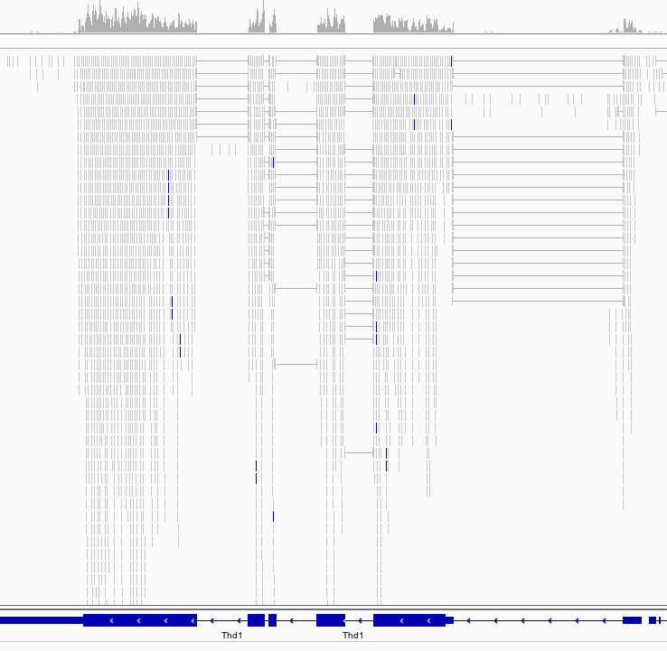
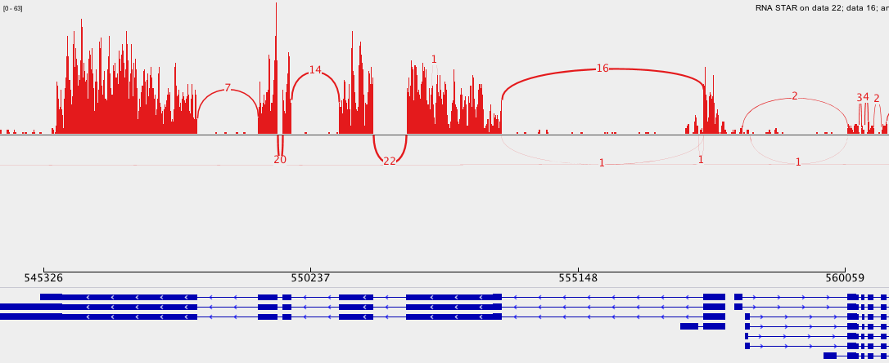
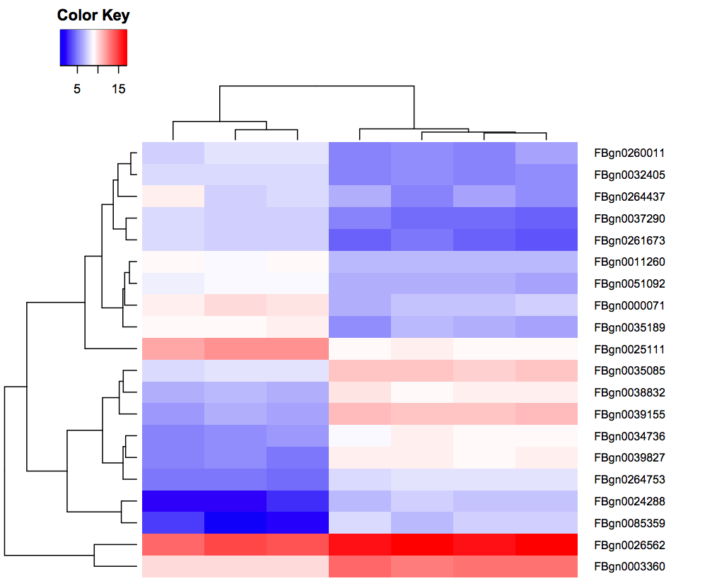

# イントロダクション
{:.no_toc}

[Brooks *et al.* 2011](https://www.ncbi.nlm.nih.gov/pmc/articles/PMC3032923/) の研究によると、 *Pasilla* (*PS*) 遺伝子、ヒトスプライシング調節因子 Nova-1 および Nova-2 タンパク質の*ショウジョウバエ*の相同体は、*キイロショウジョウバエ*の RNAi により欠乏しました。筆者らは、RNA シークエンシングのデータを用いて *Pasilla* 遺伝子によって調節されるエキソンを同定しようとしました。

全 RNA を単離し処理した（PS を欠乏させた）サンプルと未処理のサンプルについてシングルエンドとペアエンドの RNA-seq ライブラリーのいずれかを調整するために使用しました。これらのライブラリーをシークエンシングして各サンプルの RNA シークエンシングリードのコレクションを取得しました。そしてスプライシング現象による *Pasilla* 遺伝子の欠乏の影響を、処理した（PS を欠乏させた）サンプルと未処理のサンプルの RNA シークエンシングデータを比較することで解析することができます。

*キイロショウジョウバエ*のゲノムは既知でありアセンブリされています。この解析を容易にするためにリファレンスゲノムとして利用することができます。リファレンスベースの RNA-seq データ解析では、転写産物を再編成する能力を大幅に改善しそしていくつかの条件の間で発現の差異を同定するために、リードを*キイロショウジョウバエ*のリファレンスゲノムに対してアラインメント（またはマッピング）する。

> ### Agenda
>
> このチュートリアルでは、以下のことを行います:
>
> 1. TOC
> {:toc}
>
{: .agenda}

# 前処理

## データのアップロード

オリジナルのデータは NCBI の Gene Expression Omnibus (GEO) から受託番号 [GSE18508](https://www.ncbi.nlm.nih.gov/geo/query/acc.cgi?acc=GSE18508) で入手することができます。

最初の7つのサンプルを見てみましょう:

- *Pasilla* (PS) 遺伝子が欠乏した3つの処理サンプル: [GSM461179](https://www.ncbi.nlm.nih.gov/geo/query/acc.cgi?acc=GSM461179), [GSM461180](https://www.ncbi.nlm.nih.gov/geo/query/acc.cgi?acc=GSM461180), [GSM461181](https://www.ncbi.nlm.nih.gov/geo/query/acc.cgi?acc=GSM461181)
- 4つの未処理サンプル: [GSM461176](https://www.ncbi.nlm.nih.gov/geo/query/acc.cgi?acc=GSM461176), [GSM461177](https://www.ncbi.nlm.nih.gov/geo/query/acc.cgi?acc=GSM461177), [GSM461178](https://www.ncbi.nlm.nih.gov/geo/query/acc.cgi?acc=GSM461178), [GSM461182](https://www.ncbi.nlm.nih.gov/geo/query/acc.cgi?acc=GSM461182)

各サンプルは対応する条件（処理か未処理か）に分けて生物学的複製物を構成しています。さらに、処理された2つのサンプルと2つの未処理のサンプルはペアエンドシークエンシング法由来で、残りのサンプルはシングルエンドシークエンシング法由来です。

Sequence Read Archive (SRA) ファイルから配列を抽出し FASTQ ファイルを構築しました。

> ###  ハンズオン: データのアップロード
>
> 1. この RNA-seq チュートリアル用に新しいヒストリーを作成する
> 2. FASTQファイルのペアをインポートする (*例*  `GSM461177_untreat_paired_chr4_R1.fastq` と `GSM461177_untreat_paired_chr4_R2.fastq`)
>     * オプション 1: 利用可能な場合は（インストラクターにお尋ねください）共有データライブラリから
>     * オプション 2: [Zenodo](https://dx.doi.org/10.5281/zenodo.290221) から
>
>           > ###  Tip: リンクからデータをインポートする
>           >
>           > * リンクの場所をコピーする
>           > * Galaxy Upload Manager を開く
>           > * **Paste/Fetch Data** を選択する
>           > * リンクをテキストフィールドにペーストする
>           > * **Start** を押す   
>           {: .tip}
>           
>           以下から直接ペーストすることができます:
>
>           ```
>           https://zenodo.org/record/1185122/files/GSM461177_1.fastqsanger
>           https://zenodo.org/record/1185122/files/GSM461177_2.fastqsanger
>           https://zenodo.org/record/1185122/files/GSM461180_1.fastqsanger
>           https://zenodo.org/record/1185122/files/GSM461180_2.fastqsanger
>           ```
>
> 3. サンプルごとにデータセットの名前を変更する
> 4. データタイプが `fastqsanger` であることを確認する（ `fastq` では**ありません**）。
>    データタイプが `fastq` の場合は、ファイルタイプを `fastqsanger` に変更してください。
>
>    > ###  Tip: データタイプを変更する
>    > * ヒストリーのデータセットに表示されている鉛筆ボタンをクリックする
>    > * 上部にある **Datatype** を選択する
>    > * `fastqsanger` を選択する
>    > * **Save** を押す
>    {: .tip}
>
> 5. 各データベースにサンプル名に対応するタグを追加する (`#GSM461177` または `#GSM461180`)
>
>    > ###  Tip: タグを追加する
>    > * データセットをクリックする
>    > * <i class="fa fa-tags"></i> **Edit dataset tags** をクリックする
>    > * `#` で始まるタグを追加する
>    >    
>    >     `#` で始まるタグはこのデータセットを使うことでツールのアウトプットに自動的に伝播されます。
>    >  
>    > * タグがデータセット名の下に表示されていることを確認してください
>    >
>    {: .tip}
{: .hands_on}

この配列はシークエンシング機からの生データであり、前処理を何もしていません。これらのデータは質のために評価する必要があります。

## クオリティコントロール

クオリティコントロールに関しては、[NGS-QC tutorial]({{site.baseurl}}/topics/sequence-analysis) に記載されている同様のツールを使用します: [FastQC](https://www.bioinformatics.babraham.ac.uk/projects/fastqc/) と [Trim Galore](https://www.bioinformatics.babraham.ac.uk/projects/trim_galore/) 。

> ###  ハンズオン: クオリティコントロール
>
> 1. **FastQC** : FASTQ ファイルで FastQC を実行してリードのクオリティをコントロールする
>       - "Short read data from your current history"
>           - "Multiple datasets" をクリックする
>           - 全ての生データを選択する
>
>       > ###  Tip
>       >
>       > CTRL（または COMMAND）キーを押しながら興味のあるファイルをクリックすると複数のファイルを選択できます
>       {: .tip}
>
> 2. 生成された `GSM461177_1` サンプルのウェブページを調べましょう
>
>    > ###  Questions
>    >
>    > リードの長さは何ですか？
>    >
>    >    > ###  Solution
>    >    >
>    >    > リードの長さは 37 bp です
>    >    >
>    >    {: .solution}
>    >
>    {: .question}
>
> 3. **MultiQC** : で次の設定で FastQC のレポートを集計する
>      - "Which tool was used generate logs?" → `FastQC`
>      - "Type of FastQC output?" → `Raw data`
>      - "FastQC output" には生成された `Raw data` ファイル (multiple datasets) を選択する
>
> 4. MultiQC のアウトプットであるウェブページを調べましょう
>
>    > ###  Questions
>    >
>    > それぞれのファイルの配列のクオリティはどうですか？
>    >
>    >    > ###  Solution
>    >    >
>    >    > 3つのファイルは全て正常のようです。しかし GSM461180_2 では、末端の配列でクオリティがかなり低下するようです。
>    >    >
>    >    {: .solution}
>    >
>    {: .question}
>
> 2. **Trim Galore** : Trim Galore! を実行して配列のクオリティを扱いましょう
>      - "Is this library paired- or single-end?" → `Paired-end`
>      - 1つ目の "Reads in FASTQ format" には `_1` の fastqsanger データセットを両方とも選択する (multiple datasets)
>      - 2つ目の "Reads in FASTQ format" には `_2` の fastqsanger データセットを両方とも選択する(multiple datasets)
>
>    > ###  Questions
>    >
>    > Trim Galore! において各データセットで1回ずつの2回実行するのではなく、ペアエンドデータセットで一度だけ実行するのは何故ですか？
>    >
>    >    > ###  Solution
>    >    >
>    >    > Trim Galore はトリミング処理中に配列が短すぎると配列を除去することができます。ペアエンドファイルでは Trim Galore! は、2つのリードの一方（または両方）が設定された長さのカットオフよりも短くなった場合、全配列対を除去します。指定した閾値よりも長いものの、対となるリードがとても短い場合のペアリードの読み取りはオプションとしてシングルエンドのファイルに書き込むことができます。これにより1つのリードさえクオリティが良ければ、ペアリードの情報が完全に失われないことが保証されています。
>    >    >
>    >    {: .solution}
>    >
>    {: .question}
>
{: .hands_on}

*キイロショウジョウバエ*のゲノムは既知でありアセンブリされているため、この情報を使ってこのゲノム上の配列をマッピングしてスプライシング現象による *Pasilla* 遺伝子の欠乏の影響を同定することができます。

# マッピング

リードを理解するために、これらのリードがどの遺伝子に属しているかを決定する必要があります。最初のステップでは*キイロショウジョウバエ*のゲノム内での位置を明らかにしましょう。このプロセスではリードをリファレンスにアラインメントまたは 'マッピング' することとして知られている。

> ###  Comment
>
> マッピングの原理についてもっと学びたいですか？私たちの [トレーニング]({{site.baseurl}}/topics/sequence-analysis/) を見てみましょう。
{: .comment}

真核生物の転写産物の場合、ほとんどのリードはイントロンのないプロセシングされた mRNAs に由来しているため、通常は DNA データのように単純にゲノムをマッピングすることはできません。代わりにリードを2つのカテゴリーに分ける必要があります:

- エキソン内で完全にマッピングされるリード
- 2つ以上のエキソンにまたがるためエキソン内の全長にわたってマッピングすることができないリード

")

スプライスマッパーは転写物のリードをゲノムに対して効率的にマッピングするために開発されています:

 identification of the reads spanning a single exon, (2) identification of the splicing junctions on the unmapped reads")

> ###  スプライスマッパーのそれぞれの違いについての詳細
>
> RNA-seq のデータが爆発的に増加する中で数年にわたっていくつかのスプライスマッパーが開発されました。
>
> [TopHat](https://ccb.jhu.edu/software/tophat/index.shtml) ([Trapnell et al, Bioinformatics, 2009](https://academic.oup.com/bioinformatics/article/25/9/1105/203994)) はこの問題を処理するために特化して設計された最初のツールの1つです。TopHat のリードはゲノムに対してマッピングされ、次の2つのカテゴリに分けられます: (1) マッピングされるもの (2) 最初にマッピングされなかったもの (IUM)。潜在的にエキソン部分となるリードの "Piles" は潜在的に供与体または受容体となるスプライス部位を探索することで拡張され潜在的なスプライス結合部が再構築されます。IUM はこれらの接合部にマッピングされる。
>
>    ")
>
> TopHat は後に TopHat2 を開発し改良されました ([Kim et al, Genome Biology, 2013](https://genomebiology.biomedcentral.com/articles/10.1186/gb-2013-14-4-r36)):
>
>    ")
>
> スプライスされたリードのアラインメントをさらに最適化して高速化するために Kim ら ([Nat Methods, 2015](https://www.nature.com/articles/nmeth.3317)) は [HISAT](https://ccb.jhu.edu/software/hisat2/index.shtml) を開発しました。それは1つのグローバルゲノムワイドインデックスと ~48,000 個のローカルオーバーラッピング 42 kb インデックス（HISAT2 では ~55,000 個の 56 kb インデックス）のコレクションからなる [FM-indices](https://en.wikipedia.org/wiki/FM-index) のセットを使用しています。これによりグローバルインデックスを用いてゲノム内の潜在的なリードのアラインメントの初期シード位置を見つけてローカルインデックスを用いてこれらのアラインメントを迅速に精製することができます:
>
>    ")
>
> 一部のリード（青色の矢印）はまずグローバル FM インデックスを使用してゲノムにマッピングされます。次に HISAT はゲノム配列（紫色の矢印）を直接利用してアラインメントを延ばそうとします。図 (**a**) ではそれが成功していて、リードは完全にエキソン内にあるようにアラインメントされています。図 (**b**) では Extension に不一致があります。ここで HISAT はこの位置と重なるローカル FM インデックスを利用して、このリードの余りの部分（緑色の矢印）に一致するマッピングを探します。図 (**c**) では2つの方法の組み合わせを示しています: リードの開始はグローバル FM インデックス（青色の矢印）を使用してマッピングされ、エキソンの末端（紫色の矢印）に達するまで延長されて、ローカル FM インデックス（緑色の矢印）を使用してマッピングされてそして再び延長されます（紫色の矢印）。
>
> [STAR aligner](https://github.com/alexdobin/STAR) は非圧縮の [suffix array](https://en.wikipedia.org/wiki/Suffix_array) を使用してゲノムに対して RNAseq のリードをマッピングするために高速で置き換えるツールです。それは2つの段階によって行われます [Dobin et al, Bioinformatics, 2013](https://academic.oup.com/bioinformatics/article/29/1/15/272537)。第一段階ではシード検索を実行します:
>
>    ")
>
> ここでは2つの連続したエキソン間でリードを分割しています。STAR ではリードの開始位置からそれがもはや連続して一致しなくなるまで maximum mappable prefix（MMP）を探します。その後 After this point it start to MMP for the unmatched portion of the read (**a**). In the case of mismatches (**b**) and unalignable regions (**c**) MMPs serve as anchors from which to extend alignments </p>
>
> 第二段階では STAR は MMP とstitchesして（MMP とは反対に）ミスマッチや挿入欠失を含むことができるリードレベルのアラインメントを生成します。スコアリングスキームはstitchingの組み合わせを評価して優先順位付けをしたり複数の位置にマッピングするリードを評価するために使用されます。STAR は非常に高速ですが効率的に実行するには相当量の RAM が必要です。
>
{: .details}

## マッピング

STAR を使用して RNA のリードを *キイロショウジョウバエ* のゲノムにマッピングします。

> ###  ハンズオン: スプライスマッピング
>
> 1. *キイロショウジョウバエ* の Ensembl 遺伝子のアノテーション (`Drosophila_melanogaster.BDGP6.87.gtf`) を共有データライブラリまたは [Zenodo](https://doi.org/10.5281/zenodo.1185122) から現在の Galaxy のヒストリーへインポートする。
>    - 必要であればデータセットの名前を変更する
>    - データタイプが `gff` ではなく `gtf` であることを確認する
>
> 2. **RNA STAR** : リファレンスゲノムにリードをマッピングする
>    - "Single-end or paired-end reads" → `Paired-end (as individual datasets)`
>    - "RNA-Seq FASTQ/FASTA file, forward reads" には生成された `trimmed reads pair 1` ファイルを選択する (multiple datasets)
>    - "RNA-Seq FASTQ/FASTA file, reverse reads" には生成された `trimmed reads pair 2` ファイルを選択する (multiple datasets)
>    - "Custom or built-in reference genome" → `Use a built-in index`
>    - "Reference genome with or without an annotation" → `use genome reference without builtin gene-model`
>    - "Select reference genome" → `Drosophila Melanogaster (dm6)`
>    - "Gene model (gff3,gtf) file for splice junctions" にはインポートした `Drosophila_melanogaster.BDGP6.87.gtf` を選択する
>    - "Length of the genomic sequence around annotated junctions" → `36`
>
>        This parameter should be length of reads - 1
>
> 3. **MultiQC** : STAR のログを集計する
>      - "Which tool was used generate logs?" → `STAR`
>      - "Type of FastQC output?" → `Log`
>      - "STAR log output" には生成された `log` ファイルを選択する (multiple datasets)
>
>    > ###  Question
>    >
>    > 両方のサンプルにおいて正確に1回マッピングされたリードの割合はどれですか？
>    >
>    >    > ###  Solution
>    >    >
>    >    > GSM461177 では83％以上、GSM461180 では78％以上です
>    >    >
>    >    {: .solution}
>    >
>    {: .question}
{: .hands_on}

**STAR** はマッピングされたリードを含む BAM ファイルを生成します。

> ###  Question
>
> 1. BAM ファイルとはなんですか？
> 2. そのようなファイルには何が含まれていますか？
>
>    > ###  Solution
>    >
>    > 1. BAM ファイルは SAM ファイルのバイナリーバージョンです
>    > 2. このファイルにはマッピングに関する情報を含んでいます: それぞれのマッピングされたリードに関する情報や、リファレンスゲノムの位置についてや、マッピングのクオリティ、などなど
>    >
>    {: .solution}
{: .question}

## マッピングの結果を検査する

BAM ファイルにはリファレンスゲノム上でマッピングされたリードの位置に関する情報が含まれています。しかしそれはバイナリーファイルでその中に3百万以上のリードの情報がエンコードされているため、ファイルを検査して調べることは困難です。

Integrative Genomics Viewer IGV は BAM ファイルの内容を視覚化するための強力なツールです。

> ###  ハンズオン: マッピングの結果を検査する
>
> 1. **IGV** : `GSM461177` に割り当てられたリードを視覚化する
>     - ヒストリーにある STAR の BAM アウトプットをクリックして展開する
>     - ヒストリー項目の下部に向かって、`Display with IGV` で始まる行を探す
>        
>        これには2つのリンクがあります:
>        - option 1: `local`. あなたのマシンにすでに IGV がインストールされている場合は、このオプションを選択してください
>        - option 2: `D. melanogaster (dm3)`. これはローカルマシン上で IGV をダウンロードして起動します
>
>    > ###  Comments
>    >
>    > このステップを実行するには、マシンに IGV または [Java web start](https://www.java.com/en/download/faq/java_webstart.xml) がインストールされている必要があります。
>    > しかしながら、このセクションの質問は下記の IGV のスクリーンショットを調べることでも答えることができます。
>    >
>    > 詳細については [IGV documentation](https://software.broadinstitute.org/software/igv/AlignmentData) を参照してください。
>    >
>    {: .comment}
>
> 2. **IGV** : `chr4:540,000-560,000`（４番染色体の540 kb から560 kb 間）にズームする
>
>    > ###  Question
>    >
>    > 
>    >
>    > 1. トップの灰色の部分はどんな情報を表示しているのですか？
>    > 2. 整列されたいくつかのリードの間にある接続線は何を示しているのですか？
>    >
>    >    > ###  Solution
>    >    >
>    >    > 1. カバレッジプロット: 各位置でのマッピングされたリードの合計
>    >    > 2. それらは junction events （またはスプライス部位）、*即ち*、イントロンを介してマッピングされるリードを示しています
>    >    >
>    >    {: .solution}
>    {: .question}
>
> 3. **IGV** : **Sashimi plot** を使用してスプライス接合部を検査する
>
>    > ###  Tip: Sashimi plot を作成する
>    >
>    > * BAM ファイルを右クリックする
>    > * コンテキストメニューから **Sashimi Plot** を選択する
>    {: .tip}    
>
>    > ###  Question
>    >
>    > 
>    >
>    > 1. 縦棒グラフは何を表していますか？また数字が振られている円弧は何を表していますか？
>    > 2. 円弧の数字はどういう意味ですか？
>    > 3. なぜ下部にある青色のリンクボックスの異なるスタックグループを観察するのですか？
>    >
>    >    > ###  Solution
>    >    >
>    >    > 1. 各アラインメントトラックのカバレッジは棒グラフとしてプロットされます。円弧は観察されたスプライス部位、*即ち*、reads spanning introns を表しています
>    >    > 2. この数字はこれらの観察されたジャンクションリードの数を示しています。
>    >    > 3. 下のリンクボックスのグループは関与するエキソンが異なる単一遺伝子からの異なる転写産物を表しています。
>    >    >
>    >    {: .solution}
>    {: .question}
>
>    > ###  Comment
>    >
>    > [IGV documentation on Sashimi plots](https://software.broadinstitute.org/software/igv/Sashimi) をチェックしていくつかの手がかりを見つけてください
>    {: .comment}
>
{: .hands_on}

マッピングの後は、私たちはリファレンスゲノム上のどこにリードがあるかに関する情報を持っています。 また、どのようにマッピングされているかもわかります。

RNA-Seq データ解析の次のステップは異なる発現解析のためにいくつかのサンプルを比較できるようにゲノムの特徴（遺伝子、転写産物、エキソン、など）の発現レベルを定量化することです。定量化はリファレンスゲノムの既知の各ゲノム特徴（*例えば* 遺伝子）を取得してそしてこのゲノムの特徴にマッピングされたリードの数を数えることで行います。したがって、このステップでは、 we start with an information per mapped reads to end with an information per genomic feature.

> ###  Comment
>
> 定量化は、リファレンスゲノムのゲノム特徴の定義に依存していて、次にアノテーションに依存しています。マッピングに使用したリファレンスゲノムと同じバージョンのアノテーションを使用することを強くお勧めします。
{: .comment}

*Pasilla* 遺伝子によって制御されるエキソンを同定するためには、PS 遺伝子が欠乏したサンプルとコントロールのサンプルとの間で差次的に発現される遺伝子やエキソンを同定する必要があります。
このチュートリアルでは、差次的な遺伝子発現の解析だけでなく、異なるエキソンの使用法についても分析します。

マッピングのエキササイズはあなたにとって役に立ちましたか？よかったです！ :tada:

# 差次的な遺伝子発現の解析

私たちははじめに差次的な遺伝子発現を調べて *Pasilla* 遺伝子の欠乏によってどの遺伝子が影響を受けるかを同定します

## アノテーションされた遺伝子あたりのリード数を数える

異なる条件（*例えば* PS の欠乏の有無）の間での単一遺伝子の発現を比較するために、本質的な第一のステップでは遺伝子あたりのリード数を定量化します。


そのために2つの主要なツールを使うことができます: [HTSeq-count](http://htseq.readthedocs.io/en/release_0.9.1/count.html) ([Anders et al, Bioinformatics, 2015](https://academic.oup.com/bioinformatics/article/31/2/166/2366196)) または featureCounts ([Liao et al, Bioinformatics, 2014](https://academic.oup.com/bioinformatics/article/31/2/166/2366196)) の2つです。2つ目のツールはかなり高速であり、計算のリソースがはるかに少ないです。私たちはこの2つ目のツールを使用します。

原理としては、ゲノム特徴と重複するリードを数えることはかなり単純な作業です。しかし featureCounts を行うためにいくつかの細かい情報が必要になります: 例えばストランド性など

### ストランド性の推定

RNAseq 実験において典型的に標的とされる RNA は一本鎖（*例えば* mRNA）であり、そして極性（機能的に異なる5'および3'末端）を持っています:


典型的な RNAseq の実験の間、cDNA の両方のストランドが合成され、サイズが選択され、シークエンスのライブラリーに変換された後に、ストランド性に関する情報は失われてしまいます。しかしながら、この情報はリードを数える際に非常に役に立ちます。

いくつかのライブラリー調製プロトコルではストランドの情報を保存する *stranded* RNAseq ライブラリーと呼ばれるものを作成する (an excellent overview in [Levin et al, Nat Meth, 2010](https://www.ncbi.nlm.nih.gov/pmc/articles/PMC3005310/))。Stranded RNAseq の意味はリードがフォワードまたはリバースのどちらからコードされた転写産物によるものなのかを区別できるということです:

")

アプローチによって、そしてシングルエンドかペアエンドのシークエンスのどちらを実行するかによって、これらのリードをゲノムにマッピングした結果をどのように解釈するかについては複数の可能性があります:

")

実際には、Illumina paired-end RNAseq プロトコルでは、これらの可能性の多くを明らかにすることはまずありません。あなたは次のどちらかを扱います:

- Unstranded RNAseq データ
- Illumina TrueSeq RNAseq キットと [dUTP tagging](https://nar.oxfordjournals.org/content/37/18/e123) (**ISR**) で生成された Stranded RNAseq データ

この情報には通常 FASTQ ファイルが伴っているはずなので、簡単にあなたのシークエンスを確かめてください！そうでない場合は、データをダウンロードしたサイトまたは対応するパブリケーションを調べてみてください。

もう1つの選択肢としては **Infer Experiment** と呼ばれるツールを使用してこれらのパラメーターを推定することです。このツールはマッピングのアウトプット（BAM ファイル）を取り込んで、リードのサブサンプルを取り、ゲノム座標と（アノテーションファイルからの）リファレンス遺伝子モデルのストランドを比較します。遺伝子のストランドに基づいて、シークエンスがストランドに特異的であるかどうかを測定することができ、これより、リードがどのように stranded であるかを測定することができる。

> ###  ハンズオン: ライブラリーのストランドを決定する
>
> 1. **Infer Experiment** : ライブラリーのストランドを決定する:
>    - "Input .bam file" には STAR で生成された `BAM` ファイルを選択する (multiple datasets)
>    - "Reference gene model" → `Drosophila_melanogaster.BDGP6.87.gtf`
>    - "Number of reads sampled from SAM/BAM file (default = 200000)" → `200000`
{: .hands_on}

このツールでは以下の1つのファイルを生成します:
- ペアエンドまたはシングルエンドのライブラリー
- 決定できなかったリードの割合
- 2 lines
    - シングルエンドでは
        - "++,--" (前の図での **SF**)で説明されるリードの割合
        - "+-,-+" (前の図での **SR**)で説明されるリードの割合
    - ペアエンドでは
        - "1++,1--,2+-,2-+" (前の図での **SF**)で説明されるリードの割合
        - "1+-,1-+,2++,2--" (前の図での **SR**)で説明されるリードの割合

最後の2行の割合がお互いに近すぎる場合、これはライブラリーがストランド特異的なデータセットではないと結論付けます（前の図の **U**）。

> ###  Question
>
> 1. `GSM461177` はどのライブラリータイプを想定してどのBAMファイルのリードの割合を説明できるのでしょうか？
> 2. 両方のサンプルにはどのライブラリータイプを選択しますか？
>
>    > ###  Solution
>    >
>    > 1. Fraction of reads explained by "1++,1--,2+-,2-+": 0.4648 - Fraction of reads explained by "1+-,1-+,2++,2--": 0.4388
>    > 2. The library seems to be of the type unstranded for both samples.
>    {: .solution}
{: .question}

> ###  Comment
> どの設定がほかのプログラムに対応しているのかを知るのは非常に難しい場合があるので、次の表がライブラリータイプを識別するのに役立ちます:
>
> ライブラリータイプ | **Infer Experiment** | **TopHat** | **HISAT2** | **htseq-count** | **featureCounts**
> --- | --- | --- | --- | --- | ---
> ペアエンド (PE) - SF | 1++,1--,2+-,2-+ | FR Second Strand | Second Strand F/FR | yes | Forward (1)
> PE - SR | 1+-,1-+,2++,2-- | FR First Strand | First Strand R/RF | reverse | Reverse (2)
> シングルエンド (SE) - SF | ++,-- | FR Second Strand | Second Strand F/FR | yes | Forward (1)
> SE - SR | +-,-+ | FR First Strand | First Strand R/RF | reverse | Reverse (2)
> PE, SE - U | undecided | FR Unstranded | default | no | Unstranded (0)
>
{: .comment}

### Counting

**featureCounts** を実行してアノテーション遺伝子あたりのリード数を数えます。

> ###  ハンズオン: アノテーション遺伝子あたりのリード数を数える
>
> 1. **featureCounts** : **featureCounts** 使用して遺伝子あたりのリード数を数える
>    - "Alignment file" には STAR で生成された `BAM` ファイルを選択する (multiple datasets)
>    - "Gene annotation file" → `GTF file`
>    - "Gene annotation file" → `in your history`
>    - "Gene annotation file" → `Drosophila_melanogaster.BDGP6.87.gtf`
>    - "Output format" → `Gene-ID "\t" read-count (DESeq2 IUC wrapper compatible)`
>    - "Advanced options" をクリックする
>    - "GFF feature type filter" → `exon`
>    - "GFF gene identifier" → `gene_id`
>    - "Allow read to contribute to multiple features" → `No`
>    - "Strand specificity of the protocol" → `Unstranded`
>    - "Count multi-mapping reads/fragments" → `Disabled; multi-mapping reads are excluded (default)`
>    - "Minimum mapping quality per read" → `10`
>
> 2. **MultiQC** : Aggregate the FastQC report with
>      - "Which tool was used generate logs?" → `featureCounts`
>      - "Output of FeatureCounts" には生成された `summary` ファイルを選択する (multiple datasets)
>
>    > ###  Question
>    >
>    > 遺伝子にはいくつのリードが割り当てられていますか？
>    >
>    >    >###  Solution
>    >    >
>    >    > リードの約70%が遺伝子に割り当てられています: これは十分な量です。もし50%を下回っている場合は、どこにリードがマッピングされているのかを（IGV を使用して）調べてアノテーションがリファレンスゲノム（version）に対応しているかを確認する必要があります。
>    >    >
>    >    {: .solution}
>    {: .question}
>
{: .hands_on}

**featureCounts** の主なアウトプットは大きな表です。

> ###  Question
>
> 1. 生成されたテーブルファイルにはどのような情報が含まれていますか？
> 2. Which feature has the most reads mapped on it for both samples?
>
>    > ###  Solution
>    >
>    > 1. 有用な結果のファイルは2つのカラムを持つ表形式のファイルです: 遺伝子 ID と対応する遺伝子にマッピングされたリードの数
>    > 2. 最も豊富に検出されたfeatureを表示するには、featureとそれにマッピングされたリードの数でファイルをソートする必要があります。これは２列目を降順でソートするツールを使用することで行うことができ、 which reveals that FBgn0000556 is the feature with the most reads (around 258,000 in GSM461177 and 253,000 in GSM461180) mapped on it.
>    >
>    {: .solution}
{: .question}

## 差次的に発現された特徴の同定

前のセクションでは、２つのサンプルの遺伝子にマッピングされたリードを数えました。PS の欠乏によって誘導された差次的に発現された遺伝子を同定することができるためには、すべてのデータセット（3つの処理と4つの未処理）で同じ手順および全ゲノムで解析を行わなければなりません。

> ###  (Optional) ハンズオン: 他のデータセットで再実行する
>
> [Zenodo](https://doi.org/10.5281/zenodo.1185122) で利用できる他の配列ファイルに対しても同じ手順を行うことができます
>
> - ペアエンドのデータ
>     - `GSM461178_1` と `GSM461178_2`
>     - `GSM461181_1` と `GSM461181_2`
> - シングルエンドのデータ
>     - `GSM461176`
>     - `GSM461179`
>     - `GSM461182`
>
> 他のデータセットで再実行することは本当に興味深く、特に異なるタイプのデータが与えられた場合どのようにパラメーターが推測されているか確認することが重要です。
{: .hands_on}

時間を節約するために、必要なステップを実行した7つのカウントファイルを [Zenodo](https://doi.org/10.5281/zenodo.1185122) で入手できるようにしました。

これらのファイルには*ショウジョウバエ*の遺伝子ごとにマッピングされたリードの数が含まれています。ファイルを直接比較して差次的に発現する遺伝子の程度を計算することができますが、しかし遺伝子にマッピングされたシークエンスしたリードの数は以下に依存しています:

- それら自身の発現レベル
- それらの長さ
- サンプルのシークエンス深度
- サンプル内の他のすべての遺伝子の発現

サンプル間またはサンプル内の比較のために、遺伝子数を正規化する必要がある。そこで差次的な遺伝子発現（DGE）を使用することができ、それらは以下の基本的な2つのタスクからなります:

- 各条件の反復を使用して生物学的な分散を推定する
- 任意の2つの条件の間での発現差の有意性を推定する

この発現解析はリードカウントから推定され、正確な結果には絶対不可欠な複製を使用して測定値のばらつきを補正するように試みます。あなた自身の解析のために、条件ごとに少なくとも3回、できるなら5回は生物学的な反復を使用することをアドバイスします。条件ごとに異なる数の複製を作成できます。

[**DESeq2**](https://bioconductor.org/packages/release/bioc/html/DESeq2.html) は DGE 解析のための素晴らしいツールです。これは以前に生成されたリードカウントを取ってきて、それらを大きな表（行に遺伝子を含み列にサンプルを含む）に結合してサイズファクターを正規化して適用します:

- 全サンプルにわたるリードカウントでの各遺伝子の幾何平均の計算
- 幾何平均による各遺伝子数の除算
- 正規化のためのサンプルのサイズファクターとしてこれらの比の中央値を使用する

いくつかのレベルでの複数のファクターを解析に組み込むことができます。正規化の後、統計的に信頼できる方法で、異なるレベルのファクターの存在に対する任意の遺伝子の発現の応答を比較することができます。

今回の例では、遺伝子発現の違いを説明できる2つの異なるファクターを有するサンプルがあります:

- 処理 (処理か未処理のどちらか)
- シークエンスのタイプ (ペアエンドまたはシングルエンド)

ここでは処理の有無が興味を持っていることに対する主なファクターとなります。シークエンスのタイプは解析に影響を与える可能性のあるデータについて私たちが知っているさらに詳しい情報になります。この特定のマルチファクター解析により、シークエンスのタイプを考慮に入れながら、処理の効果を評価することができます。

> ###  Comment
>
> あなたが実験する際は遺伝子発現に影響を及ぼすと考えているいくつかのファクターを追加することをお勧めします。ここで説明したようなシークエンスのタイプも、複雑な操作（他の人がライブラリーの準備に関わっている場合など、、、）でも入れることができます。
{: .comment}

> ###  ハンズオン: 差次的に発現した特徴を決定する
>
> 1. 新しいヒストリーを作成する
> 2. 7つのカウントファイルを [Zenodo](https://doi.org/10.5281/zenodo.1185122) またはデータライブラリーからインポートする
>    - `GSM461176_untreat_single.counts`
>    - `GSM461177_untreat_paired.counts`
>    - `GSM461178_untreat_paired.counts`
>    - `GSM461179_treat_single.counts`
>    - `GSM461180_treat_paired.counts`
>    - `GSM461181_treat_paired.counts`
>    - `GSM461182_untreat_single.counts`
>
> 3. **DESeq2** : **DESeq2** を次のように実行する:
>    - For "1: Factor"
>       - "Specify a factor name" → `Treatment`
>       - "1: Factor level"
>           - "Specify a factor level" → `treated`
>           - "Counts file(s)" には名前に `treated` が入っている3つの遺伝子のカウントファイル (multiple datasets) を選択する
>       - "2: Factor level"
>           - "Specify a factor level" → `untreated`
>           - "Counts file(s)" には名前に `untreated` が入っている4つの遺伝子のカウントファイル (multiple datasets) を選択する
>    - "Insert Factor" ("Insert Factor level" ではありません) をクリックする
>    - For "2: Factor"
>       - "Specify a factor name" → `Sequencing`
>       - "1: Factor level"
>           - "Specify a factor level" → `PE`
>           - "Counts file(s)" には名前に `paired` が入っている生成したカウントファイル (multiple datasets) を選択する
>       - "2: Factor level"
>           - "Specify a factor level" → `SE`
>           - "Counts file(s)" には名前に `single` が入っている生成したカウントファイル (multiple datasets) を選択する
>    - "Output normalized counts table" → `Yes`
{: .hands_on}

**DESeq2** では3つのアウトプットを生成します

- 各遺伝子（行）と各サンプル（列）の正規化カウントの表
- 実験のクオリティを評価するのに役に立つ、結果の図式的な要約:

    1. すべてのテストにおける *p* 値のヒストグラム
    2. [MA plot](https://en.wikipedia.org/wiki/MA_plot): global view of the relationship between the expression change of conditions (log ratios, M), the average expression strength of the genes (average mean, A), and the ability of the algorithm to detect differential gene expression. The genes that passed the significance threshold (adjusted p-value < 0.1) are colored in red.
    3. Principal Component Analysis ([PCA](https://en.wikipedia.org/wiki/Principal_component_analysis)) and the first two axes

        各複製は個々のデータポイントとしてプロットされます。このタイプのプロットは実験的共変量とバッチ効果の全体的な効果を視覚化するのに役立ちます。

        > ###  Questions
        >
        > 1. What is the first axis separating?
        > 2. And the second axis?    
        >
        >    > ###  Solution
        >    >
        >    > 1. The first axis is seperating the treated samples from the untreated samples, as defined when DESeq2 was launched
        >    > 2. The second axis is separating the single-end datasets from the paired-end datasets
        >    {: .solution}
        {: .question}


    4. サンプル間の距離行列のヒートマップ: サンプル間の類似度と非類似度の概要

        > ###  Questions
        >
        > How are the samples grouped?
        >
        >    > ###  Solution   
        >    > They are first grouped depending on the treatment (the first factor) and after on the library type (the second factor), as defined when DESeq2 was launched
        >    >
        >    {: .solution}
        {: .question}

    5. 分散の推定: 遺伝子に基づく推定値（黒色）、適合値（赤色）、そしてテストで使用された最終最大事後推定値（青色）

        この分散プロットは典型的なものであり、最終推定値は This dispersion plot is typical, with the final estimates shrunk from the gene-wise estimates towards the fitted estimates. Some gene-wise estimates are flagged as outliers and not shrunk towards the fitted value. The amount of shrinkage can be more or less than seen here, depending on the sample size, the number of coefficients, the row mean and the variability of the gene-wise estimates.

- Summary ファイルは各遺伝子について次の値を有しています

    1.  遺伝子のID
    2.  両方の条件からすべてのサンプルにわたって平均した、平均正規化カウント
    3.  Logarithm (to basis 2) of the fold change

        The log2 fold changes are based on primary factor level 1 vs. factor level 2, hence the order of factor levels is important. For example, for the factor 'Treatment', DESeq2 computes fold changes of 'treated' samples against 'untreated', *i.e.* the values correspond to up- or downregulation of genes in treated samples.

    4.  Standard error estimate for the log2 fold change estimate
    5.  [Wald](https://en.wikipedia.org/wiki/Wald_test) statistic
    6.  *p*-value for the statistical significance of this change
    7.  *p*-value adjusted for multiple testing with the Benjamini-Hochberg procedure which controls false discovery rate ([FDR](https://en.wikipedia.org/wiki/False_discovery_rate))

> ###  Comment
>
> For more information about **DESeq2** and its outputs, you can have a look at [**DESeq2** documentation](https://www.bioconductor.org/packages/release/bioc/manuals/DESeq2/man/DESeq2.pdf).
{: .comment}

## 差次的に発現する遺伝子の可視化

今から、最も差次的に発現された遺伝子のための各サンプルの正規化されたカウントのヒートマップを描きたいと思います。

私たちは次のいくつかのステップを進めます
- DESeq2 の summary ファイルを使用して最も差次的に発現した遺伝子を抽出する
- DESeq2 によって生成された正規化のカウントファイルを使用して各サンプルについてこれらの遺伝子の正規化カウントを抽出する
- 各サンプルについてこれらの遺伝子の正規化のカウントのヒートマップをプロットする

> ###  ハンズオン: 最も差次的に発現した遺伝子を抽出する
>
> 1. **Filter** :処理したサンプルと未処理のサンプルとの間で遺伝子発現に有意な差（調整した P 値が0.05未満）がある遺伝子を抽出する 
>    - "Filter" には DESeq2 の summary ファイルを選択する
>    - "With following condition" → `c7<0.05`
>
>    > ###  Question
>    >
>    > これらの条件間で遺伝子発現に有意差がある遺伝子はいくつありましたか？ 
>    >
>    >    > ###  Solution
>    >    >
>    >    > 処理されたサンプルと未処理のサンプルとの間で遺伝子発現の有意差がある遺伝子は 1,091 (6.21%)ありました。 
>    >    >
>    >    {: .solution}
>    {: .question}
>
>    > ###  Comment
>    >
>    > The file with the independent filtered results can be used for further downstream analysis as it excludes genes with only few read counts as these genes will not be considered as significantly differentially expressed.
>    {: .comment}
>
>    生成されたファイルには意味のあるヒートマップを得るための多くの遺伝子が含まれています。So we will take only the genes with an absoluted fold change > 2
>
> 2. **Filter** : Extract genes with an abs(log<sub>2</sub>FC) > 1 (FC stands for "fold change")
>    - "Filter" to the differentially expressed genes
>    - "With following condition" to `abs(c3)>1`
>
>    > ###  Question
>    >
>    > いくつの遺伝子が保存されていますか？ 
>    >
>    >    > ###  Solution
>    >    >
>    >    > 11.92% (130)の差次的に発現する遺伝子が保存されています 
>    >    >
>    >    {: .solution}
>    {: .question}
>
>    まだ遺伝子の数はそれでは多すぎます。したがって私たちは最もアップレギュレートされた10個の遺伝子と最もダウンレギュレートされた10個の遺伝子のみを取り出したいと思います。
>
> 3. **Sort** : Sort the genes by log<sub>2</sub>FC
>    - "Sort Dataset" to the differentially expressed genes with abs(FC) > 2
>    - "on column" to `3`
>    - "with flavor" to `Numerical sort`
>    - "everything in" to `Descending order`
>
> 4. **Select first lines** : 最もアップレギュレートされた10個の遺伝子を抽出する 
>    - "File to select" to the sorted DE genes with abs(FC) > 2
>    - "Operation" to `Keep first lines`
>    - "Number of lines" to `10`
>
> 4. **Select last lines** : 最もダウンレギュレートされた10個の遺伝子を抽出する
>    - "Text file" to the sorted DE genes with abs(FC) > 2
>    - "Operation" to `Keep first lines`
>    - "Number of lines" to `10`
>
> 5. **Concatenate datasets** : 最もアップレギュレートされた10個の遺伝子と最もダウンレギュレートされた10個の遺伝子を連結する
>    - "Datasets to concatenate" to the 10 most up-regulated genes and to the 10 most down-regulated genes
>
{: .hands_on}

私たちは今最も差次的に発現する20行の表を持っています。そして各遺伝子について、そのID、その平均正規化カウント（両条件の全てのサンプルで平均しました）、log<sub>2</sub>FC や他の情報を持っています。

私たちは異なる遺伝子について log<sub>2</sub>FC をプロットすることができましたが、ここでは異なるサンプル内のこれらの遺伝子の配列数をヒートマップで見たいと思います。なのでこれらの遺伝子の配列数を抽出する必要があります。 

DESeq によって生成された正規化されたカウントテーブルを生成されたばかりの表と結合して正規化されたカウントテーブルにおいて最も差次的に発現する遺伝子に対応する行のみを保存します。

> ###  ハンズオン: 異なるサンプルで最も差次的に発現された遺伝子の正規化カウントを抽出する
>
> 1. **Join two Datasets** : Join the two files
>    - "Join" to the normalized count table generated by DESeq2
>    - "using column" to `1`
>    - "with" to the concatenated file with 10 most up-regulated genes and the 10 most down-regulated genes
>    - "and column" to `1`
>    - "Keep lines of first input that do not join with second input" to `No`
>    - "Keep the header lines" to `Yes`
>
>    生成されるファイルは列が多すぎます: 平均正規化カウント、log<sub>2</sub>FC や他の情報です。私たちはそれらを削除する必要があります。 
>
> 2. **Cut** : 正規化されたカウントの列を保存する
>    - "Cut columns" to `c1,c2,c3,c4,c5,c6,c7,c8`
>    - "Delimited by" to `Tab`
>    - "From" the joined dataset
>
{: .hands_on}

今7つのサンプルでの20行（最も差次的に発現した遺伝子）でこれらの遺伝子の正規化されたカウントからなる表があります。 

> ###  ハンズオン: 各サンプルについてこれらの遺伝子の正規化されたカウントのヒートマップをプロットする 
>
> 1. **heatmap2** : 以下の設定でヒートマップをプロットする 
>    - "Input should have column headers" to the generated table
>    - "Advanced - log transformation" to `Log2(value) transform my data`
>    - "Enable data clustering" to `Yes`
>    - "Coloring groups" to "Blue to white to red"
>
{: .hands_on}

以下のようなものを取得する必要があります:



> ###  Questions
>
> 1. あなたはデータの傾向を観察していますか？ 
> 2. What is changing if we select `Plot the data as it is` in "Advanced - log transformation"?
> 3. Can you generate an heatmap the normalized counts for the up-regulated genes with FC > 2?
>
>   > ###  Solution
>   >
>   > 1. サンプルは処理の有無によってクラスタリングされています。遺伝子はカウントに基づいてクラスタリングしています。2 genes (FBgn0026562, FBgn00003360)
>   > 2. The scale is changing and the differences between the genes are not visible anymore
>   > 3. Extract the genes with logFC > 2 (filter for genes with c3>1 on the summary of the differentially expressed genes) and run heatmap2 on the generated table
>   {: .solution}
{: .question}

## 差次的に発現する遺伝子間での機能的豊富さの解析 

私たちは未処理のサンプルと比較して処理された（PS 遺伝子を欠乏させた）サンプルで差次的に発現する遺伝子を抽出しました。ここからは差次的に発現する遺伝子間での機能的な豊富さについて知りたいです。 

[Gene Ontology (GO)](http://www.geneontology.org/) 解析はゲノム分野の発現研究における複雑さを低減し生物学的プロセスを強調するために広く使用されていますが、標準的な手法は長く高度に発現された転写物の差次的な発現を過剰に発現するために RNA-seq データに偏った結果を与えます。 

[goseq tool](https://bioconductor.org/packages/release/bioc/vignettes/goseq/inst/doc/goseq.pdf) は長さのバイアスを考慮して、RNA-seq データの GO 解析を実行する方法を提供します。goseq によって使用される方法やソフトウェアは RNA-seq データの他のカテゴリーに基づくテスト、例えば KEGG 経路解析のようなものにも、等しく適用できます。

goseq needs 2 files as inputs:
- A tabular file with the differentially expressed genes from all genes assayed in the RNA-seq experiment with 2 columns:
    - the Gene IDs (unique within the file)
    - True (differentially expressed) or False (not differentially expressed)
- A file with information about the length of a gene to correct for potential length bias in differentially expressed genes

> ###  ハンズオン: GOSeq 用のデータセットを準備する
>
> 1. **Compute**  with
>    - "Add expression" to `bool(c7<0.05)`
>    - "as a new column to" to DESeq summary file
>
> 2. **Cut**  with
>    - "Cut columns" to `c1,c8`
>    - "Delimited by" to `Tab`
>    - "From" to the previously generated file
>
> 3. **Change Case**  with
>    - "From" to the previously generated file
>    - "Change case of columns" to `c1`
>    - "Delimited by" to `Tab`
>    - "To" to `Upper case`
>
>    goseq の最初のインプットを生成しました。
>
> 4. **Gene length and GC content** with
>    - "Select a built-in GTF file or one from your history" to `Use a GTF from history`
>    - "Select a GTF file" to `Drosophila_melanogaster.BDGP6.87.gtf`
>    - "Select a built-in FASTA or one from your history" to `Use a built-in FASTA`
>    - "Select a FASTA file" to `Fly (キイロショウジョウバエ): dm6 Full`
>    - "Output length file?" to `Yes`
>    - "Output GC content file?" to `No`
>
> 5. **Change Case**  with
>    - "From" to the previously generated file
>    - "Change case of columns" to `c1`
>    - "Delimited by" to `Tab`
>    - "To" to `Upper case`
{: .hands_on}

今 goseq に必須な2つのファイルを持っています。 

> ###  ハンズオン: GO 解析を実行する
>
> 1. **goseq**  with
>    - "Differentially expressed genes file" to first file generated on previous step
>    - "Gene lengths file" to second file generated on previous step
>    - "Gene categories" to `Get categories`
>    - "Select a genome to use" to `Fruit fly (dm6)`
>    - "Select Gene ID format" to `Ensembl Gene ID`
>    - "Select one or more categories" to `GO: Cellular Component`, `GO: Biological Process`, `GO: Molecular Function`
>
{: .hands_on}

goseq は GO term ごとに以下の列をからなる大きな表を生成します:
1. `category`: GO のカテゴリー
2. `over_rep_pval`: 差次的に発現される遺伝子における term の過剰発現の P 値
3. `under_rep_pval`: 差次的に発現される遺伝子における term の過小発現の P 値 
4. `numDEInCat`: このカテゴリーの差次的に発現される遺伝子の数 
5. `numInCat`: このカテゴリーにある遺伝子の数 
6. `term`: term の詳細
7. `ontology`: MF（分子機能 − 遺伝子産物の分子活性）、CC（細胞成分 − 遺伝子産物が活性化している部分です）、BP（生物学的なプロセス − 複数の遺伝子産物の活性からなる経路やより大きなプロセス） 
8. `p.adjust.over_represented`: Benjamini-Hochberg の手順による複数のテストのために調整された、差次的に発現された遺伝子における term の過剰発現の P 値 
9. `p.adjust.under_represented`: Benjamini-Hochberg の手順による複数のテストのために調整された、差次的に発現された遺伝子における term の過小発現の P 値 

To identify categories significantly enriched/unenriched below some p-value cutoff, it is necessary to use the adjusted *p*-value.

> ###  Questions
>
> 1. いくつの GO term が過剰発現されていますか？過小発現されていますか？ 
> 2. How are the over represented GO terms divided between MF, CC and BP? And for under represented GO terms?
>
>   > ###  Solution
>   >   
>   > 1. 48 GO terms (0.49%) are over represented and 65 (0.66%) - Filter on c8 (over-represented) and c9 (under-represented)
>   > 2. For over-represented, 31 BP, 6 CC and 10 MF - For under-represented, 36 BP, 25 CC and 3 MF - Group data on column 7 and count on column 1
>   >
>   {: .solution}
{: .question}

# 差次的なエキソンの使用法を推論する 

次に、RNA-seq でのエキソンのカウントを用いて処理（PS の欠乏）サンプルと未処理サンプルとの間での差次的なエキソンの使用法を探ります。これまでに生成したマッピングの結果を再解析します。

[DEXSeq](https://www.bioconductor.org/packages/release/bioc/html/DEXSeq.html) を使用します。DEXSeq は遺伝子や、多くの場合エキソンを高感度で検出し、それは差次的なエキソンの使用法について対象となります。しかしまずは、差次的な遺伝子発現について、エキソンにマッピングされたリードの数を数える必要があります。 

## エキソンあたりのリード数を数える 

このステップは、HTSeq-count の代わりに DEXSeq-Count を使用していることを除いて、[counting the number of reads per annotated gene](#count-the-number-of-reads-per-annotated-gene) のステップに似ています。 

> ###  ハンズオン: エキソンあたりのリード数を数える 
>
> 1. **DEXSeq-Count** : **DEXSeq-Count** を使用して*ショウジョウバエ*のアノテーションを用意し対応する遺伝子 ID を持つエキソンのみを抽出する 
>     - "Mode of operation" to `Prepare annotation`
>     - "GTF file" to `Drosophila_melanogaster.BDGP6.87.gtf`
>
>    このアウトプットは再びカウントするために使用することができる GTF ファイルです 
>
> 2. **DEXSeq-Count** : **DEXSeq-Count** を使用してリード数を数える 
>     - "Mode of operation" to `Count reads`
>     - "Input bam file" to the STAR-generated `BAM` files (multiple datasets)
>     - "DEXSeq compatible GTF file" to the previously generated GTF file
>     - "Is libray paired end?" to `Yes`
>     - "Is library strand specific?" to `No`
>     - "Skip all reads with alignment quality lower than the given minimum value" to `10`
>
{: .hands_on}

DEXSeq generates a file similar to the one generated by featureCounts, but with counts for exons.

> ###  Question
>
> 1. Which exon has the most reads mapped to it for both samples?
> 2. From which gene have these exon been extracted?
> 3. Is there a connection to the previous result obtained with HTSeq-count?
>
>    > ###  Solution
>    >
>    > FBgn0000556:005 is the exon with the most reads mapped to it for both samples. It is part of FBgn0000556, the feature with the most reads mapped on it (from featureCounts).
>    >
>    {: .solution}
>
{: .question}

## Differential exon usage

DEXSeq usage is similar to DESeq2. It uses similar statistics to find differentially used exons.

As for DESeq2, in the previous step, we counted only reads that mapped to exons on chromosome 4 and for only one sample. To be able to identify differential exon usage induced by PS depletion, all datasets (3 treated and 4 untreated) must be analyzed following the same procedure. To save time, we did that for you. The results are available on [Zenodo](https://doi.org/10.5281/zenodo.1185122):

- The results of running DEXSeq-count in 'Prepare annotation' mode
- Seven count files generated in 'Count reads' mode

> ###  ハンズオン:
>
> 1. Create a new history
> 2. Import the seven exon count files and the annotation GTF file from [Zenodo](https://doi.org/10.5281/zenodo.1185122) or the data library
>    - `Drosophila_melanogaster.BDGP6.87.dexseq.gtf`
>    - `GSM461176_untreat_single.exon.counts`
>    - `GSM461177_untreat_paired.exon.counts`
>    - `GSM461178_untreat_paired.exon.counts`
>    - `GSM461179_treat_single.exon.counts`
>    - `GSM461180_treat_paired.exon.counts`
>    - `GSM461181_treat_paired.exon.counts`
>    - `GSM461182_untreat_single.exon.counts`
>
> 3. **DEXSeq** : Run **DEXSeq** with
>    - "GTF file created from DEXSeq-Count tool" to `Drosophila_melanogaster.BDGP6.87.dexseq.gtf`
>    - For "1: Factor"
>       - "Specify a factor name" to `condition`
>       - "Specify a factor level" to `treated`
>       - "Count file for factor level 1" to the exon count files (multiple datasets) with `treated` in name
>       - "Specify a factor level" to `untreated`
>       - "Count file for factor level 2" to the exon count files (multiple datasets) with `untreated` in name
>    - For "2: Factor"
>       - "Specify a factor name" to `sequencing`
>       - "Specify a factor level" to `pe`
>       - "Count file for factor level 1" to the exon count files (multiple datasets) with `paired` in name
>       - "Specify a factor level" to `se`
>       - "Count file for factor level 2" to the exon count files (multiple datasets) with `single` in name
>
>    > ###  Comment
>    >
>    > Unlike DESeq2, DEXSeq does not allow flexible primary factor names. Always use your primary factor name as "condition"
>    {: .comment}
{: .hands_on}

Similarly to DESeq2, DEXSeq generates a table with:

1.  Exon identifiers
2.  Gene identifiers
3.  Exon identifiers in the Gene
4.  Mean normalized counts, averaged over all samples from both conditions
5.  Logarithm (to basis 2) of the fold change

    The log2 fold changes are based on primary factor level 1 vs. factor level 2. The order of factor levels is then important. For example, for the factor 'Condition', DESeq2 computes fold changes of 'treated' samples against 'untreated', *i.e.* the values correspond to up- or downregulations of genes in treated samples.

6.  Standard error estimate for the log2 fold change estimate
7.  *p*-value for the statistical significance of this change
8.  *p*-value adjusted for multiple testing with the Benjamini-Hochberg procedure which controls false discovery rate ([FDR](https://en.wikipedia.org/wiki/False_discovery_rate))

> ###  ハンズオン:
>
> 1. **Filter** : Run **Filter** to extract exons with a significant differential usage (adjusted *p*-value equal or below 0.05) between treated and untreated samples
>
>    > ###  Question
>    >
>    > How many exons show a significant change in usage between these conditions?
>    >
>    >    > ###  Solution
>    >    >
>    >    > We get 38 exons (12.38%) with a significant usage change between treated and untreated samples
>    >    >
>    >    {: .solution}
>    {: .question}
{: .hands_on}

# Annotation of the result tables with gene information

Unfortunately, in the process of counting, we loose all the information of the gene except its identifiant. In order to get the information back to our final counting tables, we can use a tool to make the correspondance between identifiant and annotation.

> ###  ハンズオン:
>
> 1. **Annotate DE(X)Seq result** : Run **Annotate DE(X)Seq result** on a counting table (from DESeq or DEXSeq) using the `Drosophila_melanogaster.BDGP5.78.gtf` as annotation file
{: .hands_on}

# Conclusion
{:.no_toc}

In this tutorial, we have analyzed real RNA sequencing data to extract useful information, such as which genes are up- or downregulated by depletion of the *Pasilla* gene and which genes are regulated by the *Pasilla* gene. To answer these questions, we analyzed RNA sequence datasets using a reference-based RNA-seq data analysis approach. This approach can be summarized with the following scheme:


