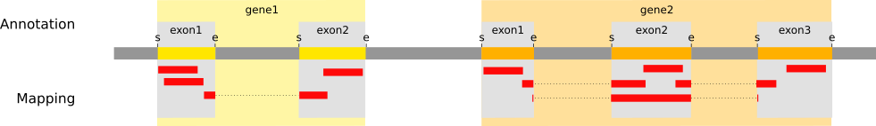

# イントロダクション
{:.no_toc}

[Brooks *et al.* 2011](https://www.ncbi.nlm.nih.gov/pmc/articles/PMC3032923/) の研究によると、 *Pasilla* (*PS*) 遺伝子、ヒトスプライシング調節因子 Nova-1 および Nova-2 タンパク質の*ショウジョウバエ*の相同体は、*キイロショウジョウバエ*の RNAi により欠乏しました。筆者らは、RNA シークエンシングのデータを用いて *Pasilla* 遺伝子によって調節されるエキソンを同定しようとしました。

全 RNA を単離し処理した（PS を欠乏させた）サンプルと未処理のサンプルについてシングルエンドとペアエンドの RNA-seq ライブラリーのいずれかを調整するために使用しました。これらのライブラリーをシークエンシングして各サンプルの RNA シークエンシングリードのコレクションを取得しました。そしてスプライシング現象による *Pasilla* 遺伝子の欠乏の影響を、処理した（PS を欠乏させた）サンプルと未処理のサンプルの RNA シークエンシングデータを比較することで解析することができます。

*キイロショウジョウバエ*のゲノムは既知でありアセンブリされています。この解析を容易にするためにリファレンスゲノムとして利用することができます。リファレンスベースの RNA-seq データ解析では、転写産物を再編成する能力を大幅に改善しそしていくつかの条件の間で発現の差異を同定するために、リードを*キイロショウジョウバエ*のリファレンスゲノムに対してアラインメント（またはマッピング）する。

> ### Agenda
>
> このチュートリアルでは、以下のことを行います:
>
> 1. TOC
> {:toc}
>
{: .agenda}

# 前処理

## データのアップロード

オリジナルのデータは NCBI の Gene Expression Omnibus (GEO) から受託番号 [GSE18508](https://www.ncbi.nlm.nih.gov/geo/query/acc.cgi?acc=GSE18508) で入手することができます。

最初の7つのサンプルを見てみましょう:

- *Pasilla* (PS) 遺伝子が欠乏した3つの処理サンプル: [GSM461179](https://www.ncbi.nlm.nih.gov/geo/query/acc.cgi?acc=GSM461179), [GSM461180](https://www.ncbi.nlm.nih.gov/geo/query/acc.cgi?acc=GSM461180), [GSM461181](https://www.ncbi.nlm.nih.gov/geo/query/acc.cgi?acc=GSM461181)
- 4つの未処理サンプル: [GSM461176](https://www.ncbi.nlm.nih.gov/geo/query/acc.cgi?acc=GSM461176), [GSM461177](https://www.ncbi.nlm.nih.gov/geo/query/acc.cgi?acc=GSM461177), [GSM461178](https://www.ncbi.nlm.nih.gov/geo/query/acc.cgi?acc=GSM461178), [GSM461182](https://www.ncbi.nlm.nih.gov/geo/query/acc.cgi?acc=GSM461182)

各サンプルは対応する条件（処理か未処理か）に分けて生物学的複製物を構成しています。さらに、処理された2つのサンプルと2つの未処理のサンプルはペアエンドシークエンシング法由来で、残りのサンプルはシングルエンドシークエンシング法由来です。

Sequence Read Archive (SRA) ファイルから配列を抽出し FASTQ ファイルを構築しました。

> ###  ハンズオン: データのアップロード
>
> 1. この RNA-seq チュートリアル用に新しいヒストリーを作成する
> 2. FASTQファイルのペアをインポートする (*例*  `GSM461177_untreat_paired_chr4_R1.fastq` と `GSM461177_untreat_paired_chr4_R2.fastq`)
>     * オプション 1: 利用可能な場合は（インストラクターにお尋ねください）共有データライブラリから
>     * オプション 2: [Zenodo](https://dx.doi.org/10.5281/zenodo.290221) から
>
>           > ###  Tip: リンクからデータをインポートする
>           >
>           > * リンクの場所をコピーする
>           > * Galaxy Upload Manager を開く
>           > * **Paste/Fetch Data** を選択する
>           > * リンクをテキストフィールドにペーストする
>           > * **Start** を押す   
>           {: .tip}
>           
>           以下から直接ペーストすることができます:
>
>           ```
>           https://zenodo.org/record/1185122/files/GSM461177_1.fastqsanger
>           https://zenodo.org/record/1185122/files/GSM461177_2.fastqsanger
>           https://zenodo.org/record/1185122/files/GSM461180_1.fastqsanger
>           https://zenodo.org/record/1185122/files/GSM461180_2.fastqsanger
>           ```
>
> 3. サンプルごとにデータセットの名前を変更する
> 4. データタイプが `fastqsanger` であることを確認する（ `fastq` では**ありません**）。
>    データタイプが `fastq` の場合は、ファイルタイプを `fastqsanger` に変更してください。
>
>    > ###  Tip: データタイプを変更する
>    > * ヒストリーのデータセットに表示されている鉛筆ボタンをクリックする
>    > * 上部にある **Datatype** を選択する
>    > * `fastqsanger` を選択する
>    > * **Save** を押す
>    {: .tip}
>
> 5. 各データベースにサンプル名に対応するタグを追加する (`#GSM461177` または `#GSM461180`)
>
>    > ###  Tip: タグを追加する
>    > * データセットをクリックする
>    > * <i class="fa fa-tags"></i> **Edit dataset tags** をクリックする
>    > * `#` で始まるタグを追加する
>    >    
>    >     `#` で始まるタグはこのデータセットを使うことでツールのアウトプットに自動的に伝播されます。
>    >  
>    > * タグがデータセット名の下に表示されていることを確認してください
>    >
>    {: .tip}
{: .hands_on}

この配列はシークエンシング機からの生データであり、前処理を何もしていません。これらのデータは質のために評価する必要があります。

## クオリティコントロール

クオリティコントロールに関しては、[NGS-QC tutorial]({{site.baseurl}}/topics/sequence-analysis) に記載されている同様のツールを使用します: [FastQC](https://www.bioinformatics.babraham.ac.uk/projects/fastqc/) と [Trim Galore](https://www.bioinformatics.babraham.ac.uk/projects/trim_galore/) 。

> ###  ハンズオン: クオリティコントロール
>
> 1. **FastQC** : FASTQ ファイルで FastQC を実行してリードのクオリティをコントロールする
>       - "Short read data from your current history"
>           - "Multiple datasets" をクリックする
>           - 全ての生データを選択する
>
>       > ###  Tip
>       >
>       > CTRL（または COMMAND）キーを押しながら興味のあるファイルをクリックすると複数のファイルを選択できます
>       {: .tip}
>
> 2. 生成された `GSM461177_1` サンプルのウェブページを調べましょう
>
>    > ###  Questions
>    >
>    > リードの長さは何ですか？
>    >
>    >    > ###  Solution
>    >    >
>    >    > リードの長さは 37 bp です
>    >    >
>    >    {: .solution}
>    >
>    {: .question}
>
> 3. **MultiQC** : で次の設定で FastQC のレポートを集計する
>      - "Which tool was used generate logs?" → `FastQC`
>      - "Type of FastQC output?" → `Raw data`
>      - "FastQC output" には生成された `Raw data` ファイル (multiple datasets) を選択する
>
> 4. MultiQC のアウトプットであるウェブページを調べましょう
>
>    > ###  Questions
>    >
>    > それぞれのファイルの配列のクオリティはどうですか？
>    >
>    >    > ###  Solution
>    >    >
>    >    > 3つのファイルは全て正常のようです。しかし GSM461180_2 では、末端の配列でクオリティがかなり低下するようです。
>    >    >
>    >    {: .solution}
>    >
>    {: .question}
>
> 2. **Trim Galore** : Trim Galore! を実行して配列のクオリティを扱いましょう
>      - "Is this library paired- or single-end?" → `Paired-end`
>      - 1つ目の "Reads in FASTQ format" には `_1` の fastqsanger データセットを両方とも選択する (multiple datasets)
>      - 2つ目の "Reads in FASTQ format" には `_2` の fastqsanger データセットを両方とも選択する(multiple datasets)
>
>    > ###  Questions
>    >
>    > Trim Galore! において各データセットで1回ずつの2回実行するのではなく、ペアエンドデータセットで一度だけ実行するのは何故ですか？
>    >
>    >    > ###  Solution
>    >    >
>    >    > Trim Galore はトリミング処理中に配列が短すぎると配列を除去することができます。ペアエンドファイルでは Trim Galore! は、2つのリードの一方（または両方）が設定された長さのカットオフよりも短くなった場合、全配列対を除去します。指定した閾値よりも長いものの、対となるリードがとても短い場合のペアリードの読み取りはオプションとしてシングルエンドのファイルに書き込むことができます。これにより1つのリードさえクオリティが良ければ、ペアリードの情報が完全に失われないことが保証されています。
>    >    >
>    >    {: .solution}
>    >
>    {: .question}
>
{: .hands_on}

*キイロショウジョウバエ*のゲノムは既知でありアセンブリされているため、この情報を使ってこのゲノム上の配列をマッピングしてスプライシング現象による *Pasilla* 遺伝子の欠乏の影響を同定することができます。

# マッピング

リードを理解するために、これらのリードがどの遺伝子に属しているかを決定する必要があります。最初のステップでは*キイロショウジョウバエ*のゲノム内での位置を明らかにしましょう。このプロセスではリードをリファレンスにアラインメントまたは 'マッピング' することとして知られている。

> ###  Comment
>
> マッピングの原理についてもっと学びたいですか？私たちの [トレーニング]({{site.baseurl}}/topics/sequence-analysis/) を見てみましょう。
{: .comment}

真核生物の転写産物の場合、ほとんどのリードはイントロンのないプロセシングされた mRNAs に由来しているため、通常は DNA データのように単純にゲノムをマッピングすることはできません。代わりにリードを2つのカテゴリーに分ける必要があります:

- エキソン内で完全にマッピングされるリード
- 2つ以上のエキソンにまたがるためエキソン内の全長にわたってマッピングすることができないリード

")

スプライスマッパーは転写物のリードをゲノムに対して効率的にマッピングするために開発されています:

 identification of the reads spanning a single exon, (2) identification of the splicing junctions on the unmapped reads")

> ###  スプライスマッパーのそれぞれの違いについての詳細
>
> RNA-seq のデータが爆発的に増加する中で数年にわたっていくつかのスプライスマッパーが開発されました。
>
> [TopHat](https://ccb.jhu.edu/software/tophat/index.shtml) ([Trapnell et al, Bioinformatics, 2009](https://academic.oup.com/bioinformatics/article/25/9/1105/203994)) はこの問題を処理するために特化して設計された最初のツールの1つです。TopHat のリードはゲノムに対してマッピングされ、次の2つのカテゴリに分けられます: (1) マッピングされるもの (2) 最初にマッピングされなかったもの (IUM)。潜在的にエキソン部分となるリードの "Piles" は潜在的に供与体または受容体となるスプライス部位を探索することで拡張され潜在的なスプライス結合部が再構築されます。IUM はこれらの接合部にマッピングされる。
>
>    ")
>
> TopHat は後に TopHat2 を開発し改良されました ([Kim et al, Genome Biology, 2013](https://genomebiology.biomedcentral.com/articles/10.1186/gb-2013-14-4-r36)):
>
>    ")
>
> スプライスされたリードのアラインメントをさらに最適化して高速化するために Kim ら ([Nat Methods, 2015](https://www.nature.com/articles/nmeth.3317)) は [HISAT](https://ccb.jhu.edu/software/hisat2/index.shtml) を開発しました。それは1つのグローバルゲノムワイドインデックスと ~48,000 個のローカルオーバーラッピング 42 kb インデックス（HISAT2 では ~55,000 個の 56 kb インデックス）のコレクションからなる [FM-indices](https://en.wikipedia.org/wiki/FM-index) のセットを使用しています。これによりグローバルインデックスを用いてゲノム内の潜在的なリードのアラインメントの初期シード位置を見つけてローカルインデックスを用いてこれらのアラインメントを迅速に精製することができます:
>
>    ")
>
> 一部のリード（青色の矢印）はまずグローバル FM インデックスを使用してゲノムにマッピングされます。次に HISAT はゲノム配列（紫色の矢印）を直接利用してアラインメントを延ばそうとします。図 (**a**) ではそれが成功していて、リードは完全にエキソン内にあるようにアラインメントされています。図 (**b**) では Extension に不一致があります。ここで HISAT はこの位置と重なるローカル FM インデックスを利用して、このリードの余りの部分（緑色の矢印）に一致するマッピングを探します。図 (**c**) では2つの方法の組み合わせを示しています: リードの開始はグローバル FM インデックス（青色の矢印）を使用してマッピングされ、エキソンの末端（紫色の矢印）に達するまで延長されて、ローカル FM インデックス（緑色の矢印）を使用してマッピングされてそして再び延長されます（紫色の矢印）。
>
> [STAR aligner](https://github.com/alexdobin/STAR) は非圧縮の [suffix array](https://en.wikipedia.org/wiki/Suffix_array) を使用してゲノムに対して RNAseq のリードをマッピングするために高速で置き換えるツールです。それは2つの段階によって行われます [Dobin et al, Bioinformatics, 2013](https://academic.oup.com/bioinformatics/article/29/1/15/272537)。第一段階ではシード検索を実行します:
>
>    ")
>
> ここでは2つの連続したエキソン間でリードを分割しています。STAR ではリードの開始位置からそれがもはや連続して一致しなくなるまで maximum mappable prefix（MMP）を探します。その後 After this point it start to MMP for the unmatched portion of the read (**a**). In the case of mismatches (**b**) and unalignable regions (**c**) MMPs serve as anchors from which to extend alignments </p>
>
> 第二段階では STAR は MMP とstitchesして（MMP とは反対に）ミスマッチや挿入欠失を含むことができるリードレベルのアラインメントを生成します。スコアリングスキームはstitchingの組み合わせを評価して優先順位付けをしたり複数の位置にマッピングするリードを評価するために使用されます。STAR は非常に高速ですが効率的に実行するには相当量の RAM が必要です。
>
{: .details}

## マッピング

STAR を使用して RNA のリードを *キイロショウジョウバエ* のゲノムにマッピングします。

> ###  ハンズオン: スプライスマッピング
>
> 1. *キイロショウジョウバエ* の Ensembl 遺伝子のアノテーション (`Drosophila_melanogaster.BDGP6.87.gtf`) を共有データライブラリまたは [Zenodo](https://doi.org/10.5281/zenodo.1185122) から現在のGalaxyのヒストリーへインポートする。
>    - 必要であればデータセットの名前を変更する
>    - データタイプが `gff` ではなく `gtf` であることを確認する
>
> 2. **RNA STAR** : リファレンスゲノムにリードをマッピングする
>    - "Single-end or paired-end reads" → `Paired-end (as individual datasets)`
>    - "RNA-Seq FASTQ/FASTA file, forward reads" には生成された `trimmed reads pair 1` ファイルを選択する (multiple datasets)
>    - "RNA-Seq FASTQ/FASTA file, reverse reads" には生成された `trimmed reads pair 2` ファイルを選択する (multiple datasets)
>    - "Custom or built-in reference genome" → `Use a built-in index`
>    - "Reference genome with or without an annotation" → `use genome reference without builtin gene-model`
>    - "Select reference genome" → `Drosophila Melanogaster (dm6)`
>    - "Gene model (gff3,gtf) file for splice junctions" にはインポートした `Drosophila_melanogaster.BDGP6.87.gtf` を選択する
>    - "Length of the genomic sequence around annotated junctions" → `36`
>
>        This parameter should be length of reads - 1
>
> 3. **MultiQC** : STAR のログを集計する
>      - "Which tool was used generate logs?" → `STAR`
>      - "Type of FastQC output?" → `Log`
>      - "STAR log output" には生成された `log` ファイルを選択する (multiple datasets)
>
>    > ###  Question
>    >
>    > 両方のサンプルにおいて正確に1回マッピングされたリードの割合はどれですか？
>    >
>    >    > ###  Solution
>    >    >
>    >    > GSM461177 では83％以上、GSM461180 では78％以上です
>    >    >
>    >    {: .solution}
>    >
>    {: .question}
{: .hands_on}

**STAR** はマッピングされたリードを含む BAM ファイルを生成します。

> ###  Question
>
> 1. BAM ファイルとはなんですか？
> 2. そのようなファイルには何が含まれていますか？
>
>    > ###  Solution
>    >
>    > 1. BAM ファイルは SAM ファイルのバイナリーバージョンです
>    > 2. このファイルにはマッピングに関する情報を含んでいます: それぞれのマッピングされたリードに関する情報や、リファレンスゲノムの位置についてや、マッピングのクオリティ、などなど
>    >
>    {: .solution}
{: .question}

## マッピングの結果を検査する

BAM ファイルにはリファレンスゲノム上でマッピングされたリードの位置に関する情報が含まれています。しかしそれはバイナリーファイルでその中に3百万以上のリードの情報がエンコードされているため、ファイルを検査して調べることは困難です。

Integrative Genomics Viewer IGV は BAM ファイルの内容を視覚化するための強力なツールです。

> ###  ハンズオン: マッピングの結果を検査する
>
> 1. **IGV** : `GSM461177` に割り当てられたリードを視覚化する
>     - ヒストリーにある STAR の BAM アウトプットをクリックして展開する
>     - ヒストリー項目の下部に向かって、`Display with IGV` で始まる行を探す
>        
>        これには2つのリンクがあります:
>        - option 1: `local`. あなたのマシンにすでに IGV がインストールされている場合は、このオプションを選択してください
>        - option 2: `D. melanogaster (dm3)`. これはローカルマシン上で IGV をダウンロードして起動します
>
>    > ###  Comments
>    >
>    > このステップを実行するには、マシンに IGV または [Java web start](https://www.java.com/en/download/faq/java_webstart.xml) がインストールされている必要があります。
>    > しかしながら、このセクションの質問は下記の IGV のスクリーンショットを調べることでも答えることができます。
>    >
>    > 詳細については [IGV documentation](https://software.broadinstitute.org/software/igv/AlignmentData) を参照してください。
>    >
>    {: .comment}
>
> 2. **IGV** : `chr4:540,000-560,000`（４番染色体の540 kb から560 kb 間）にズームする
>
>    > ###  Question
>    >
>    > 
>    >
>    > 1. トップの灰色の部分はどんな情報を表示しているのですか？
>    > 2. 整列されたいくつかのリードの間にある接続線は何を示しているのですか？
>    >
>    >    > ###  Solution
>    >    >
>    >    > 1. カバレッジプロット: 各位置でのマッピングされたリードの合計
>    >    > 2. それらは junction events （またはスプライス部位）、*即ち*、イントロンを介してマッピングされるリードを示しています
>    >    >
>    >    {: .solution}
>    {: .question}
>
> 3. **IGV** : **Sashimi plot** を使用してスプライス接合部を検査する
>
>    > ###  Tip: Sashimi plot を作成する
>    >
>    > * BAM ファイルを右クリックする
>    > * コンテキストメニューから **Sashimi Plot** を選択する
>    {: .tip}    
>
>    > ###  Question
>    >
>    > 
>    >
>    > 1. 縦棒グラフは何を表していますか？また数字が振られている円弧は何を表していますか？
>    > 2. 円弧の数字はどういう意味ですか？
>    > 3. なぜ下部にある青色のリンクボックスの異なるスタックグループを観察するのですか？
>    >
>    >    > ###  Solution
>    >    >
>    >    > 1. 各アラインメントトラックのカバレッジは棒グラフとしてプロットされます。円弧は観察されたスプライス部位、*即ち*、reads spanning introns を表しています
>    >    > 2. この数字はこれらの観察されたジャンクションリードの数を示しています。
>    >    > 3. 下のリンクボックスのグループは関与するエキソンが異なる単一遺伝子からの異なる転写産物を表しています。
>    >    >
>    >    {: .solution}
>    {: .question}
>
>    > ###  Comment
>    >
>    > [IGV documentation on Sashimi plots](https://software.broadinstitute.org/software/igv/Sashimi) をチェックしていくつかの手がかりを見つけてください
>    {: .comment}
>
{: .hands_on}

マッピングの後は、私たちはリファレンスゲノム上のどこにリードがあるかに関する情報を持っています。 また、どのようにマッピングされているかもわかります。

RNA-Seq データ解析の次のステップは異なる発現解析のためにいくつかのサンプルを比較できるようにゲノムの特徴（遺伝子、転写産物、エキソン、など）の発現レベルを定量化することです。定量化はリファレンスゲノムの既知の各ゲノム特徴（*例えば* 遺伝子）を取得してそしてこのゲノムの特徴にマッピングされたリードの数を数えることで行います。したがって、このステップでは、 we start with an information per mapped reads to end with an information per genomic feature.

> ###  Comment
>
> 定量化は、リファレンスゲノムのゲノム特徴の定義に依存していて、次にアノテーションに依存しています。マッピングに使用したリファレンスゲノムと同じバージョンのアノテーションを使用することを強くお勧めします。
{: .comment}

*Pasilla* 遺伝子によって制御されるエキソンを同定するためには、PS 遺伝子が欠乏したサンプルとコントロールのサンプルとの間で差次的に発現される遺伝子やエキソンを同定する必要があります。
このチュートリアルでは、差次的な遺伝子発現の解析だけでなく、異なるエキソンの使用法についても分析します。

マッピングのエキササイズはあなたにとって役に立ちましたか？よかったです！ :tada:

# Analysis of the differential gene expression

We will first investigate the differential gene expression to identify which genes are impacted by the *Pasilla* gene depletion

## Count the number of reads per annotated gene

To compare the expression of single genes between different conditions (*e.g.* with or without PS depletion), an essential first step is to quantify the number of reads per gene.



Two main tools could be used for that: [HTSeq-count](http://htseq.readthedocs.io/en/release_0.9.1/count.html) ([Anders et al, Bioinformatics, 2015](https://academic.oup.com/bioinformatics/article/31/2/166/2366196)) or featureCounts ([Liao et al, Bioinformatics, 2014](https://academic.oup.com/bioinformatics/article/31/2/166/2366196)). The second one is considerably faster and requires far less computational resources. We will use it.

In principle, the counting of reads overlapping with genomic features is a fairly simple task. But there are some details that need to be given to featureCounts: for example the strandness...

### Estimation of the strandness

RNAs that are typically targeted in RNAseq experiments are single stranded (*e.g.*, mRNAs) and thus have polarity (5' and 3' ends that are functionally distinct):


During a typical RNAseq experiment the information about strandedness is lost after both strands of cDNA are synthesized, size selected, and converted into sequencing library. However, this information can be quite useful for the read counting.

Some library preparation protocols create so called *stranded* RNAseq libraries that preserve the strand information (an excellent overview in [Levin et al, Nat Meth, 2010](https://www.ncbi.nlm.nih.gov/pmc/articles/PMC3005310/)). The implication of stranded RNAseq is that you can distinguish whether the reads are derived from forward- or reverse-encoded transcripts:

")

Depending on the approach and whether one performs single- or paired-end sequencing there are multiple possibilities on how to interpret the results of mapping of these reads onto the genome:

")

In practice, with Illumina paired-end RNAseq protocols, you are unlikely to uncover many of these possibilities. You will either deal with:

- Unstranded RNAseq data
- Stranded RNAseq data produced with Illumina TrueSeq RNAseq kits and [dUTP tagging](https://nar.oxfordjournals.org/content/37/18/e123) (**ISR**)

This information should usually come with your FASTQ files, ask your sequencing facility! If not, try to find them on the site where you downloaded the data or in the corresponding publication.

Another option is to estimate these parameters with a tool called **Infer Experiment**. This tool takes the output of your mappings (BAM files), takes a subsample of your reads and compares their genome coordinates and strands with those of the reference gene model (from an annotation file). Based on the strand of the genes, it can gauge whether sequencing is strand-specific, and if so, how reads are stranded.

> ###  ハンズオン: Determining the library strandness
>
> 1. **Infer Experiment** : Determine the library strandness with:
>    - "Input .bam file" to the STAR-generated `BAM` files (multiple datasets)
>    - "Reference gene model" to `Drosophila_melanogaster.BDGP6.87.gtf`
>    - "Number of reads sampled from SAM/BAM file (default = 200000)" to `200000`
{: .hands_on}

The tool generates one file with:
- Paired-end or singled-end library
- Fraction of reads failed to determine
- 2 lines
    - For single-end
        - Fraction of reads explained by "++,--" (**SF** in previous figure)
        - Fraction of reads explained by "+-,-+" (**SR** in previous figure)
    - For paired-end
        - Fraction of reads explained by "1++,1--,2+-,2-+" (**SF** in previous figure)
        - Fraction of reads explained by "1+-,1-+,2++,2--" (**SR** in previous figure)

If the fractions in the two last lines are too close to each other, we conclude that this is the library is not specific to a strand specific dataset (**U** in previous figure).

> ###  Question
>
> 1. Which fraction of the reads in the BAM file can be explained assuming which library type for `GSM461177`?
> 2. Which library type do you choose for both samples?
>
>    > ###  Solution
>    >
>    > 1. Fraction of reads explained by "1++,1--,2+-,2-+": 0.4648 - Fraction of reads explained by "1+-,1-+,2++,2--": 0.4388
>    > 2. The library seems to be of the type unstranded for both samples.
>    {: .solution}
{: .question}

> ###  Comment
> As it is sometimes quite difficult to find out which settings correspond to those of other programs, the following table might be helpful to identify the library type:
>
> Library type | **Infer Experiment** | **TopHat** | **HISAT2** | **htseq-count** | **featureCounts**
> --- | --- | --- | --- | --- | ---
> Paired-End (PE) - SF | 1++,1--,2+-,2-+ | FR Second Strand | Second Strand F/FR | yes | Forward (1)
> PE - SR | 1+-,1-+,2++,2-- | FR First Strand | First Strand R/RF | reverse | Reverse (2)
> Single-End (SE) - SF | ++,-- | FR Second Strand | Second Strand F/FR | yes | Forward (1)
> SE - SR | +-,-+ | FR First Strand | First Strand R/RF | reverse | Reverse (2)
> PE, SE - U | undecided | FR Unstranded | default | no | Unstranded (0)
>
{: .comment}

### Counting

We now run **featureCounts** to count the number of reads per annotated gene.

> ###  ハンズオン: Counting the number of reads per annotated gene
>
> 1. **featureCounts** : Count the number of reads per genes using **featureCounts** with
>    - "Alignment file" to the STAR-generated `BAM` files (multiple datasets)
>    - "Gene annotation file" to `GTF file`
>    - "Gene annotation file" to `in your history`
>    - "Gene annotation file" to `Drosophila_melanogaster.BDGP6.87.gtf`
>    - "Output format" to `Gene-ID "\t" read-count (DESeq2 IUC wrapper compatible)`
>    - Click on "Advanced options"
>    - "GFF feature type filter" to `exon`
>    - "GFF gene identifier" to `gene_id`
>    - "Allow read to contribute to multiple features" to `No`
>    - "Strand specificity of the protocol" to `Unstranded`
>    - "Count multi-mapping reads/fragments" to `Disabled; multi-mapping reads are excluded (default)`
>    - "Minimum mapping quality per read" to `10`
>
> 2. **MultiQC** : Aggregate the FastQC report with
>      - "Which tool was used generate logs?" to `featureCounts`
>      - "Output of FeatureCounts" to the generated `summary` files (multiple datasets)
>
>    > ###  Question
>    >
>    > How many reads have been assigned to a gene?
>    >
>    >    >###  Solution
>    >    >
>    >    > Around 70% of the reads have been assigned to genes: this quantity is correct enough. If it is going below 50%, you should investigate where are mapping your reads (with IGV) and check that the annotation corresponds to the reference genome (version).
>    >    >
>    >    {: .solution}
>    {: .question}
>
{: .hands_on}

The main output of **featureCounts** is a big table.

> ###  Question
>
> 1. Which information does the generated table files contain?
> 2. Which feature has the most reads mapped on it for both samples?
>
>    > ###  Solution
>    >
>    > 1. The useful result file is a tabular file with two columns: the gene id and the number of reads mapped on the corresponding gene
>    > 2. To display the most abundantly detected feature, we need to sort the files with the features and the number of reads mapped to them. This can be done using the Sort tool on the second column and in descending order, which reveals that FBgn0000556 is the feature with the most reads (around 258,000 in GSM461177 and 253,000 in GSM461180) mapped on it.
>    >
>    {: .solution}
{: .question}

## Identification of the differentially expressed features

In the previous section, we counted reads that mapped to genes for two sample. To be able to identify differential gene expression induced by PS depletion, all datasets (3 treated and 4 untreated) must be analyzed following the same procedure and for the whole genome.

> ###  (Optional) ハンズオン: Re-run on the other datasets
>
> You can do the same process on the other sequence files available on [Zenodo](https://doi.org/10.5281/zenodo.1185122)
>
> - Paired-end data
>     - `GSM461178_1` and `GSM461178_2`
>     - `GSM461181_1` and `GSM461181_2`
> - Single-end data
>     - `GSM461176`
>     - `GSM461179`
>     - `GSM461182`
>
> This is really interesting to redo on the other datasets, specially to check how the parameters are inferred given the different type of data.
{: .hands_on}

To save time, we have run the necessary steps for you and obtained 7 count files, available on [Zenodo](https://doi.org/10.5281/zenodo.1185122).

These files contain for each gene of *Drosophila* the number of reads mapped to it. We could compare the files directly and calculate the extent of differential gene expression, but the number of sequenced reads mapped to a gene depends on:

- Its own expression level
- Its length
- The sequencing depth of the sample
- The expression of all other genes within the sample

Either for within- or for between-sample comparison, the gene counts need to be normalized. We can then use the Differential Gene Expression (DGE) analysis, whose two basic tasks are:

- Estimate the biological variance using the replicates for each condition
- Estimate the significance of expression differences between any two conditions

This expression analysis is estimated from read counts and attempts are made to correct for variability in measurements using replicates that are absolutely essential for accurate results. For your own analysis, we advice you to use at least 3, but preferably 5 biological replicates per condition. You can have different number of replicates per condition.

[**DESeq2**](https://bioconductor.org/packages/release/bioc/html/DESeq2.html) is a great tool for DGE analysis. It takes read counts produced previously, combines them into a big table (with genes in the rows and samples in the columns) and applies size factor normalization:

- Computation for each gene of the geometric mean of read counts across all samples
- Division of every gene count by the geometric mean
- Use of the median of these ratios as a sample's size factor for normalization

Multiple factors with several levels can then be incorporated in the analysis. After normalization we can compare, in a statistically reliable way, the response of the expression of any gene to the presence of different levels of a factor.

In our example, we have samples with two varying factors that can explain differences in gene expression:

- Treatment (either treated or untreated)
- Sequencing type (paired-end or single-end)

Here treatment is the primary factor which we are interested in. The sequencing type is some further information that we know about the data that might affect the analysis. This particular multi-factor analysis allows us to assess the effect of the treatment, while taking the sequencing type into account, too.

> ###  Comment
>
> We recommend you to add as many factors as you think may affect gene expression in your experiment. It can be the sequencing type like here, but it can also be the manipulation (if different persons are involved in the library preparation), ...
{: .comment}

> ###  ハンズオン: Determines differentially expressed features
>
> 1. Create a new history
> 2. Import the seven count files from [Zenodo](https://doi.org/10.5281/zenodo.1185122) or the data library
>    - `GSM461176_untreat_single.counts`
>    - `GSM461177_untreat_paired.counts`
>    - `GSM461178_untreat_paired.counts`
>    - `GSM461179_treat_single.counts`
>    - `GSM461180_treat_paired.counts`
>    - `GSM461181_treat_paired.counts`
>    - `GSM461182_untreat_single.counts`
>
> 3. **DESeq2** : Run **DESeq2** with:
>    - For "1: Factor"
>       - "Specify a factor name" to `Treatment`
>       - "1: Factor level"
>           - "Specify a factor level" to `treated`
>           - "Counts file(s)" to the 3 gene count files (multiple datasets) with `treated` in name
>       - "2: Factor level"
>           - "Specify a factor level" to `untreated`
>           - "Counts file(s)" to the 4 gene count files (multiple datasets) with `untreated` in name
>    - Click on "Insert Factor" (not on "Insert Factor level")
>    - For "2: Factor"
>       - "Specify a factor name" to `Sequencing`
>       - "1: Factor level"
>           - "Specify a factor level" to `PE`
>           - "Counts file(s)" to the generated count files (multiple datasets) with `paired` in name
>       - "2: Factor level"
>           - "Specify a factor level" to `SE`
>           - "Counts file(s)" to the generated count files (multiple datasets) with `single` in name   
>    - "Output normalized counts table" to `Yes`
{: .hands_on}

**DESeq2** generated 3 outputs

- A table with the normalized counts for each genes (rows) and each samples (columns)
- A graphical summary of the results, useful to evaluate the quality of the experiment:

    1. Histogram of *p*-values for all tests
    2. [MA plot](https://en.wikipedia.org/wiki/MA_plot): global view of the relationship between the expression change of conditions (log ratios, M), the average expression strength of the genes (average mean, A), and the ability of the algorithm to detect differential gene expression. The genes that passed the significance threshold (adjusted p-value < 0.1) are colored in red.
    3. Principal Component Analysis ([PCA](https://en.wikipedia.org/wiki/Principal_component_analysis)) and the first two axes

        Each replicate is plotted as an individual data point. This type of plot is useful for visualizing the overall effect of experimental covariates and batch effects.

        > ###  Questions
        >
        > 1. What is the first axis separating?
        > 2. And the second axis?    
        >
        >    > ###  Solution
        >    >
        >    > 1. The first axis is seperating the treated samples from the untreated samples, as defined when DESeq2 was launched
        >    > 2. The second axis is separating the single-end datasets from the paired-end datasets
        >    {: .solution}
        {: .question}


    4. Heatmap of sample-to-sample distance matrix: overview over similarities and dissimilarities between samples

        > ###  Questions
        >
        > How are the samples grouped?
        >
        >    > ###  Solution   
        >    > They are first grouped depending on the treatment (the first factor) and after on the library type (the second factor), as defined when DESeq2 was launched
        >    >
        >    {: .solution}
        {: .question}

    5. Dispersion estimates: gene-wise estimates (black), the fitted values (red), and the final maximum a posteriori estimates used in testing (blue)

        This dispersion plot is typical, with the final estimates shrunk from the gene-wise estimates towards the fitted estimates. Some gene-wise estimates are flagged as outliers and not shrunk towards the fitted value. The amount of shrinkage can be more or less than seen here, depending on the sample size, the number of coefficients, the row mean and the variability of the gene-wise estimates.

- A summary file with the following values for each gene

    1.  Gene identifiers
    2.  Mean normalized counts, averaged over all samples from both conditions
    3.  Logarithm (to basis 2) of the fold change

        The log2 fold changes are based on primary factor level 1 vs. factor level 2, hence the order of factor levels is important. For example, for the factor 'Treatment', DESeq2 computes fold changes of 'treated' samples against 'untreated', *i.e.* the values correspond to up- or downregulation of genes in treated samples.

    4.  Standard error estimate for the log2 fold change estimate
    5.  [Wald](https://en.wikipedia.org/wiki/Wald_test) statistic
    6.  *p*-value for the statistical significance of this change
    7.  *p*-value adjusted for multiple testing with the Benjamini-Hochberg procedure which controls false discovery rate ([FDR](https://en.wikipedia.org/wiki/False_discovery_rate))

> ###  Comment
>
> For more information about **DESeq2** and its outputs, you can have a look at [**DESeq2** documentation](https://www.bioconductor.org/packages/release/bioc/manuals/DESeq2/man/DESeq2.pdf).
{: .comment}

## Visualization of the differentially expressed genes

We would like now to draw an heatmap of the normalized counts for each sample for the most differentially expressed genes.

We would proceed in several steps
- Extract the most differentially expressed genes using the DESeq2 summary file
- Extract the normalized counts of these genes for each sample using the normalized count file generated by DESeq2
- Plot the heatmap of the normalized counts of these genes for each sample

> ###  ハンズオン: Extract the most differentially expressed genes
>
> 1. **Filter** : Extract genes with a significant change in gene expression (adjusted *p*-value below 0.05) between treated and untreated samples
>    - "Filter" to the DESeq2 summary file
>    - "With following condition" to `c7<0.05`
>
>    > ###  Question
>    >
>    > How many genes have a significant change in gene expression between these conditions?
>    >
>    >    > ###  Solution
>    >    >
>    >    > We get 1,091 genes (6.21%) with a significant change in gene expression between treated and untreated samples.
>    >    >
>    >    {: .solution}
>    {: .question}
>
>    > ###  Comment
>    >
>    > The file with the independent filtered results can be used for further downstream analysis as it excludes genes with only few read counts as these genes will not be considered as significantly differentially expressed.
>    {: .comment}
>
>    The generated file contains to many genes to get a meaningful heatmap. So we will take only the genes with an absoluted fold change > 2
>
> 2. **Filter** : Extract genes with an abs(log<sub>2</sub>FC) > 1 (FC stands for "fold change")
>    - "Filter" to the differentially expressed genes
>    - "With following condition" to `abs(c3)>1`
>
>    > ###  Question
>    >
>    > How many genes have been conserved?
>    >
>    >    > ###  Solution
>    >    >
>    >    > 11.92% (130) of the differentially expressed genes
>    >    >
>    >    {: .solution}
>    {: .question}
>
>    The number of genes is still too high there. So we will take only the 10 most up-regulated and 10 most down-regulated genes
>
> 3. **Sort** : Sort the genes by log<sub>2</sub>FC
>    - "Sort Dataset" to the differentially expressed genes with abs(FC) > 2
>    - "on column" to `3`
>    - "with flavor" to `Numerical sort`
>    - "everything in" to `Descending order`
>
> 4. **Select first lines** : Extract the 10 most up-regulated genes
>    - "File to select" to the sorted DE genes with abs(FC) > 2
>    - "Operation" to `Keep first lines`
>    - "Number of lines" to `10`
>
> 4. **Select last lines** : Extract the 10 most down-regulated genes
>    - "Text file" to the sorted DE genes with abs(FC) > 2
>    - "Operation" to `Keep first lines`
>    - "Number of lines" to `10`
>
> 5. **Concatenate datasets** : Concatenated the 10 most up-regulated genes with the 10 most down-regulated genes
>    - "Datasets to concatenate" to the 10 most up-regulated genes and to the 10 most down-regulated genes
>
{: .hands_on}

We now have a table with 20 lines corresponding to the most differentially expressed genes. And for each of the gene, we have its id, its mean normalized counts (averaged over all samples from both conditions), its log<sub>2</sub>FC and other information.

We could plot the log<sub>2</sub>FC for the different genes, but here we would like to look at the heatmap with the read counts for these genes in the different samples. So we need to extract the read counts for these genes.

We will join the normalized count table generated by DESeq with the table we just generated to conserved in the normalized count table only the lines corresponding to the most differentially expressed genes

> ###  ハンズオン: Extract the normalized counts of most differentially expressed genes in the different samples
>
> 1. **Join two Datasets** : Join the two files
>    - "Join" to the normalized count table generated by DESeq2
>    - "using column" to `1`
>    - "with" to the concatenated file with 10 most up-regulated genes and the 10 most down-regulated genes
>    - "and column" to `1`
>    - "Keep lines of first input that do not join with second input" to `No`
>    - "Keep the header lines" to `Yes`
>
>    The generated files has too many columns: the ones with mean normalized counts, the log<sub>2</sub>FC and other information. We need to remove them
>
> 2. **Cut** : Conserve the columns with normalized counts
>    - "Cut columns" to `c1,c2,c3,c4,c5,c6,c7,c8`
>    - "Delimited by" to `Tab`
>    - "From" the joined dataset
>
{: .hands_on}

We have now a table with 20 lines (the most differentially expressed genes) and the normalized counts for these genes in the 7 samples.

> ###  ハンズオン: Plot the heatmap of the normalized counts of these genes for each sample
>
> 1. **heatmap2** : Plot the heatmap with
>    - "Input should have column headers" to the generated table
>    - "Advanced - log transformation" to `Log2(value) transform my data`
>    - "Enable data clustering" to `Yes`
>    - "Coloring groups" to "Blue to white to red"
>
{: .hands_on}

You should obtain something similar to:


> ###  Questions
>
> 1. Do you observe any tendency in the data?
> 2. What is changing if we select `Plot the data as it is` in "Advanced - log transformation"?
> 3. Can you generate an heatmap the normalized counts for the up-regulated genes with FC > 2?
>
>   > ###  Solution
>   >
>   > 1. The samples are clustering by treatment. The genes are also clustering based on the counts. 2 genes (FBgn0026562, FBgn00003360)
>   > 2. The scale is changing and the differences between the genes are not visible anymore
>   > 3. Extract the genes with logFC > 2 (filter for genes with c3>1 on the summary of the differentially expressed genes) and run heatmap2 on the generated table
>   {: .solution}
{: .question}

## Analysis of the functional enrichment among the differentially expressed genes

We have extracted genes that are differentially expressed in treated (with PS gene depletion) samples compared to untreated samples. We would like to know the functional enrichment among the differentially expressed genes.

[Gene Ontology (GO)](http://www.geneontology.org/) analysis is widely used to reduce complexity and highlight biological processes in genome-wide expression studies, but standard methods give biased results on RNA-seq data due to over-detection of differential expression for long and highly expressed transcripts.

[goseq tool](https://bioconductor.org/packages/release/bioc/vignettes/goseq/inst/doc/goseq.pdf) provides methods for performing GO analysis of RNA-seq data, taking length bias into account. The methods and software used by goseq are equally applicable to other category based tests of RNA-seq data, such as KEGG pathway analysis.

goseq needs 2 files as inputs:
- A tabular file with the differentially expressed genes from all genes assayed in the RNA-seq experiment with 2 columns:
    - the Gene IDs (unique within the file)
    - True (differentially expressed) or False (not differentially expressed)
- A file with information about the length of a gene to correct for potential length bias in differentially expressed genes

> ###  ハンズオン: Prepare the datasets for GOSeq
>
> 1. **Compute**  with
>    - "Add expression" to `bool(c7<0.05)`
>    - "as a new column to" to DESeq summary file
>
> 2. **Cut**  with
>    - "Cut columns" to `c1,c8`
>    - "Delimited by" to `Tab`
>    - "From" to the previously generated file
>
> 3. **Change Case**  with
>    - "From" to the previously generated file
>    - "Change case of columns" to `c1`
>    - "Delimited by" to `Tab`
>    - "To" to `Upper case`
>
>    We just generated the first input for goseq
>
> 4. **Gene length and GC content** with
>    - "Select a built-in GTF file or one from your history" to `Use a GTF from history`
>    - "Select a GTF file" to `Drosophila_melanogaster.BDGP6.87.gtf`
>    - "Select a built-in FASTA or one from your history" to `Use a built-in FASTA`
>    - "Select a FASTA file" to `Fly (キイロショウジョウバエ): dm6 Full`
>    - "Output length file?" to `Yes`
>    - "Output GC content file?" to `No`
>
> 5. **Change Case**  with
>    - "From" to the previously generated file
>    - "Change case of columns" to `c1`
>    - "Delimited by" to `Tab`
>    - "To" to `Upper case`
{: .hands_on}

We have now the two required files for goseq.

> ###  ハンズオン: Perform GO analysis
>
> 1. **goseq**  with
>    - "Differentially expressed genes file" to first file generated on previous step
>    - "Gene lengths file" to second file generated on previous step
>    - "Gene categories" to `Get categories`
>    - "Select a genome to use" to `Fruit fly (dm6)`
>    - "Select Gene ID format" to `Ensembl Gene ID`
>    - "Select one or more categories" to `GO: Cellular Component`, `GO: Biological Process`, `GO: Molecular Function`
>
{: .hands_on}

goseq generates a big table with the following columns for each GO term:
1. `category`: GO category
2. `over_rep_pval`: *p*-value for over representation of the term in the differentially expressed genes
3. `under_rep_pval`: *p*-value for under representation of the term in the differentially expressed genes
4. `numDEInCat`: number of differentially expressed genes in this category
5. `numInCat`: number of genes in this category
6. `term`: detail of the term
7. `ontology`: MF (Molecular Function - molecular activities of gene products), CC (Cellular Component - where gene products are active), BP (Biological Process - pathways and larger processes made up of the activities of multiple gene products)
8. `p.adjust.over_represented`: *p*-value for over representation of the term in the differentially expressed genes, adjusted for multiple testing with the Benjamini-Hochberg procedure
9. `p.adjust.under_represented`: *p*-value for over representation of the term in the differentially expressed genes, adjusted for multiple testing with the Benjamini-Hochberg procedure

To identify categories significantly enriched/unenriched below some p-value cutoff, it is necessary to use the adjusted *p*-value.

> ###  Questions
>
> 1. How many GO terms are over represented? Under represented?
> 2. How are the over represented GO terms divided between MF, CC and BP? And for under represented GO terms?
>
>   > ###  Solution
>   >   
>   > 1. 48 GO terms (0.49%) are over represented and 65 (0.66%) - Filter on c8 (over-represented) and c9 (under-represented)
>   > 2. For over-represented, 31 BP, 6 CC and 10 MF - For under-represented, 36 BP, 25 CC and 3 MF - Group data on column 7 and count on column 1
>   >
>   {: .solution}
{: .question}

# Inference of the differential exon usage

Next, we would like to know the differential exon usage between treated (PS depleted) and untreated samples using RNA-seq exon counts. We will rework on the mapping results we generated previously.

We will use [DEXSeq](https://www.bioconductor.org/packages/release/bioc/html/DEXSeq.html). DEXSeq detects high sensitivity genes, and in many cases exons, that are subject to differential exon usage. But first, as for the differential gene expression, we need to count the number of reads mapping to the exons.

## Count the number of reads per exon

This step is similar to the step of [counting the number of reads per annotated gene](#count-the-number-of-reads-per-annotated-gene) except that, instead of HTSeq-count, we are using DEXSeq-Count.

> ###  ハンズオン: Counting the number of reads per exon
>
> 1. **DEXSeq-Count** : Use the **DEXSeq-Count** to prepare the *Drosophila* annotations to extract only exons with corresponding gene ids
>     - "Mode of operation" to `Prepare annotation`
>     - "GTF file" to `Drosophila_melanogaster.BDGP6.87.gtf`
>
>    The output is again a GTF file that is ready to be used for counting
>
> 2. **DEXSeq-Count** : Count reads using **DEXSeq-Count** with
>     - "Mode of operation" to `Count reads`
>     - "Input bam file" to the STAR-generated `BAM` files (multiple datasets)
>     - "DEXSeq compatible GTF file" to the previously generated GTF file
>     - "Is libray paired end?" to `Yes`
>     - "Is library strand specific?" to `No`
>     - "Skip all reads with alignment quality lower than the given minimum value" to `10`
>
{: .hands_on}

DEXSeq generates a file similar to the one generated by featureCounts, but with counts for exons.

> ###  Question
>
> 1. Which exon has the most reads mapped to it for both samples?
> 2. From which gene have these exon been extracted?
> 3. Is there a connection to the previous result obtained with HTSeq-count?
>
>    > ###  Solution
>    >
>    > FBgn0000556:005 is the exon with the most reads mapped to it for both samples. It is part of FBgn0000556, the feature with the most reads mapped on it (from featureCounts).
>    >
>    {: .solution}
>
{: .question}

## Differential exon usage

DEXSeq usage is similar to DESeq2. It uses similar statistics to find differentially used exons.

As for DESeq2, in the previous step, we counted only reads that mapped to exons on chromosome 4 and for only one sample. To be able to identify differential exon usage induced by PS depletion, all datasets (3 treated and 4 untreated) must be analyzed following the same procedure. To save time, we did that for you. The results are available on [Zenodo](https://doi.org/10.5281/zenodo.1185122):

- The results of running DEXSeq-count in 'Prepare annotation' mode
- Seven count files generated in 'Count reads' mode

> ###  ハンズオン:
>
> 1. Create a new history
> 2. Import the seven exon count files and the annotation GTF file from [Zenodo](https://doi.org/10.5281/zenodo.1185122) or the data library
>    - `Drosophila_melanogaster.BDGP6.87.dexseq.gtf`
>    - `GSM461176_untreat_single.exon.counts`
>    - `GSM461177_untreat_paired.exon.counts`
>    - `GSM461178_untreat_paired.exon.counts`
>    - `GSM461179_treat_single.exon.counts`
>    - `GSM461180_treat_paired.exon.counts`
>    - `GSM461181_treat_paired.exon.counts`
>    - `GSM461182_untreat_single.exon.counts`
>
> 3. **DEXSeq** : Run **DEXSeq** with
>    - "GTF file created from DEXSeq-Count tool" to `Drosophila_melanogaster.BDGP6.87.dexseq.gtf`
>    - For "1: Factor"
>       - "Specify a factor name" to `condition`
>       - "Specify a factor level" to `treated`
>       - "Count file for factor level 1" to the exon count files (multiple datasets) with `treated` in name
>       - "Specify a factor level" to `untreated`
>       - "Count file for factor level 2" to the exon count files (multiple datasets) with `untreated` in name
>    - For "2: Factor"
>       - "Specify a factor name" to `sequencing`
>       - "Specify a factor level" to `pe`
>       - "Count file for factor level 1" to the exon count files (multiple datasets) with `paired` in name
>       - "Specify a factor level" to `se`
>       - "Count file for factor level 2" to the exon count files (multiple datasets) with `single` in name
>
>    > ###  Comment
>    >
>    > Unlike DESeq2, DEXSeq does not allow flexible primary factor names. Always use your primary factor name as "condition"
>    {: .comment}
{: .hands_on}

Similarly to DESeq2, DEXSeq generates a table with:

1.  Exon identifiers
2.  Gene identifiers
3.  Exon identifiers in the Gene
4.  Mean normalized counts, averaged over all samples from both conditions
5.  Logarithm (to basis 2) of the fold change

    The log2 fold changes are based on primary factor level 1 vs. factor level 2. The order of factor levels is then important. For example, for the factor 'Condition', DESeq2 computes fold changes of 'treated' samples against 'untreated', *i.e.* the values correspond to up- or downregulations of genes in treated samples.

6.  Standard error estimate for the log2 fold change estimate
7.  *p*-value for the statistical significance of this change
8.  *p*-value adjusted for multiple testing with the Benjamini-Hochberg procedure which controls false discovery rate ([FDR](https://en.wikipedia.org/wiki/False_discovery_rate))

> ###  ハンズオン:
>
> 1. **Filter** : Run **Filter** to extract exons with a significant differential usage (adjusted *p*-value equal or below 0.05) between treated and untreated samples
>
>    > ###  Question
>    >
>    > How many exons show a significant change in usage between these conditions?
>    >
>    >    > ###  Solution
>    >    >
>    >    > We get 38 exons (12.38%) with a significant usage change between treated and untreated samples
>    >    >
>    >    {: .solution}
>    {: .question}
{: .hands_on}

# Annotation of the result tables with gene information

Unfortunately, in the process of counting, we loose all the information of the gene except its identifiant. In order to get the information back to our final counting tables, we can use a tool to make the correspondance between identifiant and annotation.

> ###  ハンズオン:
>
> 1. **Annotate DE(X)Seq result** : Run **Annotate DE(X)Seq result** on a counting table (from DESeq or DEXSeq) using the `Drosophila_melanogaster.BDGP5.78.gtf` as annotation file
{: .hands_on}

# Conclusion
{:.no_toc}

In this tutorial, we have analyzed real RNA sequencing data to extract useful information, such as which genes are up- or downregulated by depletion of the *Pasilla* gene and which genes are regulated by the *Pasilla* gene. To answer these questions, we analyzed RNA sequence datasets using a reference-based RNA-seq data analysis approach. This approach can be summarized with the following scheme:


