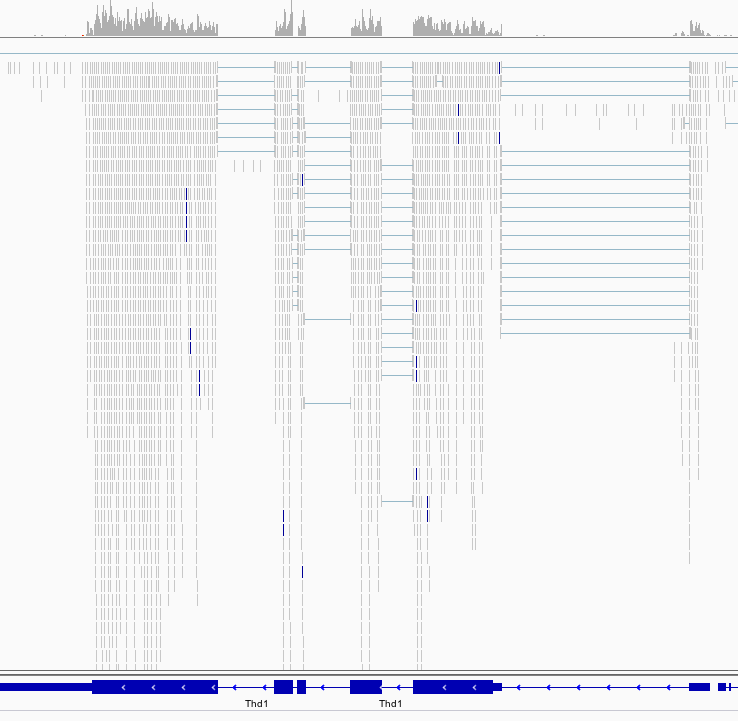

# 前書き
{:.no_toc}

[Brooks * et al。* 2011]（http://genome.cshlp.org/content/21/2/193.long）の研究では、Pasilla（PS）遺伝子、ヒトスプライシングの* Drosophila *ホモログ レギュレーターNova-1およびNova-2 Proteinsは、* Drosophila melanogaster *でRNAiにより枯渇しました。 著者らは、RNAシークエンシングデータを用いてPasilla遺伝子によって調節されるエキソンを同定することを望んでいた。

全RNAを単離し、処理した（PSを枯渇させた）試料および未処理の試料について、片末端または対末端RNA-seqライブラリーのいずれかを調製するために使用した。 これらのライブラリーを配列決定して、各サンプルのRNA配列決定読み取りのコレクションを得た。 次いで、スプライシング事象に対するパシラ遺伝子枯渇の影響を、処理された（PS枯渇）および未処理サンプルのRNA配列決定データの比較によって分析することができる。

* Drosophila melanogaster *のゲノムは既知であり、組み立てられています。 この解析を容易にするために、参照ゲノムとして使用することができます。 リファレンスベースのRNA-seqデータ解析では、転写物を再構成する能力を大幅に改善し、次にいくつかの条件の間の発現の差異を同定するために、参照ゲノム* Drosophila melanogaster *に対して、読み取りを整列させる（またはマッピングする）。

> ### 議題
>
> このチュートリアルでは、:
>
> 1. TOC
> {:toc}
>
{: .agenda}

# 前処理

## データアップロード

元のデータは、受託番号[GSE18508]（https://www.ncbi.nlm.nih.gov/geo/query/acc.cgi?acc=GSE18508）でNCBI Gene Expression Omnibus（GEO）で入手可能である。

最初の7つのサンプルを見てみましょう：

- Pasilla（PS）遺伝子が欠乏した3つの処理サンプル：[GSM461179]（https://www.ncbi.nlm.nih.gov/geo/query/acc.cgi?acc=GSM461179）、[GSM461180]（https： /www.ncbi.nlm.nih.gov/geo/query/acc.cgi?acc=GSM461180）、[GSM461181]（https://www.ncbi.nlm.nih.gov/geo/query/acc.cgi？ acc = GSM461181）
- 4つの未処理サンプル：[GSM461176]（https://www.ncbi.nlm.nih.gov/geo/query/acc.cgi?acc=GSM461176）、[GSM461177]（https：//www.ncbi.nlm。 nih.gov/geo/query/acc.cgi?acc=GSM461177）、[GSM461178]（https://www.ncbi.nlm.nih.gov/geo/query/acc.cgi?acc=GSM461178）、[GSM461182 ]（https://www.ncbi.nlm.nih.gov/geo/query/acc.cgi?acc=GSM461182）

各サンプルは、対応する状態（処置または未処置）の別個の生物学的複製物を構成する。 さらに、処理された2つのサンプルおよび未処理のサンプルの2つは、ペアエンドシーケンシングアッセイ由来であり、残りのサンプルは、シングルエンドシーケンシング実験由来である。

Sequence Read Archive（SRA）ファイルからシーケンスを抽出し、FASTQファイルを構築しました。

> ###  ハンズオン: データアップロード
>
> 1. このRNA-seqエクササイズの新しい履歴を作成する
> 2. FASTQファイルのペアをインポートする（例：* `GSM461177_untreat_paired_chr4_R1.fastq`と` GSM461177_untreat_paired_chr4_R2.fastq`）
>     * オプション1：共有データライブラリから利用可能な場合（インストラクタにお尋ねください）
>     * オプション2：[Zenodo]（https://dx.doi.org/10.5281/zenodo.290221）から
>
>    > ###  ヒント：リンクを介したデータのインポート
>    >
>    > * リンクの場所をコピーする
>    > * Galaxy Upload Managerを開く
>    > * **データのペースト/フェッチ**を選択
>    > * リンクをテキストフィールドに貼り付ける
>    > * **スタート**を押してください
>    {: .tip}
>
> 3. データファイルがヒストリに入ったら、データ型が `fastq`ではなく` fastqsanger`であることを確認します。
>    データ型が `fastq`の場合は、ファイルタイプを` fastqsanger`に変更してください
>
>    > ###  ヒント：データ型の変更
>    > * 履歴のデータセットに表示されている鉛筆ボタンをクリックします
>    > * 上部に**データタイプ**を選択してください
>    > * `fastqsanger`を選択してください
>    > * プレス**保存**
>    {: .tip}
>
> 4. "データベース/ビルド"を編集して `dm3`を選択してください
> 5. サンプルに応じてデータセットの名前を変更する
>
{: .hands_on}

両方のファイルには、ペアエンドのサンプルの第4染色体に属する読み取りが含まれています。 配列は、前処理なしで配列決定装置からの生の配列である。 彼らは彼らの品質のために制御する必要があります。

## 品質管理

品質管理に関しては、[NGS-QCチュートリアル]（{{site.baseurl}} / topics / sequence-analysis）に記載されている同様のツールを使用します：[FastQC]（https://www.bioinformatics.babraham.ac.uk / projects / fastqc /）と[Trim Galore]（https://www.bioinformatics.babraham.ac.uk/projects/trim_galore/）を参照してください。

> ###  ハンズオン: 品質管理
>
> 1. ** FastQC ** {％icon tool％}：両方のFASTQファイルでFastQCを実行して、読み取りの品質を制御します
>
>    > ###  質問
>    >
>    > 1. 読んだ長さは何ですか？
>    > 2. 2つのレポートを比較すると、目立つものはありますか？
>    >
>    >    

>    >    
 クリックして回答を表示 

>    >    <ol type="1">
>    >    <li> 読み取りの長さは37 bpです </li>
>    >    <li> GSM461177_untreat_paired_chr4_R1とGSM461177_untreat_paired_chr4_R2の両方のレポートは大丈夫です。 GSM461177_untreat_paired_chr4_R1には、いくつかの警告があり、Kmerのコンテンツに問題があります。 GSM461177_untreat_paired_chr4_R2では、2番目のタイルの品質が悪いです（シーケンス時に問題が発生した可能性があります）。 私たちは質の高い治療に注意し、ペアの情報でそれを行う必要があります </li>
>    >    </ol>
>    >    

>    {: .question}
>
> 2. **Trim Galore** : Trim Galoreを実行してシーケンスの品質を扱う
>      - *ペアエンド*データセットを扱っていることを示します
>
>    > ###  質問
>    >
>    > Trim Galoreはペアデータセットで一度実行され、各データセットで2回実行されないのはなぜですか？
>    >
>    > 

>    > 
クリックして回答を表示

>    > Trim Galoreは、トリミング処理中にシーケンスが短すぎるとシーケンスを削除できます。 ペアエンドファイルの場合は、Trim Galore！ 2つの読み取りの一方（または両方）が、設定された長さのカットオフよりも短くなった場合、全配列対を除去する。 指定されたしきい値よりも長いが、パートナー読取りが短くなった読取りペアの読取りは、オプションでシングルエンド・ファイルに書き込むことができます。 これにより、1つの読み取りが良質であれば、読み取りペアの情報が完全に失われないことが保証されます。
>    > 

>    {: .question}
>
> 3. **FastQC** : Trim Galoreの出力でFastQCを再実行し、違いを調べる
>
>    > ###  質問
>    >
>    > 1. トリミングはどのように読み取りの長さに影響しましたか？
>    > 2. Trim Galoreの影響を受ける他の報告された特性はありますか？
>    >
>    >    

>    >    
クリックして回答を表示

>    >    <ol type="1">
>    >    <li>読取りの長さはもはや一様ではなく、今では20から37bpの範囲であり、*すなわち*は、異なる程度にトリミングされた。</li>
>    >    <li>GSM461177_untreat_paired_chr4_R1では、1塩基単位の内容が赤色になりました。 GSM461177_untreat_paired_chr4_R2については、タイル毎のシーケンス品質は依然として悪いが、今や塩基単位のシーケンスコンテンツ及びKmerコンテンツは問題とみなされる。</li>
>    >    </ol>
>    >    

>    {: .question}
>
{: .hands_on}

* Drosophila melanogaster *のゲノムが既知であり、組み立てられているので、我々はこの情報を用いて、このゲノム上の配列をマップして、スプライシング事象に対するPasilla遺伝子枯渇の影響を同定することができる。

# マッピング

読みの意味を理解するために、* Drosophila melanogaster *ゲノム内の位置を決定しなければなりません。 このプロセスは、読み取りを参照ゲノムに整列または「マッピング」することとして知られている。

> ###  コメント
>
> マッピングの原則についてもっと学びたいですか？ 私たちの[トレーニング]（{{site.baseurl}}/topics/sequence-analysis/）に従ってください
> {: .comment}

真核生物のトランスクリプトームの場合、ほとんどの読み取りはイントロンのないプロセシングされたmRNAに由来するため、通常はDNAデータの場合と同様に単純にゲノムにマッピングすることはできません。 代わりに、読み込みを2つのカテゴリに分ける必要があります。:

- エキソン内で完全にその地図を読む
- 2つ以上のエキソンにまたがるため、エクソン内の全長にわたってマップすることはできません

スプライスされたマッパーは、転写物由来の読み取りをゲノムに対して効率的にマッピングするために開発されている。 [TopHat]（https://ccb.jhu.edu/software/tophat/index.shtml）は、これらの問題を解決するために特別に設計された最初のツールの1つでした。:

1. ゲノムにマップする読み取りを使用して潜在的なエクソンの同定
2. 隣接エキソン間の可能なスプライスの生成
3. 最初にゲノムにマッピングされていなかった読み込みとこれらのin silico *で作成されたジャンクションとの比較

ここでは、メモリ要件が低くても高速なTopHat2の後継バージョンであるHISAT2を使用します。

マッピングを効率的に行うために、HISAT2はシークエンシングライブラリに関する重要なパラメータの1つ、すなわちライブラリタイプを知る必要があります。

この情報には通常、FASTQファイルが含まれているはずです。 そうでない場合は、データをダウンロードしたサイトまたは対応する出版物で検索してみてください。 別のオプションは、*ダウンサンプリングされた*ファイルといくつかの解析プログラムの*事前マッピング*でこれらのパラメータを推定することです。 その後、最適化されたパラメータで元のファイルに実際のマッピングをやり直すことができます。

## 予備マッピング

事前マッピングでは、後でHISAT2を効率的に実行するためにライブラリの種類を推定します。

> ###  コメント
> このステップは、データのライブラリー・タイプを見積もる必要がない場合は必要ありません。
{: .comment}

ライブラリーの種類は、ライブラリー調製プロトコールによって決定され、逆転写を介して入力RNAから得られたcDNAの2つの鎖のうちのどれが最終的に配列決定されるかを決定する。

")

前の図では、dUTP法では、元のRNAの逆転写によって合成された最初のcDNA鎖のみが配列され、元のRNA鎖に対応する2番目のcDNA鎖は dUTPが組み込まれています。

プロトコルの例 | 説明 | ライブラリタイプ（HISAT2）
--- | --- | ---
Standard Illumina | 断片の最左端からの読み取り（転写物座標における）は転写物鎖にマッピングされ、最も右側の末端は反対の鎖へのマッピング | アンストランド（デフォルト）
dUTP, NSR, NNSR | 断片の最右端（転写産物座標における）が最初に配列される（または片末端読み取りのためにのみ配列される）という規則を強制することを除いて、上記と同じです。 同様に、第1鎖合成中に生成された鎖のみが配列決定されると仮定する。 | 第1鎖（FR / F）
Ligation, Standard SOLiD | 断片の最左端（転写産物座標における）が最初に配列される（または片末端読み取りのためにのみ配列される）という規則を適用することを除いて、上記と同じです。 同様に、第2の鎖合成中に生成された鎖のみが配列決定されると推定される。 | 第2のストランド（RF / R）

ライブラリタイプがわからない場合は、参照ゲノムの読み込みをマッピングし、マッピングの情報を参照ゲノムの注釈と比較することによって、マッピング結果からライブラリタイプを推測することで、自分で見つけることができます。

配列決定は5 'から3'に進む。 したがって、First Strandの場合、RNA断片の左端からの読み取り（常に5 'から3'）は転写鎖にマッピングされ、（対末端配列決定の場合） ほとんどの末端は常に反対の鎖にマッピングされます。

今、データのライブラリタイプを決定しようとすることができます。

> ###  ハンズオン: ライブラリタイプの決定（オプション）
>
> 1. Drosophila melanogaster *（[`Drosophila_melanogaster.BDGP5.78.gtf`]（https://zenodo.org/record/290221/files/Drosophila_melanogaster.BDGP5.78.gtf））のEnsembl遺伝子注釈を読み込みます 共有データライブラリまたは[Zenodo]（https://dx.doi.org/10.5281/zenodo.290221）から現在のGalaxyの履歴に移動します
>  - 必要に応じてデータセットの名前を変更する
>  - データ型が `gf`ではなく` gtf`であることを確認してください。 データ型が `gtf`でない場合は、鉛筆アイコンを使って変更してください。
>
> 2. **最初に選択する** : ツールを使用する**ファイルから最初の行を選択する**は、Trim Galoreによって生成されたFASTQファイルを両方とも200kまたは1Mの読み取りにダウンサンプリングする
>
>    > ###  質問
>    >
>    > 1. なぜデータをダウンサンプリングするのですか？
>    > 2. 200kの読み込みを節約するには、いくつの行を選択する必要がありますか？
>    >
>    > 

>    > 
クリックして回答を表示

>    > <ol>
>    > <li> ライブラリタイプを決定する目的で、事前マッピングを行っています。 このために完全なデータセットは必要ありません。完全なデータセットをマッピングするにはかなりの時間とリソースが必要です。したがって、データの小さなサブセットでこのテストを実行することをお勧めします。
>    > </li>
>    > <li> FASTQファイルでは、読み取りは4行に相当します。 したがって、200,000回の読み込みを節約するには、800,000を選択する必要があります。
>    >      FASTQフォーマットの詳細については、 <a href="https://en.wikipedia.org/wiki/FASTQ_format">こちら</a> をご覧ください。
>    > </li>
>    > </ol>
>    >
>    > 

>    {: .question}
>
> 3. **HISAT2** : ** HISAT2 **を実行する:
>    - "Source for the reference genome" to `Use a built-in genome`
>    - "Reference genome" to `dm3`
>    - "Single-end or parired-end reads?" to `paired-end`
>    - "FASTA/Q file #1" to the downsampled `Trimmed reads pair 1` (Trim Galore output)
>    - "FASTA/Q file #2" to the downsampled `Trimmed reads pair 2` (Trim Galore output)
>    - Default values for other parameters
>
> 4. **Infer Experiment** : **実験を推測**を実行してライブラリタイプを決定する:
>    - HISAT2 output as "Input BAM/SAM file"
>    - Drosophila annotation as "Reference gene model"
>
> 5. 結果を確認し、ツールのドキュメントでその意味に関するヘルプを検索してください
>
>    > ###  コメント
>    > どの設定が他のプログラムの設定に対応しているかを知るのは非常に困難な場合があるので、次の表がライブラリタイプを識別するのに役立ちます。:
>    >
>    > シーケンシングタイプ | **実験を推測する** | **TopHat** | **HISAT2** | **htseq-count** | **featureCounts**
>    > --- | --- | --- | --- | --- | ---
>    > Paired-End (PE) | "1++,1--,2+-,2-+" | "FR Second Strand" | "Second Strand F/FR" | "yes" | "1"
>    > PE | "1+-,1-+,2++,2--" | "FR First Strand" | "First Strand R/RF" | "reverse" | "2"
>    > Single-End (SE) | "++,--" | "FR Second Strand" | "Second Strand F/FR" | "yes" | "1"
>    > SE | "+-,-+" | "FR First Strand" | "First Strand R/RF" | "reverse" | "2"
>    > SE,PE | undecided | "FR Unstranded" | default | "no" | "0"
>    >
>    {: .comment}
>
>    > ###  質問
>    >
>    > 1. どのライブラリタイプを前提にBAMファイルのどの部分を説明できるか？
>    > 2. どのライブラリタイプを選択しますか？ ** HISAT2 **のこのライブラリタイプに対応する用語は何ですか？
>    >
>    >    

>    >    
クリックして回答を見る

>    >    <ol type="1">
>    >    <li>"1 +、1 - 、2 + - 、2 +"：0.0151で説明された読み取りの割合と "1 +、1 +、2 ++、2-"で説明される読み取りの割合：0.9843</li>
>    >    <li>ライブラリは、HISAT2のFirst Strand（R / RF）タイプと呼ばれ、htseq-countの "reverse"タイプと呼ばれるタイプ1 +、1 +、2 ++、2--のようです。 </li>
>    >    </ol>
>    >    

>    {: .question}
{: .hands_on}

## 実際のマッピング

我々は、* Drosophila melanogaster *ゲノム上のすべてのRNA配列をHISAT2を用いてマップすることができます。

> ###  ハンズオン: スプライスされたマッピング
>
> 1. **HISAT2** : ** HISAT2 **を:
>    - "Source for the reference genome" to `Use a built-in genome`
>    - "Reference genome" to `dm3`
>    - "Single-end or parired-end reads?" to `paired-end`
>    - "FASTA/Q file #1" to `Trimmed reads pair 1` (Trim Galore output)
>    - "FASTA/Q file #2" to `Trimmed reads pair 2` (Trim Galore output)
>    - "Specify strand information" set to the previously determined value (`RF`)
>    - Default values for other parameters except "Spliced alignment options"
>    - "Disable spliced alignment" to `False`
>    - "GTF file with known splice sites" to `Drosophila_melanogaster.BDGP5.78.gtf`
>
> 2. マッピング統計を調べる
>    - Click on "View details" ("i" icon)
>    - Click on "stderr" (Tool Standard Error)
>
>    > ###  質問
>    >
>    > 1. 1回のマッピングでペアレントに読み取られた読み取り回数はいくつですか？ ペアになった複数の読み込みは1回以上何回マッピングされたのでしょうか？
>    > 2. マッピングされたものの数は何ですか？
>    > 3. 全体のアライメントレートはどのくらいですか？
>    >
>    >    

>    >    
クリックして回答を見る

>    >    <ol type="1">
>    >    <li>37.84％および14.69％</li>
>    >    <li>14,454回の読み取り（不一致の1回の読み取り）</li>
>    >    <li>全体の整列率は93.52％である。 マップされた読み取りの割合をカウントします。（15413 + 5985 + 14454 + 3637/2 + 849/2）/ 40736</li>
>    >    </ol>
>    >    

>    {: .question}
{: .hands_on}

** HISAT2 **はマップされた読み込みでBAMファイルを生成します。

> ###  質問
>
> 1. BAMファイルとは何ですか？
> 2. そのようなファイルには何が含まれていますか？
>
>    

>    
クリックして回答を見る

>    <ol type="1">
>    <li>BAMファイルはSAMファイルのバイナリバージョンです</li>
>    <li>それは、マッピングに関する情報を含んでいます：それぞれのマップされた読み込みのために、参照ゲノム上の位置、マッピングの質、...</li>
>    </ol>
>    

{: .question}

マッピング演習はあなたのために働いたのですか？ すばらしいです！ :tada:

> ###  (Optional) ハンズオン: 他のデータセットをマップする
>
> [Zenodo]（https://dx.doi.org/10.5281/zenodo.290221）で利用可能な他のシーケンスファイルに対しても同じ処理を行うことができます。
>
> - Paired-end data
>     - `GSM461178_untreat_paired_chr4_R1` and `GSM461178_untreat_paired_chr4_R2`
>     - `GSM461180_treat_paired_chr4_R1` and `GSM461180_treat_paired_chr4_R2`
>     - `GSM461181_treat_paired_chr4_R1` and `GSM461181_treat_paired_chr4_R2`
> - Single-end data
>     - `GSM461176_untreat_single_chr4`
>     - `GSM461179_treat_single_chr4`
>     - `GSM461182_untreat_single_chr4`
>
> これは、他のデータセットをやり直すことは本当に面白いです。特に、異なるタイプのデータが与えられた場合にパラメータが推測される方法を確認することが重要です。
{: .hands_on}

## HISAT2の結果の検査

BAMファイルには、参照ゲノム上の読み取りがマップされている場所に関する情報が含まれています。 しかし、それはバイナリファイルであり、その中に3百万以上の読み込み情報がエンコードされているため、ファイルを調べて調べることは困難です。

BAMファイルの内容を視覚化するための強力なツールは、Integrative Genomics Viewer IGVです。

> ###  ハンズオン: HISAT2の結果の検査
>
> 1. **IGV** : アライメントされた読み取りを視覚化する
>     - 履歴内のHISAT2 BAM出力をクリックして展開します。
>     - 履歴項目の最後に向かって、 `Display with IGV`で始まる行を見つけてください。 これに2つのリンクが続きます:
>        - option 1: `ローカル`。 マシンにIGVがインストールされている場合は、このオプションを選択します。
>        - option 2: `D. メラノガスター（dm3） `。 これにより、ローカルマシン上でIGVがダウンロードされ起動されます。
>     - IGVが開始したら、560kbから600kbの間の第4染色体（ `chr4：560,000-600,000`）
>
>    > ###  コメント
>    >
>    > - この手順を実行するには、IGVまたは[Java Web Start]（https://www.java.com/ja/download/faq/java_webstart.xml）が必要です。
>    >   あなたのマシンにインストールされます。 しかし、このセクションの質問は、下記のIGVスクリーンショットを調べることによっても答えることができます。
>    > - 詳細については、[IGVドキュメント]（https://software.broadinstitute.org/software/igv/AlignmentData）を参照してください。
>    >
>    {: .comment}
>
>    > ###  質問
>    >
>    > 次のスクリーンショットでは、
>    > 1. どの情報が上に灰色で表示されますか？
>    > 2. 整列された読み込み間の接続線は何を示していますか？
>    >
>    >    
>    >
>    >    

>    >    
クリックして回答を表示

>    >    <ol type="1">
>    >    <li>カバレッジ・プロット：各位置でのマップされた読み取りの合計</li>
>    >    <li>それらは、接合イベント（またはスプライス部位）、すなわち*イントロンを介してマッピングされる読み取りを示す</li>
>    >    </ol>
>    >    

>    {: .question}
>
> 3. **IGV** : `chr4：560,000-600,000 'にズームし、**刺身プロット**を使用してスプライス接合部を検査する
>
>    > ###  ヒント：刺身プロットの作成
>    >
>    > * BAMファイルを右クリック
>    > * コンテキストメニューから「**刺身プロット**」を選択します
>    {: .tip}
>
>    > ###  質問
>    >
>    > 
>    >
>    > 1. 縦棒グラフは何を表していますか？ そして、番号が付けられた円弧？
>    > 2. アークの数字はどういう意味ですか？
>    > 3. なぜ、右下に青いリンクボックスの4つの異なるスタックグループを観察するのですか？
>    >
>    >    

>    >    
クリックして回答を表示

>    >    <ol type="1">
>    >    <li>各アライメントトラックのカバレッジは、棒グラフとしてプロットされます。 弧は観察されたスプライス接合部を表し、*は*、棘付きイントロン</li>
>    >    <li>数字は、これらの観測されたジャンクション読み取りの数を示す。 </li>
>    >    <li>下の4つのリンクボックスのグループは、最初のエクソンで異なる単一の遺伝子からの4つの転写物を表す。</li>
>    >    </ol>
>    >    

>    {: .question}
>
>    > ###  コメント
>    >
>    > [刺身プロットに関するIGV文書]（https://software.broadinstitute.org/software/igv/Sashimi）を調べていくつかの手がかりを見つけてください
>    {: .comment}
>
{: .hands_on}

マッピングの後、我々は、生成されたマッピングファイルに、参照ゲノム上の読み取りがどこにマッピングされるかについての情報を有する。 したがって、マップされた各読み取りでは、マップされた場所とマップされた場所がわかります。

RNA-Seqデータ解析の次のステップは、異なる発現解析のためにいくつかのサンプルを比較できるようにゲノム特徴（遺伝子、転写物、エキソンなど）の発現レベルの定量化です。 定量化は、参照ゲノムの既知の各ゲノム特徴（例えば、*遺伝子）を採取し、次いでこのゲノム特徴にマッピングされた読み取り回数を数えることからなる。 したがって、このステップでは、マッピングされた読み取りごとの情報から、ゲノム機能ごとの情報で終了します。

> ###  コメント
>
> 定量化は、参照ゲノムのゲノム特徴の定義に依存し、次にアノテーションに依存する。 マッピングに使用した参照ゲノムと同じバージョンのアノテーションを使用することを強くお勧めします。
{: .comment}

Pasilla遺伝子によって制御されるエキソンを同定するためには、PS遺伝子が欠乏した試料と対照試料との間で差次的に発現される遺伝子およびエキソンを同定する必要がある。
このチュートリアルでは、微分遺伝子の発現だけでなく、異なるエクソンの使用法も分析します。

# 微分遺伝子発現の解析

我々はまず、差次的遺伝子発現を調べて、どの遺伝子がパシラ遺伝子欠乏によって影響を受けるかを同定する

## 注釈付き遺伝子あたりの読み込み回数を数える

異なる条件（例えば、PS枯渇の有無にかかわらず）の間の単一の遺伝子の発現を比較するために、本質的な第1のステップは遺伝子あたりの読み取りの数を定量することである。 [** HTSeq-count **]（https://www-huber.embl.de/users/anders/HTSeq/doc/count.html）は、遺伝子定量のための最も一般的なツールの1つです。

遺伝子にマッピングされた読み取りの数を定量化するために、遺伝子位置の注釈が必要である。 前のステップでは、* Drosophila melanogaster *のEnsembl遺伝子注釈付き `Drosophila_melanogaster.BDGP5.78.gtf`を既にGalaxyにアップロードしました。これをこの目的のために使用することができます。

原則的に、ゲノム特徴と重複する読み取りのカウントはかなり簡単な作業です。 しかし、マルチマッピングの読み込みを処理する方法など、決定する必要がある詳細がいくつかあります。 ** HTSeq-count **は、複数の場所への読み取りマッピング、オーバーラップするイントロンの読み取り、または複数のゲノム機能と重複する読み取りを処理する3つの選択肢（ "union"、 "intersection_strict"および "intersection_nonempty"）を提供します:

")

推奨モードは "読み取り"がゲノム機能とシーケンスの一部を共有し、複数の機能に重複する読み取りを無視する場合でも、重複をカウントする "共用体"です。

> ###  ハンズオン: 注釈付き遺伝子あたりの読み込み回数のカウント
>
> 1. **HTSeq-count** : BAMファイルで** HTSeq-count **を実行する
>    - `Drosophila_melanogaster.BDGP5.78.gtf` as "GFF file"
>    - The "Union" mode
>    - A "Minimum alignment quality" of 10
>    - "Stranded" to `reverse`
>
> 2. 結果ファイルを検査する
>
>    > ###  質問
>    >
>    > 1. 結果ファイルにはどの情報が含まれていますか？
>    > 2. どの機能の読み込みが最も多くなっていますか？
>    >
>    >    

>    >    
クリックして回答を表示

>    >    <ol type="1">
>    >    <li>有用な結果ファイルは、2つのカラムを有する表形式のファイルである：遺伝子idおよび対応する遺伝子にマップされた読み取りの数</li>
>    >    <li>最も豊富に検出されたフィーチャを表示するには、フィーチャとそれにマップされた読み込み回数で出力ファイルをソートする必要があります。 これは、2番目の列の降順でソートツールを使用して実行することができます。これにより、FBgn0017545が最も多くの読み込み（7,650）のマップされたフィーチャになります。</li>
>    >    </ol>
>    >    

>    {: .question}
{: .hands_on}

## 微分遺伝子発現の解析

前のセクションでは、4番染色体の遺伝子と1つのサンプルのみにマッピングされた読みを数えました。 PS枯渇によって誘導された異なる遺伝子発現を同定することができるためには、全てのデータセット（処置3および未処置）は、同じ手順および全ゲノムについて分析しなければならない。

時間を節約するため、必要な手順を実行し、[Zenodo]（https://dx.doi.org/10.5281/zenodo.290221）で入手可能な7つのカウントファイルを取得しました。

これらのファイルには、ショウジョウバエの遺伝子ごとにそれにマップされた読み取りの数が含まれています。 ファイルを直接比較して、異なる遺伝子発現の程度を計算することができるが、遺伝子にマップされた配列決定された読み取りの数は、:

- 独自の発現レベル
- その長さ
- サンプルのシーケンシング深度
- サンプル内の他のすべての遺伝子の発現

試料間または試料間の比較のために、遺伝子数を正規化する必要がある。 次に、Differential Gene Expression（DGE）分析を使用することができます。その2つの基本的なタスクは次のとおりです。:

- 各条件の反復を用いて生物学的分散を推定する
- 任意の2つの条件の間の発現差の有意性を推定する

この発現解析は、読み取りカウントから推定され、正確な結果には絶対不可欠な複製を使用して測定値のばらつきを補正する試みが行われます。 あなた自身の分析のために、条件ごとに少なくとも3、しかし好ましくは5の生物学的反復を使用するようアドバイスします。 条件ごとに異なる数の複製を作成できます。

[** DESeq2 **]（https://bioconductor.org/packages/release/bioc/html/DESeq2.html）は、DGE分析のための素晴らしいツールです。 ** HTseq-count **によって生成された読み込み回数を取得し、大きなテーブル（列の中の遺伝子と列のサンプルを含む）に結合し、サイズファクタ正規化を適用します。:

- 全サンプルにわたる読み取りカウントの幾何平均の各遺伝子の計算
- 幾何平均による各遺伝子数の除算
- 標準化のためのサンプルのサイズ係数としてこれらの比の中央値を使用する

いくつかのレベルを有する複数の因子を分析に組み込むことができる。 正規化後、統計的に信頼できる方法で、因子の異なるレベルの存在に対する任意の遺伝子の発現の応答を比較することができる。

この例では、遺伝子発現の違いを説明できる2つの異なる因子を持つサンプルがあります:

- 治療（治療または未治療のいずれか）
- シーケンシングタイプ（ペアエンドまたはシングルエンド）

ここでは、治療が私たちが興味を持っている主な要因です。シークエンシングタイプは、分析に影響を与える可能性のあるデータについて知っているさらに詳しい情報です。 この特定のマルチファクター分析により、シークエンシングタイプを考慮に入れながら、治療の効果を評価することができます。

> ###  コメント
>
> 実験で遺伝子発現に影響を及ぼす可能性のある因子を追加することをお勧めします。 ここのようなシークエンシングタイプにすることもできますが、それは操作（別の人が図書館の準備に関わっている場合）でもあります。
{: .comment}

> ###  ハンズオン: 微分遺伝子発現の解析（1）
>
> 1. 新しい履歴を作成する
> 2. [Zenodo]から7つのカウントファイルをインポートする（https://dx.doi.org/10.5281/zenodo.290221）
>    - `GSM461176_untreat_single.deseq.counts`
>    - `GSM461177_untreat_paired.deseq.counts`
>    - `GSM461178_untreat_paired.deseq.counts`
>    - `GSM461179_treat_single.deseq.counts`
>    - `GSM461180_treat_paired.deseq.counts`
>    - `GSM461181_treat_paired.deseq.counts`
>    - `GSM461182_untreat_single.deseq.counts`
>
> 3. **DESeq2** : ** DESeq2 **を実行する:
>    - 「治療された」および「治療されていない」レベルおよび第2レベルに対応するカウントファイルの選択による第1因子としての「治療」
>
>       > ###  先端
>       >
>       > CTRL（またはCOMMAND）キーを押しながら興味のあるファイルをクリックすると、複数のファイルを選択できます
>       {: .tip}
>
>    - セカンドファクタとしての「シーケンシング」と、レベルとしての「PE」および「SE」と、両方のレベルに対応するカウントファイルの選択
>
>    > ###  コメント
>    >
>    > ファイル名にはすべての情報が必要です
>    {: .comment}
{: .hands_on}

** DESeq2 **の最初の出力は表形式のファイルです。 列は次のとおりです。:

1.	遺伝子識別子
2.	両方の条件からの全サンプルにわたって平均した平均正規化カウント
3.	フォールド変更の対数（底2）

    log2倍の変化は、第1因子レベル1対第2因子レベルに基づくので、因子レベルの順序は重要である。 例えば、因子 '処置'に関しては、DESeq2は、「処置された」試料のフォールド変化を「未処置」に対して計算する。すなわち、*値は、処置された試料における遺伝子のアップレギュレーションまたはダウンレギュレーションに対応する。

4.	log2倍の変化の推定値に対する標準誤差推定値
5.	[Wald]（https://en.wikipedia.org/wiki/Wald_test）統計情報
6.	*この変化の統計的有意性のためのp *値
7.	*誤った発見率（[FDR]（https://en.wikipedia.org/wiki/False_discovery_rate））を制御するBenjamini-Hochberg手続きによる複数のテストのために調整された* p *値

> ###  ハンズオン: 微分遺伝子発現の解析（2）
>
> 1. **Filter** : **フィルター**を実行して、処理されたサンプルと未処理のサンプルとの間の遺伝子発現の有意な変化（調整された* p *値が0.05未満）を有する遺伝子を抽出する
>
>    > ###  質問
>    >
>    > これらの条件の間で遺伝子発現の有意な変化を有する遺伝子はいくつであるか？
>    >
>    > 

>    > 
クリックして回答を表示

>    > フィルタリングするには、式 "c7 <0.05"を追加する必要があります。 そして、処理されたサンプルと未処理のサンプルとの間の遺伝子発現の有意な変化を伴う751の遺伝子（5.05％）を得る。
>    > 

>    {: .question}
>
>    > ###  コメント
>    >
>    > 独立したフィルタリングされた結果を有するファイルは、これらの遺伝子が有意に差異的に発現されないと考えられるので、読取り回数が少ない遺伝子を排除するので、さらなる下流分析に使用することができる。
>    {: .comment}
>
> 2. **Filter** : 処理されたサンプルにおいて有意に上方および下方制御される遺伝子を抽出する
>
>    > ###  コメントs
>    > ダウンストリーム分析のためにあなたのデータセットの名前を変更する
>    {: .comment}
>
>    > ###  質問
>    >
>    > 治療されたサンプルにさらに上方制御された遺伝子または下方制御された遺伝子がありますか？
>    >
>    > 

>    > 
クリックして回答を表示

>    > アップレギュレートされた遺伝子を得るために、我々は、発現「c3> 0」（log2倍の変化は0より大きくなければならない）を用いて以前に生成されたファイル（遺伝子発現の有意な変化を伴う）をフィルタリングする。 我々は331の遺伝子（遺伝子発現の有意な変化を伴う遺伝子の44.07％）を得る。 ダウンレギュレートされた遺伝子については、逆数を行い、420個の遺伝子（遺伝子発現の有意な変化を伴う遺伝子の55.93％）を、
>    > 

>    {: .question}
{: .hands_on}

遺伝子のリストに加えて、** DESeq2 **は結果をグラフで表示し、実験の質を評価するのに役立ちます:

1. *すべてのテストの* p *値のヒストグラム
2. [MAプロット]（https://en.wikipedia.org/wiki/MA_plot）：条件の発現変化（対数比、M）、遺伝子の平均発現強度（平均平均、A ）、および微分遺伝子発現を検出するアルゴリズムの能力。 有意性閾値（調整されたp値<0.1）を通過した遺伝子は赤色に着色されている。
3. 主成分分析（[PCA]（https://en.wikipedia.org/wiki/Principal_component_analysis））と最初の2つの軸

    各複製は、個々のデータポイントとしてプロットされます。 このタイプのプロットは、実験的共変量とバッチ効果の全体的な効果を視覚化するのに役立ちます。

    > ###  質問
    >
    > 1. 最初の軸は何で分かれていますか？
    > 2. そして第二の軸ですか？
    >
    >    

    >    
クリックして回答を表示

    >    <ol type="1">
    >    <li>第1の軸は、DESeq2が開始されたときに定義されるように、未処理試料から処理された試料を分離することである</li>
    >    <li>2番目の軸は、シングルエンドデータセットとペアエンドデータセットを分離することです</li>
    >    </ol>
    >    

    {: .question}

4. サンプル間距離行列のヒートマップ：サンプル間の類似度および非類似度の概要

    > ###  質問
    >
    > サンプルはどのようにグループ分けされていますか？
    >
    >    

    >    
クリックして回答を表示

    >    <ol type="1">
    >    <li>それらは、DESeq2が開始されたときに定義されるように、治療（第1因子）およびライブラリータイプ（第2因子）の後に最初に分類される</li>
    >    </ol>
    >    

    {: .question}

5. 分散分析の推定値：遺伝子に基づく推定値（黒色）、適合値（赤色）、および試験で使用された最終最大事後推定値（青色）

    この分散プロットは典型的なものであり、最終推定値は遺伝子ごとの推定値から近似された推定値に向かって縮小される。 いくつかの遺伝子に基づく推定値は異常値としてフラグ付けされ、当てはめられた値に向かって収縮しない。 収縮量は、サンプルサイズ、係数の数、行平均および遺伝子ごとの推定値の変動性に応じて、ここで見られたよりも多かれ少なかれでもよい。

** DESeq2 **とその出力の詳細については、[** DESeq2 ** documentation]（https://www.bioconductor.org/packages/release/bioc/manuals/DESeq2/man/）をご覧ください。 DESeq2.pdf）。

## 異なる発現遺伝子間の機能的濃縮の分析

我々は、未処理試料と比較して、処理された（PS遺伝子枯渇を伴う）試料において差次的に発現される遺伝子を抽出した。 差次的に発現する遺伝子間の機能的濃縮を知りたい。

Annotation、Visualization、およびIntegrated Discovery（[DAVID]（https://david.ncifcrf.gov/））データベースは、研究者が大きな遺伝子リストの背後にある生物学的意味を理解するための包括的な機能注釈ツールを提供します。

DAVIDへのクエリは、100個の遺伝子に対してのみ実行できます。 だから、私たちは最も関心のあるものを選択する必要があります。

> ###  ハンズオン:
>
> 1. **Sort** : 降順または昇順でlog2倍の変化が与えられた場合、上に生成された2つのデータセット（アップレギュレートされた遺伝子およびダウンレギュレートされた遺伝子）をソートします（上部でより高い絶対log2倍の変化を得るため）
> 1. **Select first lines from a dataset** : ソートされたファイルの最初の100行を抽出する
> 2. **DAVID** : これらのファイルに** DAVID **を
>     - 最初の列は「識別子付き列」です。
>     - "識別子タイプ"として "ENSEMBL_GENE_ID"
>
>    ** DAVID **ツールの出力は、DAVIDウェブサイトへのリンクを含むHTMLファイルです。
>
> 2. 機能注釈表を検査する
>
>    > ###  質問
>    >
>    > 最も代表的な機能カテゴリは何ですか？
>    >
>    > 

>    > 
クリックして回答を表示

>    > アップレギュレートされた遺伝子は、大部分が膜に関連する（遺伝子の数において）。 最も代表的な機能的カテゴリーは、ダウンレギュレートされた遺伝子のシグナルおよび経路に関連している。
>    > 

>    {: .question}
>
> 3. 機能的アノテーションクラスタリングを検査する
>
>    > ###  質問
>    >
>    > どのような機能的な注釈が最初のクラスタに関連していますか？
>    >
>    > 

>    > 
クリックして回答を表示

>    > アップレギュレートされた遺伝子について、第1のクラスターは、シャペロンおよびストレス応答に関連する機能により多く構成されている。 ダウンレギュレートされた遺伝子は、リガーゼ活性にさらに関連している。
>    > 

>    {: .question}
{: .hands_on}

# 差異エクソンの使用の推論

次に、RNA-seqエキソン数を用いて、処理された（PSが枯渇した）サンプルと未処理サンプルとの間の差異エクソン使用を知りたい。 これまでに作成したマッピング結果を再解析します。

[DEXSeq]（https://www.bioconductor.org/packages/release/bioc/html/DEXSeq.html）を使用します。 DEXSeqは、高感度遺伝子、および多くの場合エキソンを検出し、それは異なるエクソン使用の対象となる。 しかし、まず、遺伝子発現の差異については、エキソンにマッピングされた読み込み回数を数える必要があります。

## エキソンあたりの読み込み回数を数えます

このステップは、HTSeq-countの代わりにDEXSeq-countを使用していることを除いて[注釈付き遺伝子あたりの読み取り数をカウントする]ステップ（＃注釈付き注釈遺伝子数をカウントするステップ）に似ています。 カウント。

> ###  ハンズオン: エクソンあたりの読み取り回数を数える
>
> 1. **DEXSeq-Count** : ** Drosophila *注釈（ `Drosophila_melanogaster.BDGP5.78.gtf`）を用意して対応する遺伝子IDを持つエクソンのみを抽出するには、** DEXSeq-Count **を使用してください
>     - "Prepare annotation" of "Mode of operation"
>
>    出力は再びカウントのために使用できるGTFファイルです
>
> 4. **DEXSeq-Count** : ** DEXSeq-Count **を使用して読み取りをカウントする
>     - HISAT2 output as "Input bam file"
>     - The formatted GTF file
> 5. 結果ファイルを検査する
>
>    > ###  質問
>    >
>    > どのエキソンに最も多くの読み込みがマッピングされていますか？ このエクソンがどの遺伝子から抽出されていますか？ HTSeq-countで得られた前回の結果との接続はありますか？
>    >
>    > 

>    > 
クリックして回答を表示

>    > FBgn0017545：004は、ほとんどの読み込みがマップされているエキソンです。 これはFBgn0017545の一部で、HTSeq-countでマップされた読み込み量が最も多い機能です
>    > 

>    {: .question}
{: .hands_on}

## 差動エクソンの使用

DEXSeqの使用法はDESeq2と似ています。 それは差異的に使用されるエキソンを見つけるために同様の統計を使用する。

DESeq2に関しては、前の段階で、我々は4番染色体のエクソンにマッピングされたリードと1つのサンプルのみをカウントした。 PS枯渇によって誘発された異なるエキソン使用を同定することができるためには、同じ手順に従ってすべてのデータセット（処置3および未処置）を分析しなければならない。 時間を節約するために、私たちはあなたのためにそれを行いました。 結果は[Zenodo]（https://dx.doi.org/10.5281/zenodo.290221）でご覧になれます。:

- [dexseq.gtf]（https://zenodo.org/record/290221/files/dexseq.gtf）：「注釈の準備」モードでDEXSeq-countを実行した結果
- 'Count reads'モードで生成された7つのカウントファイル

> ###  ハンズオン:
>
> 1. 新しい履歴を作成する
> 2. [Zenodo]（https://dx.doi.org/10.5281/zenodo.290221）から7つのカウントファイルとdexseq.gtfをインポートします。
>    - `dexseq.gtf`
>    - `GSM461176_untreat_single.dexseq.counts`
>    - `GSM461177_untreat_paired.dexseq.counts`
>    - `GSM461178_untreat_paired.dexseq.counts`
>    - `GSM461179_treat_single.dexseq.counts`
>    - `GSM461180_treat_paired.dexseq.counts`
>    - `GSM461181_treat_paired.dexseq.counts`
>    - `GSM461182_untreat_single.dexseq.counts`
>
> 3. **DEXSeq** : ** DEXSeq **を
>    - 「治療された」および「治療されていない」がレベルであり、両方のレベルに対応するカウントファイルが選択されている第1因子としての「状態」
>    - セカンドファクタとしての「シーケンシング」と、レベルとしての「PE」および「SE」と、両方のレベルに対応するカウントファイルの選択
>
>    > ###  コメント
>    >
>    > DESeq2とは異なり、DEXSeqはフレキシブルプライマリファクタ名を許可しません。 あなたの主要なファクター名は常に「条件」として使用してください
>    {: .comment}
{: .hands_on}

DESeq2と同様に、DEXSeqは:

1.  エキソンの識別子
2.  遺伝子識別子
3.  遺伝子のエクソン識別子
4.  両方の条件からの全サンプルにわたって平均した平均正規化カウント
5.  フォールド変更の対数（底2）

    log2倍の変化は、主要因子レベル1対因子レベル2に基づいている。因子レベルの順序は重要である。 例えば、因子 '条件'については、DESeq2は、「未処理」、すなわち処理された試料の遺伝子のアップレギュレーションまたはダウンレギュレーションに対応する「処理済み」サンプルのフォールド変化を計算する。

6.  log2倍の変化の推定値に対する標準誤差推定値
7.  *この変化の統計的有意性のためのp *値
8.  *誤った発見率（[FDR]（https://en.wikipedia.org/wiki/False_discovery_rate））を制御するBenjamini-Hochberg手続きによる複数のテストのために調整された* p *値

> ###  ハンズオン:
>
> 1. **Filter** : **フィルター**を実行して、処理されたサンプルと未処理のサンプルとの間の有意差使用（調整された* p *値が0.05以下）を有するエキソンを抽出する
>
>    > ###  質問
>    >
>    > いくつのエキソンがこれらの条件の間で使用量の大きな変化を示していますか？
>    >
>    > 

>    > 
クリックして回答を表示

>    > 処理された試料と未処理の試料との間で有意な使用変化を伴って38エキソン（12.38％）が得られる
>    > 

>    {: .question}
{: .hands_on}

# 遺伝子情報による結果表の注釈

残念なことに、カウントの過程で、我々はその同定者以外の遺伝子のすべての情報を失う。 情報を最終集計表に戻すために、識別ツールと注釈の間の対応を行うツールを使用できます。

> ###  ハンズオン:
>
> 1. **Annotate DE(X)Seq result** : 注釈ファイルとして `Drosophila_melanogaster.BDGP5.78.gtf`を使用して**テーブル（DESeqまたはDEXSeqから）に* ** Annotate DE（X）Seq結果**を実行する
{: .hands_on}

# 結論
{:.no_toc}

このチュートリアルでは、実際のRNA配列データを解析して、Pasilla遺伝子の消耗によってどの遺伝子がアップレギュレートされるか、どの遺伝子がPasilla遺伝子によって制御されるかなどの有用な情報を抽出しました。 これらの質問に答えるために、我々は、参照に基づくRNA-seqデータ分析アプローチを用いてRNA配列データセットを分析した。 このアプローチは、以下のスキームで要約できます。:

